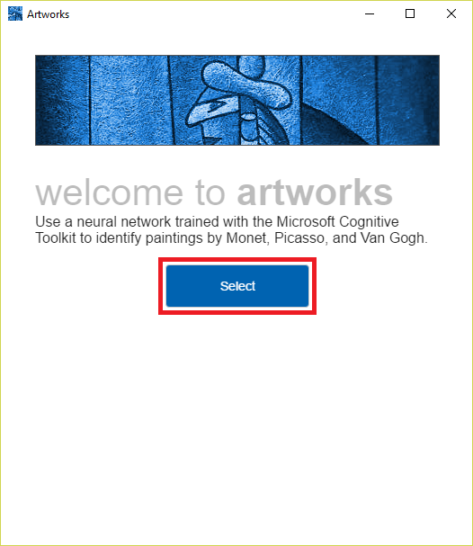
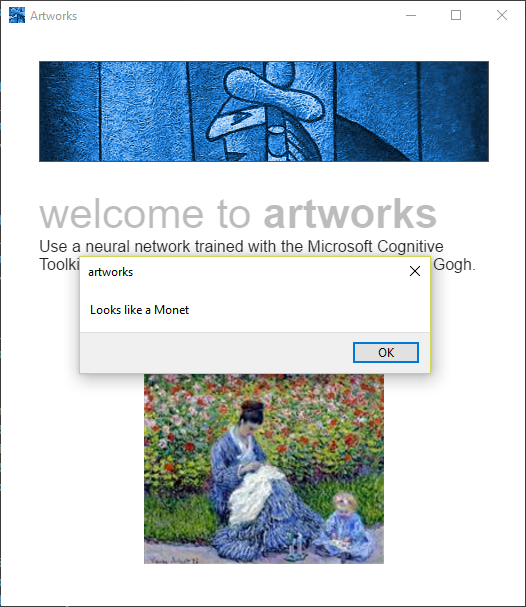

In the [previous lab](../3%20-%20Predict), you built a machine-learning model with the [Microsoft Cognitive Toolkit](https://www.microsoft.com/cognitive-toolkit/), also known as CNTK, and trained it to differentiate between paintings by Picasso, Monet, and Van Gogh. You used a Jupyter notebook to do the training. The output was a **.model** file containing a trained neural network.

In this lab, the fourth of four in the series, you will operationalize the model by packaging the **.model** file and a Web service written in Python and [Flask](http://flask.pocoo.org/) in a Docker container image. That Web service will expose a REST endpoint that evaluates an uploaded image and returns a JSON payload containing the probabilities that the image depicts a painting by each of the three famous artists. Then you will conclude the series by running the Web service in a Docker container and connecting to it from a cross-platform desktop app written with [Node.js](https://nodejs.org/en/) and [Electron](https://electronjs.org/).


<a name="Objectives"></a>
### Objectives ###

In this hands-on lab, you will learn how to:

- Operationalize a CNTK model in a Docker container
- Expose an HTTP-callable REST endpoint from the container
- Call the endpoint from a Node app

<a name="Prerequisites"></a>
### Prerequisites ###

The following are required to complete this hands-on lab:

- [Docker](https://www.docker.com/)
- [Node.js](https://nodejs.org/en/)

If you haven't completed the [previous lab in this series](../3%20-%20Predict), you must do so before starting this lab.

<a name="Resources"></a>
### Resources ###

[Click here](https://topcs.blob.core.windows.net/public/400-mmlspark-resources-04.zip) to download a zip file containing the resources used in this lab. Copy the contents of the zip file into a folder on your hard disk.

---

<a name="Exercises"></a>
## Exercises ##

This hands-on lab includes the following exercises:

- [Exercise 1: Operationalize the model using a Web service](#Exercise1)
- [Exercise 2: Call the Web service from a Node app](#Exercise2)

Estimated time to complete this lab: **30** minutes.

<a name="Exercise1"></a>
## Exercise 1: Operationalize the model using a Web service ##

TODO: Add introduction.

1. tk.

	

	_tk_

1. tk.

	

	_tk_

1. Use the following command to 

	

	_tk_

1. tk.

	

	_tk_

1. tk.

	```python
	import cntk as C
	from PIL import Image
	from io import BytesIO
	import numpy as np
	from flask import Flask, request, jsonify
	
	app = Flask(__name__)
	model = C.load_model('PaintingsTransferLearning.model')
	
	def eval_single_image(loaded_model, image_bytes):
	    try:
	        image_dims = (3, 224, 224)
	        img = Image.open(BytesIO(image_bytes)).convert('RGBA')
	        resized = img.resize((image_dims[2], image_dims[1]), Image.ANTIALIAS)
	        bgr_image = np.asarray(resized, dtype=np.float32)[..., [2, 1, 0]]
	
	        hwc_format = np.ascontiguousarray(np.rollaxis(bgr_image, 2))
	        arguments = {loaded_model.arguments[0]: [hwc_format]}
	        output = loaded_model.eval(arguments)
	
	        sm = C.softmax(output[0])
	        return sm.eval()
	
	    except:
	        return [-1.0, -1.0, -1.0]
	
	@app.route('/analyze', methods=['POST'])
	def analyze():
	    bytes = request.get_data()
	    result = eval_single_image(model, bytes)
	
	    output = {}
	    output['Picasso'] = float(str(result[0]))
	    output['Monet'] = float(str(result[1]))
	    output['VanGogh'] = float(str(result[2]))
	    return jsonify(output)
	
	if __name__ == '__main__':
	    app.run(debug=True, port=8008, host='0.0.0.0')
	```

1. tk.

	

	_tk_

1. tk.

	```dockerfile
	FROM microsoft/mmlspark:plus-0.9.9
	USER root
	#RUN curl https://cntk.ai/BinaryDrop/CNTK-2-3-Linux-64bit-CPU-Only.tar.gz  -o /home/mmlspark/CNTK.tar.gz && \
	#    tar -xzf /home/mmlspark/CNTK.tar.gz && \
	#    chown -R mmlspark:mmlspark cntk
	# ENV PATH=/home/mmlspark/cntk/cntk/bin:$PATH
	# ENV LD_LIBRARY_PATH=/home/mmlspark/cntk/cntk/lib:/home/mmlspark/cntk/cntk/dependencies/lib:$LD_LIBRARY_PATH
	RUN pip install https://cntk.ai/PythonWheel/CPU-Only/cntk-2.3.1-cp35-cp35m-linux_x86_64.whl
	RUN pip install pillow
	RUN pip install flask
	RUN mkdir /app
	COPY app.py /app
	COPY PaintingsTransferLearning.model /app
	WORKDIR /app
	EXPOSE 8008
	ENTRYPOINT ["python"]
	CMD ["app.py"]
	```

1. tk.

	

	_tk_

1. tk.

	```
	docker build -t spark-server .
	```

1. tk.

	```
	docker run -p1234:8008 spark-server
	```

1. Verify output.

TODO: Add closing.

<a name="Exercise2"></a>
## Exercise 2: Call the Web service from a Node app ##

In this exercise, you will use an app provided for you in the [resources that accompany this lab](https://topcs.blob.core.windows.net/public/400-mmlspark-resources-04.zip) to upload images to the Web service and display the results. The app is already configured to place calls to the Web service's REST endpoint at http://localhost:1234/analyze. Port 1234 is the one you redirected to port 8008 in the container when you started the container in the previous exercise. The Web server inside the container is listening on port 8008.

1. If [Node.js](https://nodejs.org/en/) isn't installed on your computer, go to https://nodejs.org and install the latest LTS version for your operating system. If you aren't sure whether Node.js is installed, open a Command Prompt or terminal window and type ```node -v```. If you don't see a Node.js version number, then Node.js isn't installed.

	> If a version of Node.js older than 8.9 is installed, it is highly recommend that you download and install the latest version.

1. In a Command Prompt or terminal window, ```cd``` to the "Artworks Client" directory in the resources that accompany this lab. Then use the following command to install the packages that the app requires:

	```
	npm install
	```

1. Now execute this command to launch the Artworks app:

	```
	npm start
	```

1. Once the app starts, click the **Select** button and select one of the image files in "Test Images" folder of the resources that accompany this lab.

	

	_Selecting an image to evaluate_

1. Wait for the image to be evaluated and check the results shown in the alert box. Did the model correctly identify the artist of the painting?

	

	_Looks like a Monet!_

1. Select other images in the "Test Images" folder and submit them for evaluation. Confirm that the model correctly identifies the artists.

You are not limited to evaluating only those images in the "Test Images" folder. Feel free to search the Web for other images depicting paintings by Monet, Picasso, and Van Gogh and evaluate them, too. There is no limit on the size of the images that you can submit to the Web service, but smaller images do upload and evaluate faster.

<a name="Summary"></a>
## Summary ##

Because you packaged a CNTK model and a Web service in a Docker container, you could easily deploy them to the cloud and run them there using the [Azure Container Service](https://azure.microsoft.com/services/container-service/) or [Azure Container Instances](https://azure.microsoft.com/services/container-instances/). You could also run them on an [HDInsight](https://azure.microsoft.com/services/hdinsight/) Spark cluster hosted in Azure. For more information on deploying HDInsight clusters and using them as compute targets, see [Create DSVM and HDI Spark cluster as compute targets](https://docs.microsoft.com/azure/machine-learning/preview/how-to-create-dsvm-hdi#create-an-apache-spark-for-azure-hdinsight-cluster-in-azure-portal).


Once you're finished using the solution you built in this series, you should delete all the Azure services you deployed so they no longer charge to your subscription. To delete them, simply go to the Azure Portal and delete the "mmlsparklab-rg" resource group. That's one of the many benefits of using resource groups: one simple action deletes the resource group and everything inside it. Once deleted, a resource group cannot be recovered, so make sure you're finished with it before deleting it.

---

Copyright 2018 Microsoft Corporation. All rights reserved. Except where otherwise noted, these materials are licensed under the terms of the MIT License. You may use them according to the license as is most appropriate for your project. The terms of this license can be found at https://opensource.org/licenses/MIT.
