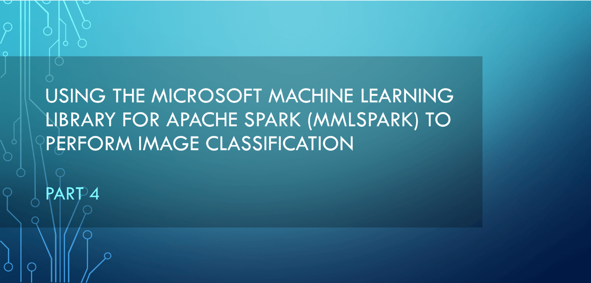
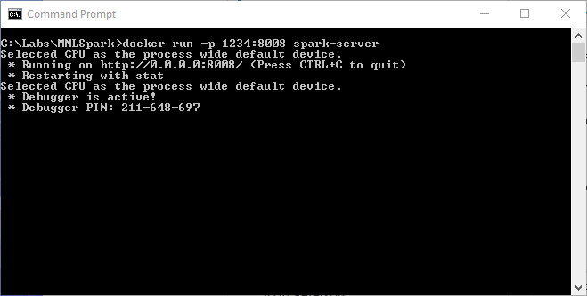

In the [previous lab](../3%20-%20Predict), you built a machine-learning model with the [Microsoft Cognitive Toolkit](https://www.microsoft.com/cognitive-toolkit/), also known as CNTK, and trained it to differentiate between paintings by Picasso, Monet, and Van Gogh. You used Python code in a Jupyter notebook to do the training. The output was a **.model** file containing a trained neural network.

In this lab, the fourth of four in the series, you will operationalize the model by packaging the **.model** file and a Web service written in Python and [Flask](http://flask.pocoo.org/) in a Docker container image. That Web service will expose a REST endpoint that evaluates an uploaded image and returns a JSON payload containing the probabilities that the image depicts a painting by each of the three artists. Then you will conclude the series by running the Web service in a Docker container and connecting to it from a cross-platform desktop app written with [Node.js](https://nodejs.org/en/) and [Electron](https://electronjs.org/).


<a name="Objectives"></a>
### Objectives ###

In this hands-on lab, you will learn how to:

- Operationalize a CNTK model in a Docker container
- Expose an HTTP-callable REST endpoint from the container
- Call the endpoint from a Node app

<a name="Prerequisites"></a>
### Prerequisites ###

The following are required to complete this hands-on lab:

- [Docker](https://www.docker.com/)
- [Node.js](https://nodejs.org/en/)

If you haven't completed the [previous lab in this series](../3%20-%20Predict), you must do so before starting this lab.

<a name="Resources"></a>
### Resources ###

[Click here](https://topcs.blob.core.windows.net/public/400-mmlspark-resources-04.zip) to download a zip file containing the resources used in this lab. Copy the contents of the zip file into a folder on your hard disk.

---

<a name="Exercises"></a>
## Exercises ##

This hands-on lab includes the following exercises:

- [Exercise 1: Operationalize the model using a Web service](#Exercise1)
- [Exercise 2: Call the Web service from a Node app](#Exercise2)

Estimated time to complete this lab: **20** minutes.

<a name="Exercise1"></a>
## Exercise 1: Operationalize the model using a Web service ##

In this exercise, you will write a simple Web service using the [Flask](http://flask.pocoo.org/) framework and package it and the **.model** file created in the previous lab in a Docker container image. Then you will start the Web service by running the container on the local Docker host.

1. Create a project directory on your hard disk. Name it anything you want. Then copy the **PaintingsLearningTransfer.model** file that you copied to the local file system in the previous lab into the project directory.

1. Add a file named **app.py** to the project directory and paste in the following Python code. Then save the file:

	```python
	import cntk as C
	from PIL import Image
	from io import BytesIO
	import numpy as np
	from flask import Flask, request, jsonify
	
	app = Flask(__name__)
	model = C.load_model('PaintingsTransferLearning.model')
	
	def eval_single_image(loaded_model, image_bytes):
	    try:
	        image_dims = (3, 224, 224)
	        img = Image.open(BytesIO(image_bytes)).convert('RGBA')
	        resized = img.resize((image_dims[2], image_dims[1]), Image.ANTIALIAS)
	        bgr_image = np.asarray(resized, dtype=np.float32)[..., [2, 1, 0]]
	
	        hwc_format = np.ascontiguousarray(np.rollaxis(bgr_image, 2))
	        arguments = {loaded_model.arguments[0]: [hwc_format]}
	        output = loaded_model.eval(arguments)
	
	        sm = C.softmax(output[0])
	        return sm.eval()
	
	    except:
	        return [-1.0, -1.0, -1.0]
	
	@app.route('/analyze', methods=['POST'])
	def analyze():
	    bytes = request.get_data()
	    result = eval_single_image(model, bytes)
	
	    output = {}
	    output['Picasso'] = float(str(result[0]))
	    output['Monet'] = float(str(result[1]))
	    output['VanGogh'] = float(str(result[2]))
	    return jsonify(output)
	
	if __name__ == '__main__':
	    app.run(debug=True, port=8008, host='0.0.0.0')
	```

	This code implements a Web service using the Flask framework. The Web service listens for HTTP requests on port 8008, and it exposes a single REST method at the URL "/analyze." That method accepts a binary image in the body of an HTTP POST. Then it evaluates the image by passing it to the CNTK model embodied in **PaintingsLearningTransfer.model**. The call to ```C.load_model``` loads the model when the Web service starts, and the ```eval_single_image``` function invokes the model with a call to ```loaded_model.eval```. The output from the method is a JSON payload formatted in this manner:

	```json
	{
	  "Picasso": 0.000167,
	  "Monet": 0.00026,
	  "VanGogh": 0.99807,
	}
	```

	The values of the respective properties denote the probabilities that the image represents a painting by each of the three artists. In this example, the model determined that Van Gogh is most likely the artist of the image that was evaluated.

1. Create a file named **Dockerfile** (no file-name extension) in the project directory and paste in the following statements before saving the file:

	```dockerfile
	FROM microsoft/mmlspark:plus-0.9.9
	USER root
	#RUN curl https://cntk.ai/BinaryDrop/CNTK-2-3-Linux-64bit-CPU-Only.tar.gz  -o /home/mmlspark/CNTK.tar.gz && \
	#    tar -xzf /home/mmlspark/CNTK.tar.gz && \
	#    chown -R mmlspark:mmlspark cntk
	# ENV PATH=/home/mmlspark/cntk/cntk/bin:$PATH
	# ENV LD_LIBRARY_PATH=/home/mmlspark/cntk/cntk/lib:/home/mmlspark/cntk/cntk/dependencies/lib:$LD_LIBRARY_PATH
	RUN pip install https://cntk.ai/PythonWheel/CPU-Only/cntk-2.3.1-cp35-cp35m-linux_x86_64.whl
	RUN pip install pillow
	RUN pip install flask
	RUN mkdir /app
	COPY app.py /app
	COPY PaintingsTransferLearning.model /app
	WORKDIR /app
	EXPOSE 8008
	ENTRYPOINT ["python"]
	CMD ["app.py"]
	```

	This **Dockerfile** contains instructions for building a Docker container image. It starts with the base image [microsoft/mmlspark](https://hub.docker.com/r/microsoft/mmlspark/) and adds the CPU-only version of CNTK, the Python [Pillow](https://pillow.readthedocs.io/en/5.0.0/) package for image processing, and [Flask](http://flask.pocoo.org/). Then it copies **app.py** and **PaintingsLearningTransfer.model** into the container image, opens port 8008 to networking traffic, and configures the container to run **app.py** when the container is started.

1. Navigate to the project directory in a Command Prompt or terminal window and execute the following command to build a Docker image named "spark-server:"

	```
	docker build -t spark-server .
	```

1. Wait for the command to complete and confirm that it completed successfully, ignoring any warnings present in the output. Then execute this command to run the container and start the Web service:

	```
	docker run -p 1234:8008 spark-server
	```

	The ```-p``` switch redirects traffic sent to port 1234 on the local machine to port 8008 in the container. The Web server inside the container listens on port 8008.

1. Confirm that output similar to the following appears in the Command Prompt or terminal window indicating that the Web service is running:

	

	_Running the container_

The CNTK model is now operationalized and waiting to be called by the Web service. The next step is to place some calls to the Web service.

<a name="Exercise2"></a>
## Exercise 2: Call the Web service from a Node app ##

In this exercise, you will use an app provided for you in the [resources that accompany this lab](https://topcs.blob.core.windows.net/public/400-mmlspark-resources-04.zip) to upload images to the Web service and display the results. The app is already configured to place calls to the Web service's REST endpoint at http://localhost:1234/analyze. Port 1234 is the one you redirected to port 8008 in the container when you started the container in the previous exercise.

1. If Node.js isn't installed on your computer, go to https://nodejs.org/ and install it it now. You can determine whether Node is installed — and what version is installed — by opening a Command Prompt or terminal window and typing the following command:

	```
	node -v
	```

	If Node is installed, the version number will be displayed. If the version number is less than 8.0, **download and install the latest version**.

1. In a Command Prompt or terminal window, ```cd``` to the "Artworks Client" directory in the resources that accompany this lab. Then use the following command to install the packages that the app requires:

	```
	npm install
	```

1. Now execute this command to launch the Artworks app:

	```
	npm start
	```

1. Once the app starts, click the **Select** button and select one of the JPEG files in "Test Images" folder of the resources that accompany this lab.

	

	_Selecting an image to evaluate_

1. Wait for the image to be evaluated and check the results shown in the alert box. Did the model correctly identify the artist of the painting?

	

	_Looks like a Monet!_

1. Select other images in the "Test Images" folder and submit them for evaluation. Confirm that the model correctly identifies the artists.

	You are not limited to evaluating only those images in the "Test Images" folder. Feel free to search the Web for other images depicting paintings by Monet, Picasso, and Van Gogh and evaluate them, too. There is no limit on the size of the images that you can submit to the Web service, but smaller images do upload and evaluate faster.

If you're curious to know how the Artworks app works, browse the files in the "Artworks Client" directory. In particular, examine **predict.js**,which contains the code that uploads images to the Web service and displays the results. The variable named ```url``` on line 4 contains the URL of the Web service's ```analyze``` method. If the Web service were hosted somewhere else, you could modify this value to change the target of the calls.

<a name="Summary"></a>
## Summary ##

Because you packaged a CNTK model and a Web service in a Docker container, you could easily deploy them to the cloud and run them there using the [Azure Container Service](https://azure.microsoft.com/services/container-service/) or [Azure Container Instances](https://azure.microsoft.com/services/container-instances/). You could also run them on an [HDInsight](https://azure.microsoft.com/services/hdinsight/) Spark cluster hosted in Azure. For more information on deploying HDInsight clusters and using them as compute targets, see [Create DSVM and HDI Spark cluster as compute targets](https://docs.microsoft.com/azure/machine-learning/preview/how-to-create-dsvm-hdi#create-an-apache-spark-for-azure-hdinsight-cluster-in-azure-portal).


Once you're finished using the solution you built in this series, you should delete all the Azure services you deployed so they no longer charge to your subscription. To delete them, simply go to the Azure Portal and delete the "mmlsparklab-rg" resource group. That's one of the many benefits of using resource groups: one simple action deletes the resource group and everything inside it. Once deleted, a resource group cannot be recovered, so make sure you're finished with it before deleting it.

---

Copyright 2018 Microsoft Corporation. All rights reserved. Except where otherwise noted, these materials are licensed under the terms of the MIT License. You may use them according to the license as is most appropriate for your project. The terms of this license can be found at https://opensource.org/licenses/MIT.
