# Running Containerized Applications with the Azure Kubernetes Service (AKS)

[Containers](https://www.docker.com/what-container) are revolutionizing software development, and [Docker](http://www.docker.com) is the world's most popular containerization platform. Containers allow software and files to be bundled into self-contained packages that can be run on different computers and different operating systems. This description comes from the Docker Web site:


Containers are similar to virtual machines (VMs) in that they provide a predictable and isolated environment in which software can run. Because containers are smaller than VMs, they start quickly and use less RAM. Moreover, multiple containers running on a single machine share the same operating system kernel. Docker is based on open standards, enabling Docker containers to run on all major Linux distributions as well as Windows Server 2016.

To simplify the use of Docker containers, Azure offers the [Azure Kubernetes Service](https://azure.microsoft.com/services/kubernetes-service/) (AKS), which provides a scalable cloud-based environment for hosting containerized applications, and the [Azure Container Registry](https://azure.microsoft.com/services/container-registry/) (ACR). The latter allows container images to be hosted in Azure and loaded quickly into AKS. [Kubernetes](https://kubernetes.io/) is an open-source tool for managing containerized applications across clusters of container hosts. It provides all of the infrastructure needed to run a container: storage, compute, networking, scaling, healing, load balancing, and more. AKS integrates Kubernetes with Azure so that load balancing, virtual IP addresses, and other infrastructural services are provided by Azure.

In this lab, you will get first-hand experience with AKS and have some fun at the same time. After deploying an AKS cluster to Azure, you will build a Docker image containing a [Minecraft](https://minecraft.net/) server and push the image to the Azure Container Registry. Then you will run the image in a container in AKS, connect a Minecraft client to the Minecraft server, and play Minecraft.

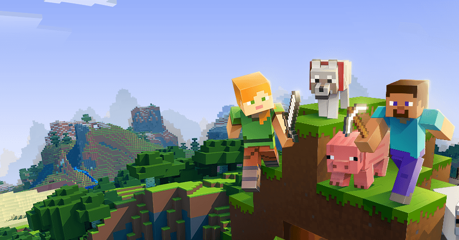

<a name="Objectives"></a>
### Objectives ###

In this hands-on lab, you will learn how to:

- Deploy an AKS cluster in Azure
- Create an Ubuntu VM equipped with Docker in Azure
- Create a Docker image
- Push a Docker image to the Azure Container Registry
- Use Azure Kubernetes Service to run the image in a container

<a name="Prerequisites"></a>
### Prerequisites ###

The following are required to complete this hands-on lab:

- An active Microsoft Azure subscription. If you don't have one, [sign up for a free trial](http://aka.ms/WATK-FreeTrial).
- [Minecraft for Windows 10](https://www.microsoft.com/p/minecraft-for-windows-10/9nblggh2jhxj?activetab=pivot%3aoverviewtab), [Minecraft for iOS](https://itunes.apple.com/us/app/minecraft/id479516143?mt=8), or [Minecraft for Android](https://play.google.com/store/apps/details?id=com.mojang.minecraftpe)

<a name="Cost"></a>
### Cost ###


The cost of this lab series is **moderate**. For an overview of cost ratings, refer to [Explanation of Costs](../../../Costs.md).

<a name="Exercises"></a>
## Exercises ##

This hands-on lab includes the following exercises:

- [Exercise 1: Deploy an AKS cluster and other Azure resources](#Exercise1)
- [Exercise 2: Create a Docker image and push it to the container registry](#Exercise2)
- [Exercise 3: Launch a Minecraft server in a container in AKS](#Exercise3)
- [Exercise 4: Connect the Minecraft client to the Minecraft server](#Exercise4)
- [Exercise 5: Delete the resource group](#Exercise5)

Estimated time to complete this lab: **45** minutes.

<a name="Exercise1"></a>
## Exercise 1: Deploy an AKS cluster and other Azure resources ##

An AKS development pipeline requires three components: a machine on which to build Docker images, a container registry to host the images, and a server or cluster of servers to host the containers created from the images. In this exercise, you will deploy an AKS cluster to host containers, create an Ubuntu virtual machine equipped with Docker for building and pushing container images, and create an Azure Container Registry instance to host the images.

Note that a virtual machine is *not* required for building Docker images. You could install Docker on your laptop and build images there. However, for very large images such as ones that contain a Minecraft server, it is typically much faster to push the images to the Azure Container Registry from a virtual machine hosted in Azure.

1. Open the [Azure Portal](https://portal.azure.com) in your browser. If asked to log in, do so using your Microsoft account.

1. Click **+ Create a resource** in the menu on the left. Then select **Containers**, followed by **Kubernetes Service**.

	

	_Creating a Kubernetes service_

1. Select **Create new** to create a new resource group and enter a resource-group name. Enter a cluster name and a DNS name prefix and make sure a green check mark appears next to each. Select the region you wish to deploy to, and set the node count to **1** to minimize the cost of the cluster. Make sure the node size is set to **Standard DS1 v2** to further minimize cost. Then click the **Review + create** button at the bottom of the blade.

	> You will place all the resources you create in this lab in a single resource group so you can easily delete all those resources simply by deleting the resource group. Resource groups offer other benefits, too, including the ability to view billing information for the resource group as a whole.

	

	_Creating a Kubernetes cluster_

	Once these settings have been validated, click **Create** at the bottom of the "Create Kubernetes cluster" blade to begin deploying the cluster.

1. The Kubernetes cluster will require a few minutes to deploy. While you wait, click **+ Create a resource** again, and select **Containers** followed by **Docker on Ubuntu server** to create an Ubuntu VM with Docker preinstalled. This is the VM you will use in [Exercise 2](#Exercise2) to build a Docker image containing a Minecraft server. 

1. In the "Create VM" blade, enter a host name for the VM. (It doesn't have to be the same as the cluster name you entered in Step 3, but it can be if you want.) Enter a user name, set the authentication type to **Password**, and enter a password. *Remember the user name and password that you entered because you will need them to log into the VM.* Click **Resource Group** and select the resource group that you created in Step 3. Set **Location** to the same region you specified for the Kubernetes cluster in Step 3, and then click **Create**.

	

	_Creating an Ubuntu VM_

1. The next step is to create an instance of the Azure Container Registry, which acts as a repository for Docker images in much the same way that [Docker Hub](https://hub.docker.com/) does. The difference is that when you run container images in Azure, the containers start faster if the images that they load are hosted in Azure, too — especially if both reside in the same data center.

	To begin, click **+ Create a resource** in the menu on the left side of the portal, followed by **Containers** and then **Container Registry**. Then enter a name for the container registry and make sure a green check mark appears next to it since the name must be unique within Azure. Select the resource group you created in Step 3 to place the container registry in the same resource group. (Be sure to select **Use existing**, too.) Select the same **Location** that you selected for the Kubernetes cluster and the Ubuntu VM and click **Enable** under "Admin user." Then finish up by clicking **Create** at the bottom of the blade.

	

	_Creating a container registry_

1. Click **Resource groups** in the menu on the left side of the portal. Then click the resource group containing the resources you deployed in this exercise. Wait until the deployment status changes to "3 Succeeded" indicating that all the resources have been deployed. If necessary, periodically click **Refresh** at the top of the blade to refresh the deployment status.

    

    _Monitoring the deployment_

You now have a Kubernetes cluster, an Ubuntu VM outfitted with Docker, and a container registry to work with. Now let's remote into the VM, create a Docker image, and push the image to the container registry.

<a name="Exercise2"></a>
## Exercise 2: Create a Docker image and push it to the container registry ##

Now that the Azure infrastructure you need has been created, it's time to create a Docker image containing a Minecraft server and deploy (push) it to the container registry. To accomplish this, you will use the [Secure Shell](https://en.wikipedia.org/wiki/Secure_Shell) (SSH) protocol to connect to the Ubuntu VM created in the previous exercise and use the [Docker command line](https://docs.docker.com/engine/reference/commandline/cli/) in the VM. Rather than use a local SSH client to connect to the VM, you will use the [Azure Cloud Shell](https://azure.microsoft.com/features/cloud-shell/) available in the Azure Portal. One benefit of using the Cloud Shell is that you can execute [Azure CLI](https://docs.microsoft.com/cli/azure/?view=azure-cli-latest) commands without installing the Azure CLI locally.

1. In the Azure Portal, return to the resource group containing the resources you deployed in [Exercise 1](#Exercise1) and select the Ubuntu virtual machine you created in Step 5.

	

	_Opening a blade for the virtual machine_

1. Click the **Copy** button that appears when you hover over the VM's IP address to copy the IP address to the clipboard.

	

	_Copying the VM's IP address_

1. Launch the Azure Cloud Shell by clicking the Cloud Shell icon in the toolbar at the top of the portal. The Cloud Shell provides a command-line environment for managing Azure resources by executing Bash and PowerShell commands.

	

	_Launching the Cloud Shell_

1. Make sure the language selected in the upper-left corner of the Cloud Shell is **Bash**. Then use the following command to connect to the Ubuntu VM using SSH, replacing IP_ADDRESS with the IP address on the clipboard and USERNAME with the user name you specified in Exercise 1, Step 5:

	> Tip: Press **Shift+Ins** to paste the contents of the clipboard into the Cloud Shell if you are running Windows, or **Cmd+V** if you are on a Mac.

	```bash
	ssh USERNAME@IP_ADDRESS
	```

	If you are warned that the authenticity of the host can't be established and asked if you want to continue connecting, answer yes. Then type the password you specified in Exercise 1, Step 5 and press **Enter**.

1. Use the following command to download a .tar file containing Docker resources for this lab and extract the files inside:

	```bash
	curl -s https://topcs.blob.core.windows.net/public/aks-docker-resources.tar | tar xv
	```

1. Use an ```ls``` command to confirm that three files were copied into the current directory:

	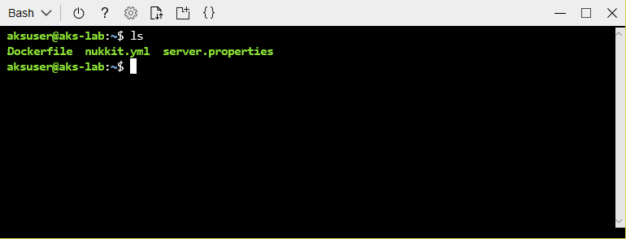

	_Listing the files extracted from the archive_

1. One of the files now present in the current directory is **Dockerfile**, which contains instructions for building a Docker image. Here are the contents of that file:

	```dockerfile
	FROM ubuntu:16.04
	WORKDIR minecraft
	COPY nukkit.yml .
	COPY server.properties .
	RUN apt-get update && \
	    apt-get install -y openjdk-8-jre-headless wget && \
	    wget https://ci.nukkitx.com/job/NukkitX/job/Nukkit/job/master/lastSuccessfulBuild/artifact/target/nukkit-1.0-SNAPSHOT.jar
	EXPOSE 19132
	CMD java -jar nukkit-1.0-SNAPSHOT.jar
	```

	The [FROM](https://docs.docker.com/engine/reference/builder/#from) command specifies the base image from which this image will be built — in this case, an Ubuntu image available from [Docker Hub](https://hub.docker.com/). The [COPY](https://hub.docker.com/) commands copy two files from the current directory into the Docker image: **nukkit.yml**, which contains configuration information for the Minecraft server software, and **server.properties**, which contains configuration information for Minecraft itself. The [RUN](https://docs.docker.com/engine/reference/builder/#run) command installs the [OpenJDK Java runtime](https://packages.ubuntu.com/xenial/openjdk-8-jre-headless) used by the Minecraft server and downloads the Minecraft server software. [EXPOSE](https://docs.docker.com/engine/reference/builder/#expose) opens port 19132 so clients can connect to it from the outside, and the [CMD](https://docs.docker.com/engine/reference/builder/#cmd) command installs Minecraft.

	The result is a Docker image containing a complete, self-contained Minecraft server. For a complete list of commands that can be included in a Dockerfile, see [Dockerfile reference](https://docs.docker.com/engine/reference/builder/).

1. Use the following command to build a Docker image using the commands in **Dockerfile**, replacing REGISTRY_NAME with the name you assigned to the container registry in Exercise 1, Step 6:

	```bash
	docker build --tag REGISTRY_NAME.azurecr.io/minecraft-server .
	```

	The ```--tag``` parameter assigns the image a name. In this case, since you will be pushing the image to a private repository rather than Docker Hub, the tag name is the location to which the image will be pushed. This lets the ```docker push``` command know where to push to.

1. Wait for the build to complete; it will probably take a few minutes. Once the image is built, the next step is to push it to the container registry. Before you can do that, you need a password for logging into the container registry. Return to the resource group that you created in [Exercise 1](#Exercise1) in the Azure Portal and click the container-registry resource. 

	

	_Opening a blade for the container registry_

1. Click **Access keys** in the menu on the left. The click the **Copy** button to the right of "password" to copy the password to the clipboard.

	

	_Copying the password_

1. Return to the Cloud Shell and execute the following command, once more replacing REGISTRY_NAME with the name you assigned to the container registry in Exercise 1, Step 6:

	```
	docker login REGISTRY_NAME.azurecr.io
	```

	When you are prompted for a user name, enter the name of the container registry. (By default, the user name is the same as the registry name.) When prompted for a password, paste the password on the clipboard into the Cloud Shell. Then press **Enter** and confirm that the login was successful.

1. Now that Docker is connected to the container registry, you can push the image with a ```docker push``` command. Use the following command to push the image, which is currently cached in a local registry, to the container registry you created in Azure, once more replacing REGISTRY_NAME with the name of your container registry:

	```
	docker push REGISTRY_NAME.azurecr.io/minecraft-server
	```

1. Wait for the push to complete; it should take about one minute. Use an ```exit``` command to close the SSH connection to the VM and return to the Cloud Shell command prompt. Then use the following command to list the Docker images in your container registry, replacing REGISTRY_NAME with the container registry's name:

	```bash
	az acr repository list --name REGISTRY_NAME
	```

	Confirm that the output includes an image named "minecraft-server," as pictured below. 

	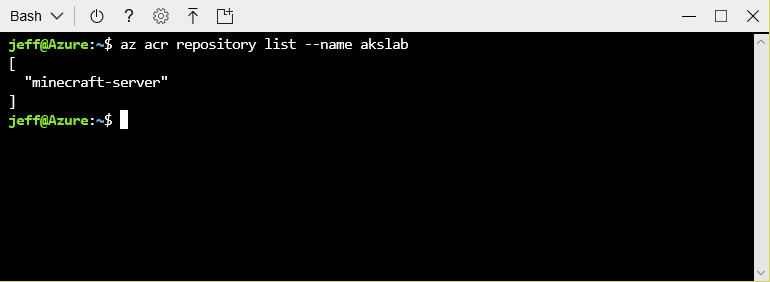

	_Listing Docker images_

The container image containing a Minecraft server is now present in the container registry and ready to be used to create container instances. Let's use AKS to launch a container instance.

<a name="Exercise3"></a>
## Exercise 3: Launch a Minecraft server in a container in AKS ##

In this exercise, you will use the Docker image that you built in the Ubuntu VM and pushed to a container registry hosted in Azure to create a container in Azure Kubernetes Services (AKS). You'll start by connecting AKS to the container registry so it can load images from there, and then use the Kubernetes CLI to launch a MineCraft server in AKS.

1. Return to the Cloud Shell and use the following command to download a .tar file and extract its contents:

	```bash
	curl -s https://topcs.blob.core.windows.net/public/aks-shell-resources.tar | tar xv
	```

1. The .tar file contains two files that are now present in the current directory. The first one — **acr.sh** — is a shell script that connects an Azure Container Registry instance to an AKS cluster. Before you run it, you need to modify it. Use the following command to open **acr.sh** in the built-in [Nano editor](https://www.nano-editor.org/):

	```
	nano acr.sh
	```

1. Replace RESOURCE_GROUP_NAME on lines 3 and 5 with the name of the resource group you created in [Exercise 1](#Exercise1). Similarly, replace CLUSTER_NAME on line 4 with the name of your AKS cluster from Exercise 1, Step 3, and replace REGISTRY_NAME on line 6 with the name of your container registry. Then press **Ctrl+O** followed by **Enter** to save the script, and **Ctrl+X** to exit Nano.

	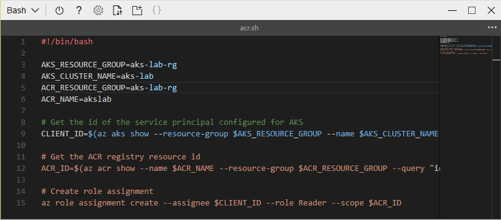

	_Modifying the shell script_

1. Use the following command to run the script:

	```bash
	bash acr.sh
	```

	Wait for the command to complete and confirm that the output contains no error messages. If successful, the command will output a JSON listing containing properties such as ```id``` and ```principalId```.

1. The second file that you downloaded in Step 1 is **minecraft.yaml**. This is a configuration file used by Kubernetes to create resources in an AKS cluster. It, too, must be modified before it is used. Use the following command to open the file in the Nano editor:

	```bash
	nano minecraft.yaml
	```

1. Replace CONTAINER_REGISTRY_NAME on line 15 with the name of your Azure container registry. Then press **Ctrl+O** followed by **Enter** to save the script, and **Ctrl+X** to exit Nano.

1. Next, you will use the Kubernetes CLI to deploy the container to AKS. The CLI is [kubectl](https://kubernetes.io/docs/reference/kubectl/overview/), which supports a variety of commands for managing Kubernetes resources and is already installed in the Cloud Shell. Before using it, you need to configure kubectl to talk to your instance of AKS.

	Return to the resource group containing the AKS cluster and click the Kubernetes service.

	

	_Opening the Kubernetes service_

1. Click **View Kubernetes dashboard**.

	

	_Opening the Kubernetes dashboard_

1. Click the **Copy** button next to item #3 to copy the command for retrieving cluster credentials to the clipboard.

	

	_Copying the command_

1. Return to the Cloud Shell, paste in the command that's on the clipboard, and execute it. Confirm that the output resembles this:

	```
	Merged "aks-lab" as current context in /home/xxx/.kube/config
	```

1. Now that credentials for logging into the AKS cluster are available to the Cloud Shell (and therefore to kubectl), you can use kubectl to create the resources defined in **minecraft.yaml**. Execute the following command to start a container instance from the Minecraft image you pushed to the container registry:

	```bash
	kubectl create -f minecraft.yaml
	```

	This command might take several minutes to complete. Behind the scenes, a lot is happening. Kubernetes loads the container image from the container registry and creates a container from the image, creates a [pod](https://kubernetes.io/docs/concepts/workloads/pods/pod-overview/) to host the container, connects the pod to the internal Kubernetes network, and creates a [kube proxy](https://kubernetes.io/docs/concepts/cluster-administration/proxies/) to serve as an interface to the network. AKS then creates a virtual IP address in Azure, connects an [Azure Load Balancer](https://azure.microsoft.com/services/load-balancer/) to the IP Address, and connects the load balancer to the kube proxy through an [Azure Virtual Network](https://docs.microsoft.com/en-us/azure/virtual-network/virtual-networks-overview), or VNet. The resultant architecture is pictured below.

	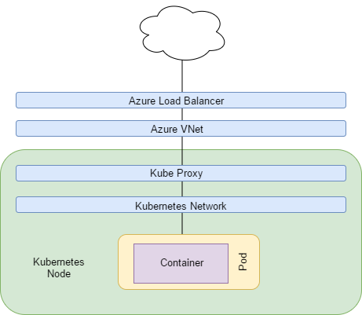
	
	_AKS architecture_

	In this relatively simple example, a pod hosts a single container representing a single application. In more complex scenarios, pods host multiple containers comprising [microservices](https://en.wikipedia.org/wiki/Microservices) which are tightly coupled to form applications.

1. Use the following command to get the IP address of the Minecraft server running in AKS:

	```bash
	kubectl get services minecraft-lb
	```

	If EXTERNAL-IP is "pending," wait a few moments and try again. When "pending" changes to an IP address, copy the IP address to the clipboard. You can use **Ctrl+C** to copy text from the Cloud Shell to the clipboard.

	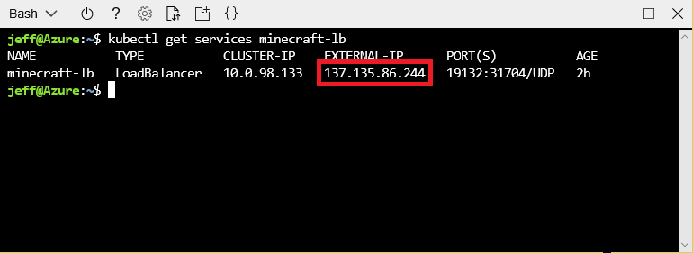

	_Copying the server's IP address_

Your Minecraft server is now up and running in AKS and ready to use. In the next exercise, you will connect to it from a Minecraft client.

<a name="Exercise4"></a>
## Exercise 4: Connect the Minecraft client to the Minecraft server ##

Now comes the fun part: connecting a Minecraft client to the Minecraft server running in a container in an AKS cluster hosted in Azure. The instructions in this exercise assume you are running [Minecraft for Windows 10](https://www.microsoft.com/p/minecraft-for-windows-10/9nblggh2jhxj?activetab=pivot%3aoverviewtab). If you are running Minecraft on iOS or Android instead, you will need to adjust accordingly. The goal is to connect to the Minecraft server whose IP address is on the clipboard using port 19132.

1. Launch Minecraft. Then click the **Play** button on the home screen.

	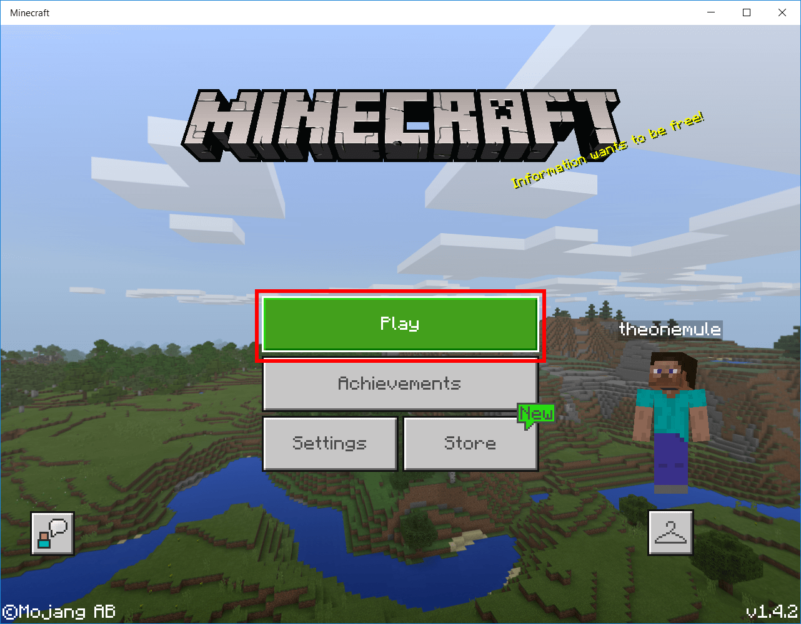

	_Launching Minecraft_

1. Go to the "Servers" tab and click **Add Server**.

	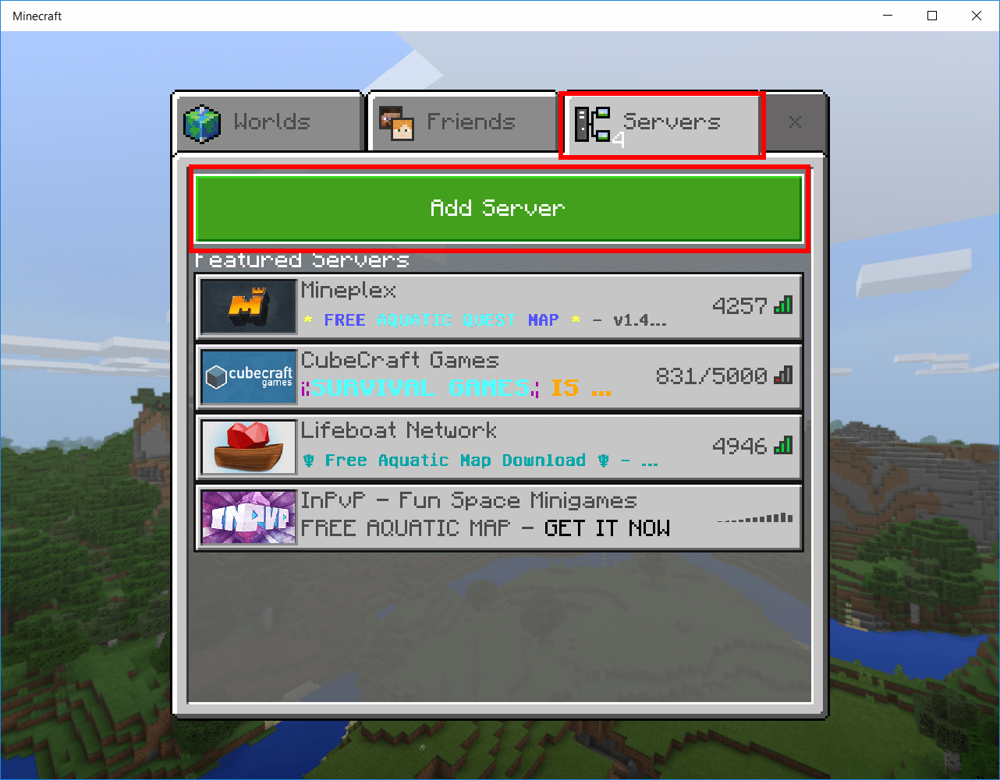

	_Adding a Minecraft server_

1. Type the Kubernetes cluster name into the "Server Name" box, and paste the IP address that you copied to the clipboard in Exercise 3, Step 12 into the "Server Address" box. Then click **Save**.

	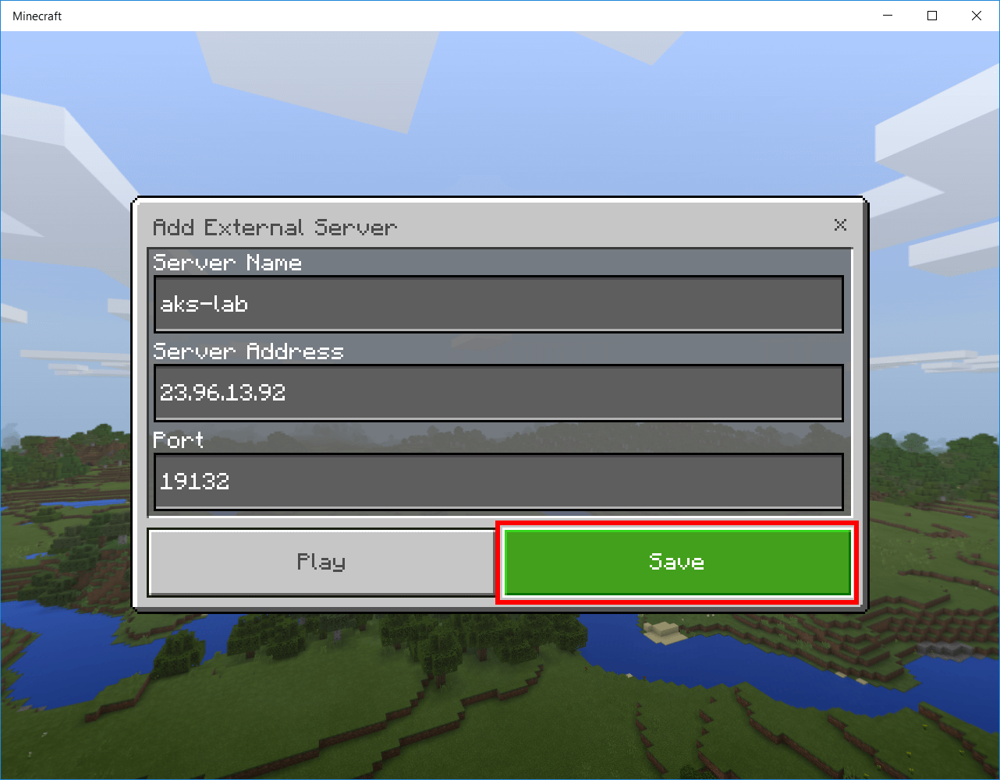

	_Entering server information_

1. Click the server that you just added to connect to it.

	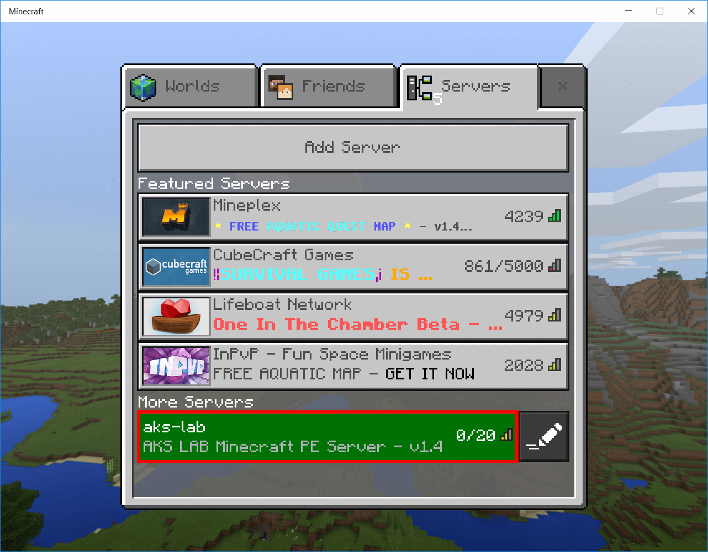

	_Connecting to the server_

1. Wait for Minecraft to connect to the server. Then play Minecraft!

	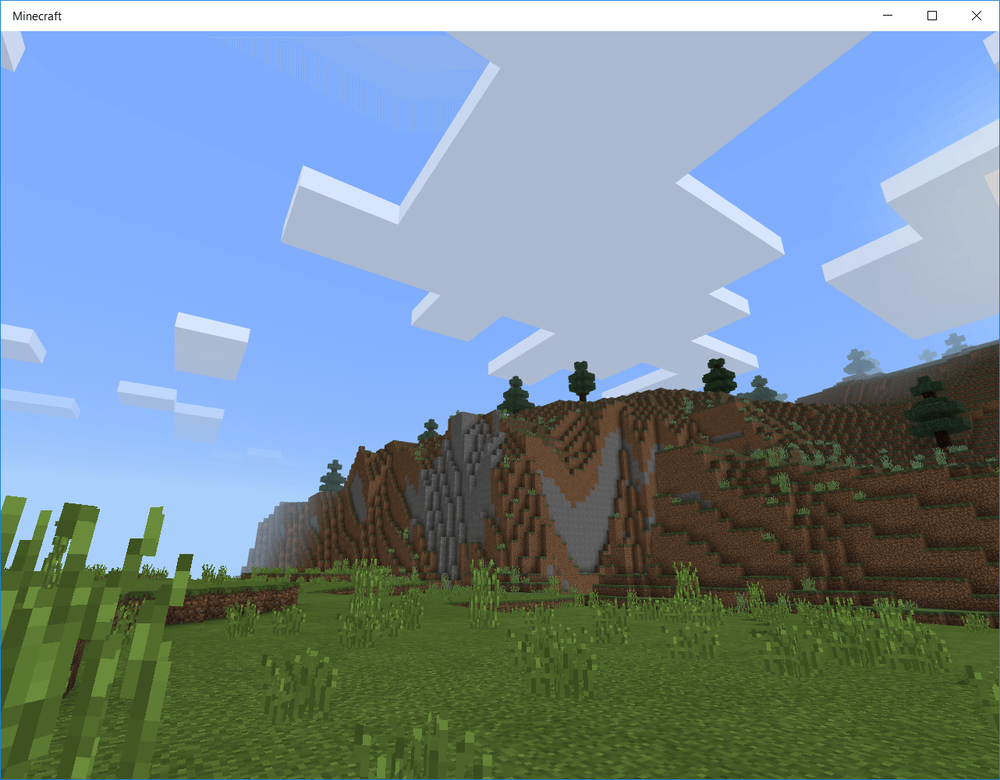

	_Playing Minecraft_

One more, if you're not running Windows 10 but have an iOS or Android device, you can run the Minecraft client there. These clients are available in the respective app stores: in the App Store [here](https://itunes.apple.com/us/app/minecraft/id479516143?mt=8), and in the Google Play store [here](https://play.google.com/store/apps/details?id=com.mojang.minecraftpe). Neither is free, but neither is expensive, either. The Minecraft server that you deployed to AKS uses the [Bedrock](https://minecraft.gamepedia.com/Bedrock_Edition) version of the Minecraft engine, which supports Windows, iOS, and Android.

<a name="Exercise5"></a>
## Exercise 5: Delete the resource group ##

In this exercise, you will delete the resource group created in [Exercise 1](#Exercise1) when you deployed the AKS cluster. Deleting the resource group deletes everything in it and prevents any further charges from being incurred for it. Resource groups that are deleted can't be recovered, so be certain you're finished using it before deleting it. However, it is **important not to leave this resource group deployed any longer than necessary** because virtual machines are relatively expensive.

1. Return to the blade for the resource group you created in Exercise 1. Then click **Delete resource group** at the top of the blade.

    

    _Deleting the resource group_

1. For safety, you are required to type in the resource group's name. (Once deleted, a resource group cannot be recovered.) Type the name of the resource group. Then click the **Delete** button to remove all traces of this lab from your Azure subscription.

After a few minutes, the resource group and all of its resources will be deleted. Billing stops when you click **Delete**, so you're not charged for the time required to delete the resources. Similarly, billing doesn't start until the resources are fully and successfully deployed.

<a name="Summary"></a>
## Summary ##

Azure Kubernetes Service can do more than host Minecraft. It is a general-purpose solution built on top of open-source software that is compatible with third-party Kubernetes tools. It supports enterprise features such as easy scalabilty, high availability, resiliency through self-health checks, and more. Combined with other container services in Azure, it makes Azure a first-rate platform for hosting Docker containers and managing those containers with Kubernetes.

---

Copyright 2018 Microsoft Corporation. All rights reserved. Except where otherwise noted, these materials are licensed under the terms of the MIT License. You may use them according to the license as is most appropriate for your project. The terms of this license can be found at <https://opensource.org/licenses/MIT.>
