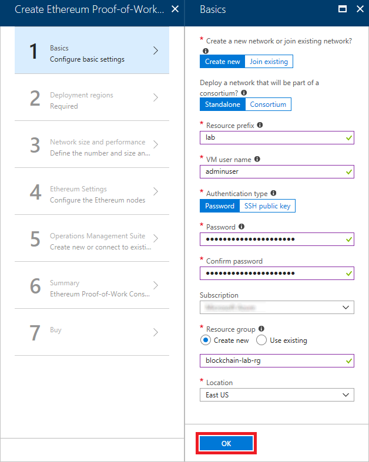
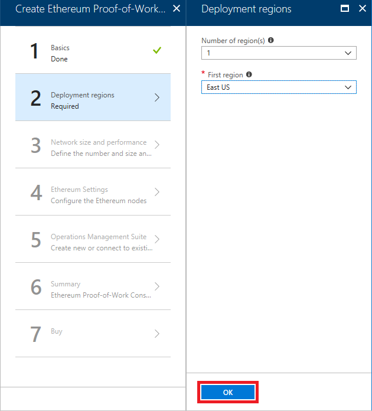
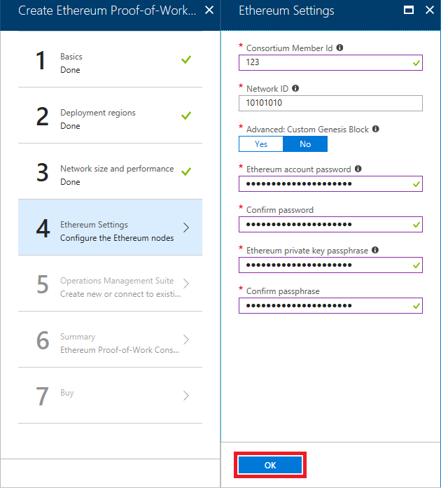
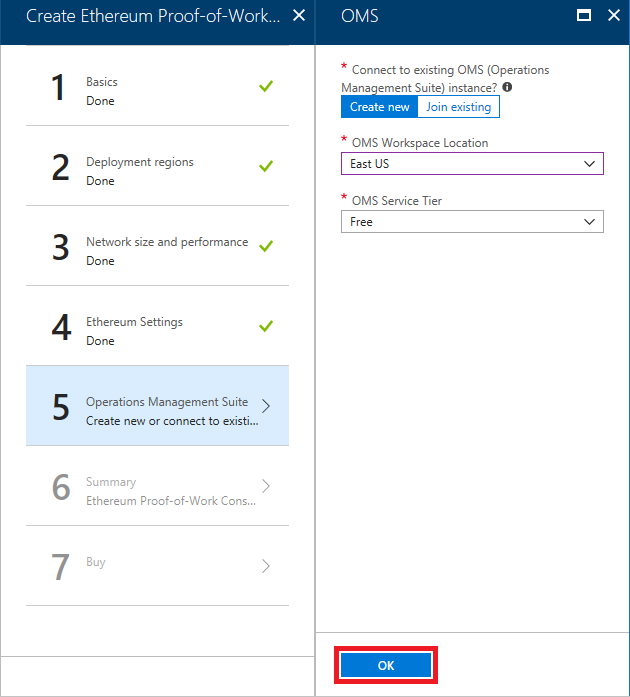
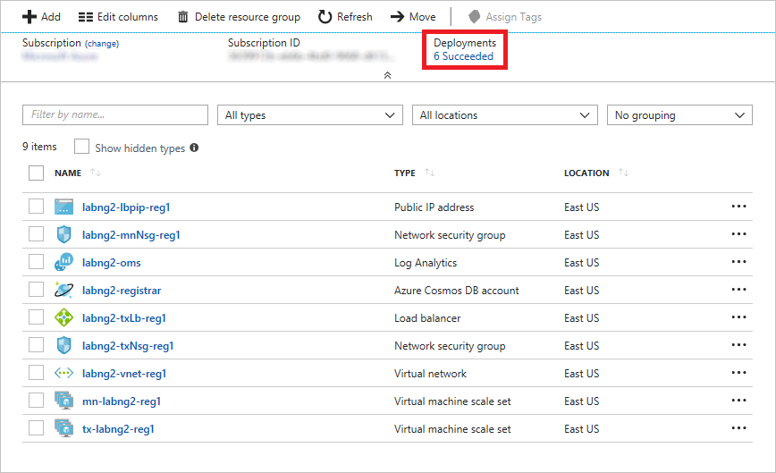
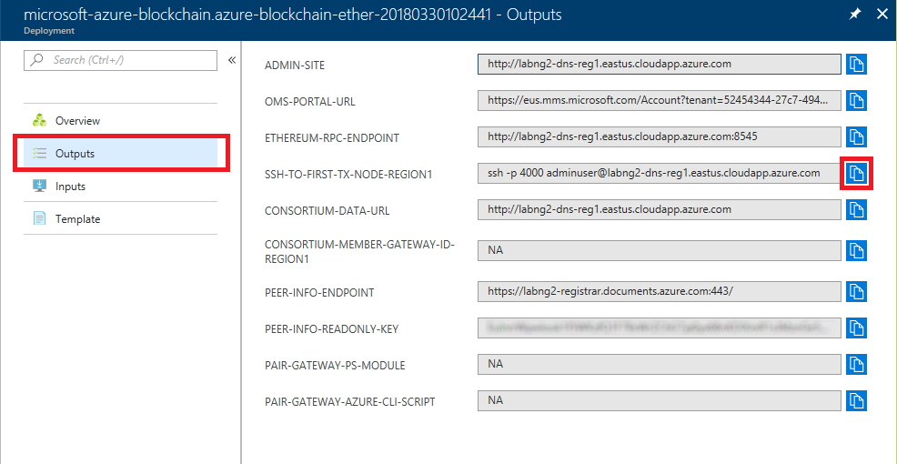

<a name="HOLTitle"></a>
# Building a Tamper-Proof Ratings System Using Blockchain on Azure #

[Blockchain](https://en.wikipedia.org/wiki/Blockchain) is one of the world's most talked-about technologies, and one that has the potential to fundamentally change the way we use the Internet. Originally designed for [Bitcoin](https://en.wikipedia.org/wiki/Bitcoin), Blockchain remains the technology behind that digital currency but is not limited to applications involving virtual money. In the words of Dan Tapscott, author, TED speaker, and Executive Director of the [Blockchain Research Institute](https://www.blockchainresearchinstitute.org/), "Blockchain is an incorruptible digital ledger of economic transactions that can be programmed to record not just financial transactions, but virtually everything of value." One of the more inventive uses for Blockchain is to implement tamper-proof digital voting systems, a concept that is being actively explored [in the U.S. and abroad](https://venturebeat.com/2016/10/22/blockchain-tech-could-fight-voter-fraud-and-these-countries-are-testing-it/).

Blockchain gets its name from the manner in which it stores data. Transactions such as a transfer of money from one party to another or a vote cast for a political candidate are stored in cryptographically sealed blocks. Blocks are joined together into chains ("blockchains"), with each block in the chain containing a hash of the previous block. A blockchain acts like an electronic ledger, and rather than be stored in one place, it is replicated across countless computers (nodes) in a Blockchain network. This decentralization means that a blockchain has no single point of failure and is controlled by no single entity. The latter is especially important for a system whose primary goal is to allow private transactions to take place without involving a "trusted" third party such as a bank.

Anyone can build a Blockchain network and use it to host blockchains. Microsoft Azure makes it incredibly simple to do both by supporting Blockchain-as-a-Service. A few button clicks in the Azure Portal are sufficient to deploy a network of virtual machines provisioned with popular Blockchain implementations such as [Ethereum](https://www.ethereum.org/), [Corda](https://www.corda.net/), or 
[Hyperledger Fabric](https://www.hyperledger.org/projects/fabric).

Ethereum was one of the first general-purpose Blockchain implementations. The software is open-source and is the basis for Ethereum's own cryptocurrency known as [Ether](https://www.ethereum.org/ether). You can deploy Ethereum networks of your own and use its Blockchain implementation however you wish. Among other features, Ethereum supports [smart contracts](https://en.wikipedia.org/wiki/Smart_contract), which are written in languages such as [Solidity](https://en.wikipedia.org/wiki/Solidity) and then compiled into bytecode and deployed to the blockchain for execution.

In this lab, you will deploy an Ethereum network on Azure and create a custom blockchain. Then you will build a Web site that lets students post comments about professors and rate them from one to five stars, and that stores the information in the blockchain. Along the way, you will get first-hand experience running Blockchain networks on Azure, as well as writing smart contracts for Ethereum and using them to store digital records in such a way that they cannot be altered.

<a name="Objectives"></a>
### Objectives ###

In this hands-on lab, you will learn how to:

- Deploy an Ethereum blockchain network on Azure
- Write smart contracts and deploy them to Ethereum networks
- Manipulate Ethereum blockchains using Node.js

<a name="Prerequisites"></a>
### Prerequisites ###

- An active Microsoft Azure subscription. If you don't have one, [sign up for a free trial](http://aka.ms/WATK-FreeTrial).
- [Node.js](https://nodejs.org)

<a name="Cost"></a>
### Cost ###


The cost of this lab is **high**. For an overview of cost ratings, refer to [Explanation of Costs](../../Costs.md).

<a name="Exercises"></a>
## Exercises ##

This hands-on lab includes the following exercises:

- [Exercise 1: Create a blockchain on Azure](#Exercise1)
- [Exercise 4: Unlock the coinbase account](#Exercise2)
- [Exercise 3: Deploy a smart contract](#Exercise3)
- [Exercise 4: Invoke the contract from an app](#Exercise4)
- [Exercise 5: Delete the blockchain network](#Exercise5)

Estimated time to complete this lab: **60** minutes.

<a name="Exercise1"></a>
## Exercise 1: Create a blockchain on Azure ##

In this exercise, you will use the Azure Portal to deploy an Ethereum Blockchain network in the cloud. [Ethereum](https://www.ethereum.org/) is a platform for running decentralized applications that rely on smart contracts, and it is offered as a service in Azure. For a great introduction to Ethereum, its history, and its uses, see [What is Ethereum? A Step-by-Step Beginners Guide](https://blockgeeks.com/guides/ethereum/).

1. In your browser, navigate to the [Azure Portal](https://portal.azure.com). If you are asked to sign in, do so using your Microsoft account.

1. In the portal, click **+ Create a resource**, followed by **Blockchain** and **Ethereum Proof-of-Work Blockchain**.

	

	_Creating an Ethereum blockchain_

1. Fill in the "Basics" blade as shown below, providing a password that's at least 12 characters long with a mix of uppercase letters, lowercase letters, numbers, and special characters. Select the region nearest you, and then click **OK**. *Be sure to remember the password that you entered, because you will need it in the next exercise*.

	

	_Entering basic settings_

1. In the "Deployment regions" blade, make sure **Number of regions** is set to 1 and select the region closest to you. Then click **OK** at the bottom of the blade.

	

	_Specifying deployment regions_

1. Click **OK** at the bottom of the "Network Size and Performance" blade to accept the default settings for VM sizes, number of nodes, and so on.

1. In the "Ethereum Settings" blade, set **Consortium Member ID** to **123** and enter a password in four places as the Ethereum account password and private key passphrase. Then click **OK**. Once again, *remember the password that you entered, because you will need it in the next exercise*.

	

	_Entering Ethereum settings_

1. Fill in the "OMS" blade as shown below, selecting the region closest to you. Then click **OK**.

	> OMS stands for [Operations Management Suite](https://www.microsoft.com/cloud-platform/insight-and-analytics) and is a feature of Azure that allows you to monitor workloads running in the cloud and gain real-time insights into their operation. When you deploy an Ethereum network, Azure automatically connects it to an OMS instance.

	

	_Entering OMS settings_

1. Review the settings in the "Summary" blade and click **OK** at the bottom of the blade. Then click the **Create** button at the bottom of the "Create" blade to begin the deployment.

1. Click **Resource groups** in the ribbon on the left. Then click the resource group named "blockchain-lab-rg." Wait until "Deploying" changes to "Succeeded" in the resource-group blade indicating that the Blockchain network and all of its resources have been deployed.

	

	_Monitoring the deployment_

Deployment will probably take 10 to 15 minutes. You can click the **Refresh** button at the top of the blade to refresh the deployment status. Once the deployment has completed, proceed to the next exercise.

<a name="Exercise2"></a>
## Exercise 2: Unlock the coinbase account ##

When it created the Ethereum network, Azure also created a *coinbase* account to support transactions performed in the blockchain. The name "coinbase" is misleading. It alludes to the fact that Blockchain is often used as the basis for digital currencies. But Blockchain can be used for much more than that, as you are in the process of demonstrating.

Every transaction performed in a blockchain must be "fueled" by an account. This coinbase account will fuel transactions that allow comments and ratings to be recorded in the blockchain. Before the coinbase account can be used, however, it must be unlocked. In this exercise, you will use SSH to connect to the Ethereum network you deployed in the previous exercise and execute a series of commands to unlock the account and retrieve its address.

1. Return to the "blockchain-lab-rg" resource group in the Azure portal. Click **Deployments** in the menu on the left, and then click **microsoft-azure-blockchain**.

	

	_Opening the blockchain_

1. Click **Outputs** in the menu on the left, and then click the **Copy** button next to SSH-TO-FIRST-TX-NODE-REGION1 to copy the SSH command to the clipboard.

	

	_Copying the SSH command_

1. Click the **Cloud Shell** button in the toolbar at the top of the portal to open a cloud shell. The Azure cloud shell provides an environment for executing Bash and PowerShell commands without leaving the portal. You can use **Shift+Insert** to paste commands into the cloud shell, and **Ctrl+Insert** to copy text from the cloud shell to the clipboard.

	

	_Opening the Azure cloud shell_

1. Make sure **Bash** is the language selected in the upper-left corner of the cloud shell. Press **Shift+Insert**  to paste the ```ssh``` command that is on the clipboard into the cloud shell. Then press **Enter** to execute the command. If you are prompted with a security warning informing you that the authenticity of the host can't be established and asking if you want to connect anyway, type "yes" and press **Enter**.

1. When prompted for a password, enter the password you entered in Exercise 1, Step 3.

1. Execute the following command in the cloud shell to attach to the first node in the Ethereum network. [geth](https://github.com/ethereum/go-ethereum/wiki/Command-Line-Options), which is short for "go-ethereum," is a multipurpose command for managing Ethereum networks.

	```
	geth attach
	```

1. Now execute the following command to unlock the coinbase account, substituting the password you entered in Exercise 1, Step 6 for PASSWORD:

	```
	web3.personal.unlockAccount(web3.personal.listAccounts[0],"PASSWORD",28800)
	```

	This will allow you to perform transactions using the coinbase account for up to 8 hours (28,800 seconds). Make sure that the output from the command is the word "true," as shown below.

	

	_Unlocking the account_

1. Now use the following command to get the address of the coinbase account:

	````
	web3.personal.listAccounts[0]
	````

	The output will be a hex value similar to this one:

	```
	0xd19cc89f0c9c1bf8280b9c8ec8125bd0e028ee51
	```

	Copy this address to the clipboard and paste it to a text file so you can easily retrieve it later.

1. Type ```exit``` into the cloud shell to detach from Ethereum.

1. Type ```exit``` again to close the SSH connection.

Now that the coinbase account is unlocked, you are ready to start using the network to execute transactions on the blockchain. To code those transactions, you will create and then deploy a smart contract.

<a name="Exercise3"></a>
## Exercise 3: Deploy a smart contract ##

Ethereum blockchains use smart contracts to broker transactions. A smart contract is a program that runs on blockchain transaction nodes in [Ethereum Virtual Machines](https://themerkle.com/what-is-the-ethereum-virtual-machine/). Ethereum developers often use the popular [Truffle](http://truffleframework.com/) framework to develop smart contracts. In this exercise, you will set up a Truffle development environment, compile a smart contract, and deploy it to the blockchain.

1. If Node.js isn't installed on your computer, go to https://nodejs.org and install the latest LTS version for your operating system. If you aren't sure whether Node.js is installed, open a Command Prompt or terminal window and execute the following command:

	```
	node --version
	```

	If you don't see a Node.js version number, then Node.js isn't installed.

1. If you are using macOS or Linux, open a terminal window. If you are using Windows instead, open a PowerShell window running **as an administrator**. In the terminal or PowerShell window, use the following command to create a directory named "truffle" in the location of your choice:

	```
	mkdir truffle
	```

1. Now change to the "truffle" directory:

	```
	cd truffle
	```

1. Use the following command to install Truffle:

	```
	npm install -g truffle
	```

1. Now use the following command to initialize a Truffle project in the current directory. This will download a few Solidity scripts and install them, and create a scaffolding in the "truffle" folder.

	```
	truffle init
	```

1. Return to the Azure portal and click the **Copy** button to the right of ETHEREUM-RPC-ENDPOINT to copy the endpoint URL to the clipboard. This URL is important, because it allows apps to make JSON-RPC calls to the network to deploy smart contracts and perform other blockchain-related tasks.

	

	_Copying the endpoint URL_

1. Use your favorite text or program editor to open the file named **truffle.js** in the "truffle" folder. Replace its contents with the statements below. Then replace ENDPOINT_URL on line 4 with the URL on the clipboard minus the leading "http://" and the trailing port number (for example, ":8545"), and replace PORT_NUMBER on line 5 with the port number you removed from the URL.

	```javascript
	module.exports = {
	  networks: {
	    development: {
	      host: "ENDPOINT_URL",
	      port: PORT_NUMBER,
	      network_id: "*", // Match any network id
	      gas: 4712388
	    }
	  }
	};
	```

	The modified file should look something like this:

	```javascript
	module.exports = {
	  networks: {
	    development: {
	      host: "labng2-dns-reg1.eastus.cloudapp.azure.com",
	      port: 8545,
	      network_id: "*", // Match any network id
	      gas: 4712388
	    }
	  }
	};
	```

	Once these changes are made, save the file.

1. Create a file named **profrates.sol** in the subdirectory named "contracts" (which was created when you ran ```truffle init```) and paste in the following code. Then save the file.

	```javascript
	pragma solidity ^0.4.16;

	contract profrates {

	    event newProfessor(uint _id);
	    event newRating(uint _id);		

	    struct Rating {
	        string comment;
	        uint stars;
	    }
			
	    struct Professor {
	        string photoUrl;
	        string name;
	        Rating[] ratings;		
		}

	    Professor[] professors;
		
	    function addProfessor(string name, string photoUrl) public returns (uint professorID) {
	        professorID = professors.length;
	        professors.length++;
	        professors[professorID].photoUrl = photoUrl;
	        professors[professorID].name = name;
	        emit newProfessor(professorID);
	    }

	    function addRating(uint professorID, string comment, uint stars) public returns (uint ratingID) {
	        if (stars > 0 && stars <= 5) {
	            Professor storage professor =  professors[professorID];
	            ratingID = professor.ratings.length;
	            professor.ratings[professor.ratings.length++] = Rating(comment, stars);
	            emit newRating(ratingID);
	        }
	        else {
	            revert();
	        }
	    }

	    function getProfessorCount() constant public returns (uint count) {
	        return professors.length;
	    }
		
	    function getProfessor(uint professorID) constant public returns (string name, string photoUrl, uint stars, uint ratingCount) {
	        Professor storage professor =  professors[professorID];
	        name = professor.name;
	        photoUrl = professor.photoUrl;
	        stars = 0;
	        ratingCount = professor.ratings.length;
	        for (uint i = 0; i < professor.ratings.length; i++) {
	            stars += professor.ratings[i].stars;
	        }		
	    }
		
	    function getRating(uint professorID, uint ratingID) constant public returns (string comment, uint stars) {
	        Professor storage professor =  professors[professorID];
	        comment = professor.ratings[ratingID].comment;
	        stars = professor.ratings[ratingID].stars;
	    }	
	}
	```

	This code, which constitutes a smart contract, is written in Solidity. Solidity files are compiled to JSON files containing interface definitions as well as bytecode. This contract contains functions for adding information about professors and ratings to the blockchain, as well as functions for retrieving that information.

1. Create a file named **2_deploy_contracts.js** in the "migrations" subdirectory. Paste the following code into the file and save it:

	```javascript
	var profrate = artifacts.require("./profrates.sol");
	module.exports = function(deployer) {
	    deployer.deploy(profrates);
	};
	```

	This is the code that deploys the contract to the blockchain.

1. Return to the terminal or PowerShell window and execute the following command to compile the  contract:

	```
	truffle compile
	```

1. Now use the following command to deploy the contract to the blockchain:

	```
	truffle deploy
	```

The contract is now present in the blockchain and waiting to be invoked. All you lack is a mechanism for invoking it. In the next exercise, you will use the contract in a Web site that runs on Node.js.

<a name="Exercise4"></a>
## Exercise 4: Invoke the contract from an app ##

Smart contracts are designed to be used by applications that use the blockchain for secure transactions. In this exercise, you will run a Web site written in Node.js that uses the "profrates" contract. The app allows users to enter ratings for professors. The data is stored in the blockchain. The app uses a library named [web3.js](https://github.com/ethereum/web3.js/), which wraps the [Ethereum RPC API](https://ethereumbuilders.gitbooks.io/guide/content/en/ethereum_json_rpc.html) and dramatically simplifies code for interacting with smart contracts. Note that there are also web3 libraries available for other languages, including .NET, Java and Python.

1. Create a directory named "Profrates" to serve as the project directory for the Web site. Open the zip file containing the [source code for the Web site](#) and copy its contents into the "Profrates" directory.

1. In a terminal or PowerShell window, ```cd``` to the "Profrates" directory. If you are running Windows, execute the following command to install [Windows-Build-Tools](https://www.npmjs.com/package/windows-build-tools), which enables native Node modules to be compiled on Windows:

	```
	npm install -g --production windows-build-tools
	```

	This command might take 5 minutes or more to complete, so be patient!

	> PowerShell must be running as an administrator for this command to succeed.

1. Now execute the following command to install the packages listed in the **package.json** file:

	```
	npm install
	```

1. Open **index.js** in the "Profrates" directory in your favorite text or program editor. Replace ENDPOINT_URL on line 6 with the Ethereum RPC endpoint you obtained from the Azure Portal in Exercise 3, Step 6.

1. Replace ACCOUNT_ADDRESS on line 7 with the address you saved in Exercise 2, Step 7.

1. In the PowerShell or terminal window, ```cd``` back to the "truffle" directory that you created in the previous exercise. Then use the following command to list the addresses of all the smart contracts in the project, including the "profrates" contract and some sample contracts that were created when you ran ```truffle init```:

	```
	truffle networks
	```

	Replace CONTRACT_ADDRESS on line 8 of **index.js** with the "profrates" address in the output. Then save the file. The modified lines should look something like this:

	```
	var etherUrl = "http://labng2-dns-reg1.eastus.cloudapp.azure.com:8545";
	var account = "0xd19cc89f0c9c1bf8280b9c8ec8125bd0e028ee51";
	var contract = "0x62af894ebf09a58dbdb3f7b1444d767241c83da5";
	```

1. Use a ```cd``` command to navigate back to the "Profrates" directory. Then execute the following command to start the Web app:

	```
	node index.js
	```

	Watch the output. The app seeds the blockchain with some sample professors and sample ratings by calling methods in the smart contract.

1. Now open your browser and navigate to http://localhost:8080. Confirm that the Web site's home page appears.

	

	_tk_

1. tk.

	

	_tk_

1. tk.

	

	_tk_

1. tk.

	

	_tk_

1. tk.

	

	_tk_

1. tk.

	

	_tk_

TODO: Add closing.

<a name="Exercise5"></a>
## Exercise 5: Delete the blockchain network 

Resource groups are a useful feature of Azure because they simplify the task of managing related resources. One of the most practical reasons to use resource groups is that deleting a resource group deletes all of the resources it contains. Rather than delete those resources one by one, you can delete them all at once.

In this exercise, you will delete the resource group created in [Exercise 1](#Exercise1) when you created the Ethereum network. Deleting the resource group deletes everything in it and prevents any further charges from being incurred for it.

1. Return to the blade for the resource group you created in Exercise 1. Then click the **Delete** button at the top of the blade.

	

	_Deleting a resource group_

1. For safety, you are required to type in the resource group's name. (Once deleted, a resource group cannot be recovered.) Type the name of the resource group. Then click the **Delete** button to remove all traces of this lab from your Azure subscription.

After a few minutes, the blockchain and all of the associated resources will be deleted. Billing stops when you click the **Delete** button, so you're not charged for the time required to delete the resources. Similarly, billing doesn't start until the resources are fully and successfully deployed.

<a name="Summary"></a>
## Summary ##

This is just one example of the kinds of apps you can build with Blockchain, and with Ethereum Blockchain networks in particular. It also demonstrates how easily Blockchain networks are deployed on Azure. For more on Azure blockchains and on Ethereum networks and their capabilities, refer to https://www.ethereum.org/.

---

Copyright 2018 Microsoft Corporation. All rights reserved. Except where otherwise noted, these materials are licensed under the terms of the MIT License. You may use them according to the license as is most appropriate for your project. The terms of this license can be found at https://opensource.org/licenses/MIT. 