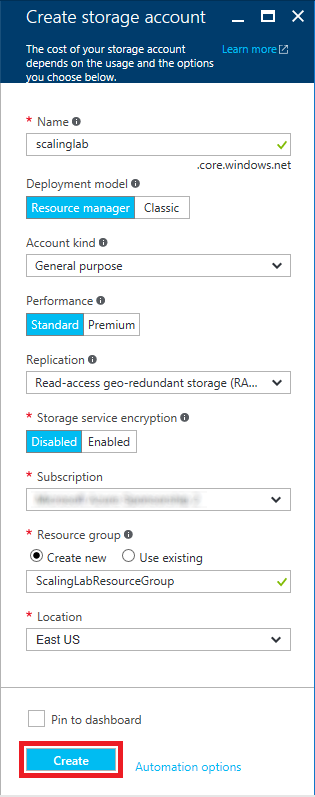
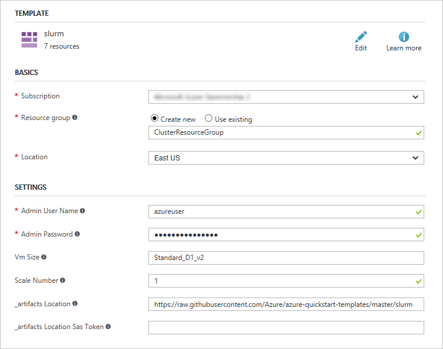
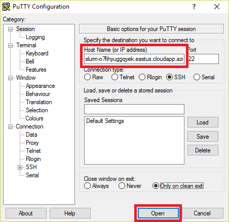
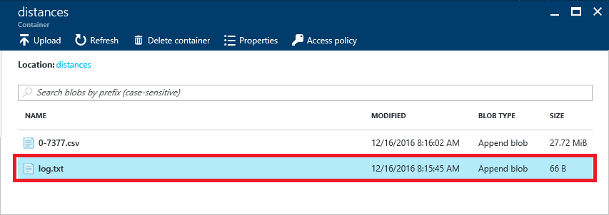
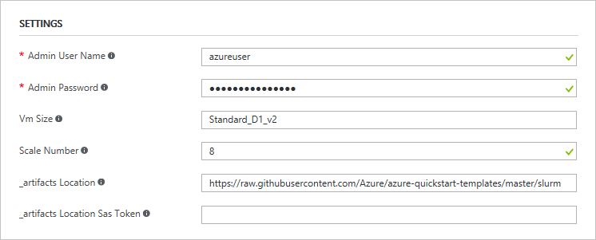

<a name="HOLTitle"></a>
# Virtual Machine Scaling and Performance #

---

<a name="Overview"></a>
## Overview ##

TODO: Add intoductory paragraph

The [Simple Linux Utility for Resource Management (SLURM)](https://slurm.schedmd.com/), also known as the SLURM Workload Manager, is a free and open-source job scheduler for Linux that excels at distributing heavy computing workloads across clusters of machines and processors. It is used on more than half of the world's largest supercomputers and High-Performance Computing (HPC) clusters, and it enjoys widespread use in the research community for jobs that require significant CPU resources.

Azure makes it easy to deploy SLURM clusters and size them to handle workloads large and small. In this lab, you will get first-hand experience deploying HPC clusters in Azure as well as managing and using the nodes in a cluster. And you will learn how easy it is to bring massive computing power to bear on problems that require it when you use the cloud. 

This lab uses SLURM to manage the calculations for a distance table with over 7,300 airports. The number of possible distances on a table is the square of the number of airports, meaning there are over 53 million possible distances. 


The distances are caculated over the [surface of a sphere](https://en.wikipedia.org/wiki/Great-circle_distance). These calculations requires a number of CPU intense, floating point operations per distance calculated. Using an HPC cluster can divide this workload among multiple CPU's to significantly speed up the time for calculation. This lab will compare using a single node to perform the calculations, a more powerful single node, and lastly a cluster of 8 nodes.

<a name="Objectives"></a>
### Objectives ###

In this hands-on lab, you will learn how to:

- Create a SLURM cluster using an Azure Resource Manager template
- Copy local resources to a SLURM cluster
- Remote into the nodes in a SLURM cluster
- Run jobs on a SLURM cluster
- Start and stop nodes in a SLURM cluster
- Use the Azure Resource Manager to delete a SLURM cluster

<a name="Prerequisites"></a>
### Prerequisites ###

The following are required to complete this hands-on lab:

- An active Microsoft Azure subscription, or [sign up for a free trial](https://azure.microsoft.com/en-us/free/)
- [PuTTY](http://www.chiark.greenend.org.uk/~sgtatham/putty/download.html) (Windows users only)

<a name="Exercises"></a>
## Exercises ##

- [Exercise 1: Create a storage account and configure Python scripts](#Exercise1)
- [Exercise 2: Deploy a compute cluster](#Exercise2)
- [Exercise 3 (macOS and Linux): Connect to and configure the cluster](#Exercise3)
- [Exercise 4 (Windows): Connect to and configure the cluster](#Exercise3)
- [Exercise 5: Run a job and view the results](#Exercise5)
- [Exercise 6: Delete the cluster](#Exercise6)
- [Exercise 7: Test with a cluster containing one worker nodes with eight CPUs](#Exercise7)
- [Exercise 8: Test with a cluster containing eight worker nodes with one CPU each](#Exercise8)
- [Exercise 9: Delete the storage account](#Exercise9)

Estimated time to complete this lab: **90 minutes**.

<a name="Exercise1"></a>
## Exercise 1: Create a storage account and configure Python scripts

In this exercise, you will use the [Azure Portal](https://portal.azure.com) to create a storage account. Then you will modify the scripts that you will run to compare the performance of various VM configurations so that they can use this account to store data in blob storage. 

1. Open the [Azure Portal](https://portal.azure.com) in your browser. If you are asked to log in, do so using your Microsoft account.
 
1. Click **+ New** in the ribbon on the left. Then click **Storage**, followed by **Storage account**.

    

    _Creating a storage account_

1. In the ensuing "Create storage account" blade, enter a name for the new storage account in **Name** field. The name is important, because it forms one part of the URL through which blobs created under this account are accessed.

	> Storage account names can be 3 to 24 characters in length and can only contain numbers and lowercase letters. In addition, the name you enter must be unique within Azure. If someone else has chosen the same name, you'll be notified that the name isn't available with a red exclamation mark in the **Name** field.

	Once you have a name that Azure will accept (as indicated by the green check mark in the **Name** field), make sure **Resource manager** is selected as the deployment model and **General purpose** is selected as the account kind. Then select **Create new** under **Resource group** and type "ScalingLabResourceGroup" (without quotation marks) into the box below to name the new resource group that will be created for the storage account. Finish up by selecting the location nearest you in the **Location** box, and clicking the **Create** button at the bottom of the blade to create the new storage account.
    
	

    _Specifying parameters for a new storage account_

1. After the account is created (it generally takes 30 seconds or so), click **Resource groups**, and then click the "ScalingLabResourceGroup" resource group that was created along with the storage account.

	

    _Opening the resource group_

1. Click the storage account that you created in Step 3.

	

    _Opening the storage account_

1. Click **Access keys** to display the storage account's access keys, and then click the **Copy** button to the right of the primary key to copy it to the clipboard.

	

    _Copying the access key_
 
1. Find **controller.py** in this lab's "resources" folder and open it for editing in the text or program editor of your choice.

1. In **controller.py**, replace *storage_account_name* on line 14 with the name of the storage account you created in Step 3, and replace *storage_account_key* on line 15 with the storage-account access key that is on the clipboard. Then save your changes and close the file.

	

    _Modifying controller.py_

1. Find **worker.py** in this lab's "resources" folder and open it for editing in the text or program editor of your choice.

1. In **worker.py**, replace *storage_account_name* on line 11 with the name of the storage account you created in Step 3, and replace *storage_account_key* on line 12 with the storage-account access key that is on the clipboard. Then save your changes and close the file.

You now have an Azure storage account that you can use in your tests as well as Python scripts that access the storage account. The next step is to deploy your first compute cluster for testing.

<a name="Exercise2"></a>
## Exercise 2: Deploy a compute cluster

The Azure Resource Manager allows you to provision applications using declarative templates. A template contains a complete description of everything that makes up the application, including virtual machines, databases, Web apps, IP addresses, and other resources. Templates can include parameters that users are prompted to fill in each time an application is deployed. Templates can also invoke scripts to initialize resources to a known and consistent state. To learn more about Azure Resource Manager templates, refer to the [documentation](https://azure.microsoft.com/en-us/documentation/articles/resource-group-template-deploy/) online.

In this exercise, you will use a deployment template built by the Azure team. This template creates a collection of virtual machines and all the resources required to form a SLURM HPC cluster from them. It is one of many useful templates on the [Azure Quickstart Templates](http://azure.microsoft.com/en-us/documentation/templates/) page and in the Quickstart templates [GitHub repository](https://github.com/Azure/azure-quickstart-templates).

The template you will use, which you can [view here](https://github.com/Azure/azure-quickstart-templates/tree/master/slurm) on GitHub, is titled "Deploy a slurm cluster." It performs the following steps:

- Deploys a master VM plus a specified number of worker VMs
- Creates a private network for the VMs (nodes) in the cluster
- Creates a public IP address for master node
- Creates an identical user account on all nodes
- Executes a shell script to configure SLURM on all nodes

Let's get started!

1. In your browser, navigate to https://github.com/Azure/azure-quickstart-templates/tree/master/slurm. In the middle of the page, click the **Deploy to Azure** button. This will load the template into a new instance of the Azure Portal. You may be asked to sign in again. If you are, sign in using your Microsoft account.

    

	_Deploying from GitHub_

1. Select **Create new** under **Resource group** and enter the resource-group name "ClusterResourceGroup" (without quotation marks). It is important NOT to use the same resource group you used for the storage account in Exercise 1, because when you delete the cluster in Exercise 6, you don't want to the storage account to be deleted, too.

	Select the location nearest you — the same one you selected for the storage account in Exercise 1 — under **Location**. Specify "azureuser" as the **Admin User Name** and "Azure4Research!" as the **Admin Password**. Leave **Vm Size** set to **Standard_D1_v2** and set **Scale Number** to **1** to create a cluster containing one master node and one worker node, each with a single CPU. Then check the **I agree to the terms and conditions stated above** box and click the **Purchase** button at the bottom of the blade.

	> It is very important to specify "azureuser" as the admin user name, because the scripts that you will use to configure the cluster use that user name.

    

	_Deploying the cluster_

1. Click **Resource groups** in the ribbon on the left. Then click the "ClusterResourceGroup" resource group created for the cluster.

    

	_Opening the resource group_

1. Wait until "Deploying" changes to "Succeeded," indicating that the cluster has been successfully deployed. It generally takes a few minutes for the deployment to complete.

	> Click the browser's **Refresh** button occasionally to update the deployment status. Clicking the **Refresh** button in the resource-group blade refreshes the list of resources in the resource group, but does not reliably update the deployment status.

    

	_Successful deployment_

With the cluster deployed, the next step is to connect to the cluster and configure it to run the scripts you prepared in Exercise 1. If you are running macOS or Linux, proceed to [Exercise 3](#Exercise3). Otherwise, if you are running Windows, skip to [Exercise 4](#Exercise4).

<a name="Exercise3"></a>
## Exercise 3 (macOS and Linux): Connect to and configure the cluster

In this exercise, you will upload the Python scripts that you modified in Exercise 1 and a pair of shell scripts to the master node of the cluster and use the shell scripts to configure the cluster.

1. In the list of resources that comprise the cluster in the cluster's resource-group blade, click **publicip**.

    

	_Opening the publicip resource_

1. Click the **Copy** button to the right of the DNS name to copy the master node's DNS name to the clipboard.

    

	_Copying the DNS name_

1. Open a terminal window and navigate to the directory containing the Python scripts you modified in [Exercise 1](#Exercise1).

1. Execute the following command in the terminal window, replacing _masterDNS_ with the DNS name on the clipboard. When prompted, enter the admin password for the cluster ("Azure4Research!").

	> Because this is the first time you have connected to the master node, you will be prompted with a security warning asking if you want to update the cached key. Since the host is one you created, answer yes.

    <pre>
    scp * azureuser@<i>masterDNS</i>:.</pre>

1. The next step is to establish an SSH connection to the master node. To do that, execute the command below in the terminal window, once more replacing _masterDNS_ with the DNS name on the clipboard. When prompted for a password, enter the password ("Azure4Research!") you entered into the deployment template in [Exercise 2](#Exercise2)

    <pre>
    ssh azureuser@<i>masterDNS</i></pre>

1. To be certain that the script files you uploaded to the cluster contain Linux-style line endings ("/r" rather than "/r/n"), execute the following command in the terminal window to install and run the dos2unix conversion program:

    ```
    sudo apt-get install dos2unix
    dos2unix *
    ```

1. Now execute the command below in the terminal window to configure the nodes in the cluster. It typically takes a few minutes for each node.

    ```
    sh setup.sh
    ```

The next task is to run a job on the cluster that you just configured. Since Exercise 4 is for Windows users only, proceed directly to [Exercise 5](#Exercise5).

<a name="Exercise4"></a>
## Exercise 4 (Windows): Connect to and configure the cluster

In this exercise, you will upload the Python scripts that you modified in Exercise 1 and a pair of shell scripts to the master node of the cluster and use the shell scripts to configure the cluster. To remote into the cluster, you'll use a popular Windows SSH client named PuTTY. If you haven't already installed PuTTY, [download the MSI](http://www.chiark.greenend.org.uk/~sgtatham/putty/download.html) and install it now.

1. In the list of resources that comprise the cluster in the cluster's resource-group blade, click **publicip**.

    

	_Opening the publicip resource_

1. Click the **Copy** button to the right of the DNS name to copy the master node's DNS name to the clipboard.

    

	_Copying the DNS name_

1. To copy files to the master node, you will use PuTTY's Secure Copy utility, pscp.exe. Open a Command Prompt window and navigate to the directory containing the Python scripts you modified in [Exercise 1](#Exercise1).
 
1. Execute the following command, replacing _masterDNS_ with the DNS name on the clipboard. When prompted, enter the admin password for the cluster ("Azure4Research!").

	> Because this is the first time you have connected to the master node, you will be prompted with a security warning asking if you want to update the cached key. Since the host is one you created, answer yes.

    <pre>
    pscp * azureuser@<i>masterDNS</i>:.</pre>

1. Start PuTTY (putty.exe) and paste the DNS name into the **Host Name (or IP address)** field. Then click the **Open** button to initiate a Secure Shell (SSH) connection.

    

    _Connecting with PuTTY_

1. A PuTTY terminal window will appear and you will be prompted to **login as**. Log in with the user name ("azureuser") and password ("Azure4Research!") you entered into the deployment template in [Exercise 2](#Exercise2).

1. To be certain that the script files you uploaded to the cluster contain Linux-style line endings ("/r" rather than "/r/n"), execute the following command in the PuTTY terminal window to install and run the dos2unix conversion program:

    ```
    sudo apt-get install dos2unix
    dos2unix *
    ```

1. Now execute the command below in the PuTTY terminal window to configure the nodes in the cluster. It typically takes a few minutes for each node.

    ```
    sh setup.sh
    ```

The next task is to run a job on the cluster that you just configured.

<a name="Exercise5"></a>
## Exercise 5: Run a job and view the results

In this exercise, you will run **controller.py** on the cluster's master node. **controller.py** performs the CPU-intensive task of computing the distances over a sphere between more than 7,300 airports, yielding more than 53 million distances in total. Rather than do the work on the master node, **controller.py** uses SLURM to delegate calculations to the worker nodes and divides the work into the number of "slices" specified in a command-line parameter. 

1. In the terminal window (macOS and Linux) or the PuTTY terminal window (Windows), execute the following command:

	```
	python3 controller.py 1
	```

	**controller.py** accepts one parameter that tells it how many jobs to delegate to SLURM. It divides the workload for building the distance table into equal proportions for each job, and uses SLURM to delegate the jobs to each of the nodes in the cluster. 

1. Return to the Azure Portal. Click **Resource groups** in the ribbon on the left, and then click the "ScalingLabResourceGroup" resource group containing the storage account you created in [Exercise 1](#Exercise1).

	

    _Opening the resource group_

1. Click the storage account found inside the resource group.

	

    _Opening the storage account_

1. Click **Blobs** to view a list of blob containers in the storage account.

    

	_Viewing blob containers_

1. Click **distances** to open the container named "distances." This container was created by the Pythin code you ran on the cluster.

    

	_Opening the blob container_

1. Click **log.txt** to open the blob containing the output from the job you ran on the cluster.

    

	_Opening the blob_

1. Click **Download** to download the blob and view its contents.

    

	_Downloading the blob_

1. Note the start time for the workload and the finish time for the last job to complete.

	Example: 

	````
	Starting: 2016-12-12 01:35:07
	Starting 0-3689:2016-12-12 01:35:09
	Starting 3690-7377:2016-12-12 01:35:09
	Finishing 3690-7377:2016-12-12 01:37:01
	Finishing 0-3689:2016-12-12 01:37:12
	````

	The difference between these two times is the time it takes to complete the workload. Keep this file handy to compare to Exercises 10 and 11.

TODO: Add closing paragraph.

<a name="Exercise6"></a>
## Exercise 6: Delete the cluster

When virtual machines are running, you are being charged — even if the VMs are idle. Therefore, it is advisable to delete virtual machines when they're not longer needed. In this exercise, you'll delete the cluster by deleting the resource group containing the cluster. Deleting the resource group deletes everything in it and prevents any further charges from being incurred for it.

1. In the [Azure Portal](https://portal.azure.com), click **Resource groups** in the ribbon on the left. Then click the "ClusterResourceGroup" resource group created for the cluster.

    

	_Opening the resource group_

1. Click the **Delete** button at the top of the blade.

	

	_Deleting the resource group_

1. For safety, you are required to type in the resource group's name. (Once deleted, a resource group cannot be recovered.) Type the name of the resource group. Then click the **Delete** button to delete all of the resources that comprise the cluster.

After a few minutes, the cluster and all of its resources will be deleted. Billing stops when you click the **Delete** button, so you're not charged for the time required to delete the cluster. Similarly, bulling doesn't start until a cluster is fully and successfully deployed.

<a name="Exercise7"></a>
## Exercise 7: Test with a cluster containing one worker node with eight CPUs

In this exercise, you will deploy a new cluster containing a single worker node with eight CPUs. Then you will run the same job on it and compare the performance of this cluster to the performance of the cluster containing a single worker node with one CPU.

1. Repeat Exercises 2-5, but this time, in Exercise 2, Step 2, set **Vm Size** to **Standard_D4_v2** and **Scale Number** to **1**.

	

	_Creating a cluster containing one worker node with eight CPUs_

1. Repeat Exercises 5 and 6, but use the following command to run the job in Exercise 5, Step 1:

	```
	python3 controller.py 8
	```

How long did it take for the job to run this time?

<a name="Exercise8"></a>
## Exercise 8: Test with a cluster containing eight worker nodes with one CPU each

In this exercise, you will deploy a new cluster containing eight worker nodes with one CPU each. Then you will run the same job on it and compare the performance of this cluster to the performance of the other two clusters. Note that it will take longer to deploy and configure the cluster this time due to the increased number of worker nodes.

1. Repeat Exercises 2-5, but this time, in Exercise 2, Step 2, set **Vm Size** to **Standard_D1_v2** and **Scale Number** to **8**. 

	

	_Setting the VM size_

1. Repeat Exercises 5 and 6, and use the following command to run the job in Exercise 5, Step 1:

	```
	python3 controller.py 8
	```

How long did it take for the job to run this time?

<a name="Exercise9"></a>
## Exercise 9: Delete the storage account

In this exercise, you will clean up the last of the lab's resources by deleting the resource group containing the storage account that you created in [Exercise1](#Exercise1).

1. In the [Azure Portal](https://portal.azure.com), click **Resource groups** in the ribbon on the left. Then click the resource group that you created in [Exercise1](#Exercise1).

	

    _Opening the resource group_

1. Click the **Delete** button at the top of the blade.

	

	_Deleting the resource group_

1. For safety, you are required to type in the resource group's name. (Once deleted, a resource group cannot be recovered.) Type the name of the resource group. Then click the **Delete** button to delete the resource group and the storage account that it contains.

After a few minutes, the resource group and all of its resources will be deleted.

<a name="Summary"></a>
## Summary

In this hands-on lab, you learned how to:

- Create a SLURM cluster using an Azure Resource Manager template
- Copy local resources to a SLURM cluster
- Remote into the nodes in a SLURM cluster
- Run jobs on a SLURM cluster
- Delete a SLURM cluster by deleting the resource group containing it

It is **much** easier to deploy a SLURM cluster in Azure than to install and configure a physical SLURM cluster. This is one of the ways in which cloud computing benefits researchers: it allows you to quickly and easily deploy the resources you need, *when* you need them, pay only for the resources you use, and delete them when they are no longer necessary.

----

Copyright 2016 Microsoft Corporation. All rights reserved. Except where otherwise noted, these materials are licensed under the terms of the MIT License. You may use them according to the license as is most appropriate for your project. The terms of this license can be found at https://opensource.org/licenses/MIT.