<a name="HOLTitle"></a>
# Microsoft Language Understanding Intelligent Service (LUIS) #

---

<a name="Overview"></a>
## Overview ##

One of the key challenges in the world of human-computer interactions is training a computer to understand spoken commands and discern the user's intent. For example, in a news reader or browsing app, a user might say "Find news about global warming," in which case the user *intends* to *find news* about *global warming*. However, implementing the logic to parse and understand even this simple phrase is an exceedingly difficult task, especially considering that phrases and intentions may be based on diverse languages and cultural concepts.  


 
Microsoft's [Language Understanding Intelligent Service](https://www.microsoft.com/cognitive-services/en-us/language-understanding-intelligent-service-luis), or LUIS for short, is designed to fill this need, making it extremely easy to deploy a model that takes sentences or *utterances* passed to it and interprets them by discerning intent and extracting *entities* such as "global warming". LUIS also lets you define sets of intentions and entities that are relevant to a specific application, which it can then use to provide guidance as a developer walks through the process of building a language understanding system. 

In this lab, you will create a LUIS application, configure a language understanding model using pre-built and custom entities, and define intents. Then you will use the model to build a bot experience using the Microsoft Bot Framework.

<a name="Objectives"></a>
### Objectives ###

In this hands-on lab, you will learn how to:

- Create a LUIS application
- Create and configure custom LUIS intents and entities
- Enhance LUIS intents with pre-built entities and phrase lists
- Train a LUIS model and publish to an HTTP endpoint
- Create a bot to access a LUIS model
- Integrate a LUIS model into a bot

<a name="Prerequisites"></a>
### Prerequisites ###

The following are required to complete this hands-on lab:

- An active Microsoft Azure subscription. If you don't have one, [sign up for a free trial](http://aka.ms/WATK-FreeTrial).
- Microsoft [Visual Studio Code](http://code.visualstudio.com) version 1.7.0 or higher
- Internet Explorer 10 or higher or [Google Chrome](https://www.google.com/chrome/) 

---

<a name="Exercises"></a>
## Exercises ##

This hands-on lab includes the following exercises:

- [Exercise 1: Create a LUIS application](#Exercise1)
- [Exercise 2: Configure intents and entities](#Exercise2)
- [Exercise 3: Add pre-built entities and phrase lists](#Exercise3)
- [Exercise 4: Train the model and publish to an HTTP endpoint](#Exercise4)
- [Exercise 5: Create a bot that uses the model](#Exercise5)
- [Exercise 6: Integrate the model into the bot](#Exercise6)
 
Estimated time to complete this lab: **60** minutes.

<a name="Exercise1"></a>
## Exercise 1: Create a LUIS application ##

The first step in creating an intelligent interaction model with LUIS is to provision an application in the [LUIS portal](https://www.luis.ai/). In order to use the portal, you must run it in Internet Explorer or Google Chrome. If you do not have one of these browsers available, stop now and [install Chrome](https://www.google.com/chrome/).

1. Open the [LUIS portal](https://www.luis.ai/) in Internet Explorer or Chrome. If you aren't already signed in, click **Sign in or create an account** and sign in with your Microsoft account. If you are prompted to "let this app access your info," review the permissions requested and click **Yes**. Additionally, if you are prompted to provide additional details such as the country you live in and the company you work for, fill in the information and click **Continue**.	

    

    _Signing in to LUIS_
 
1. Click **+ New App**, and then select **New Application**. 

    

    _Creating a LUIS application_
 
1. In the ensuing dialog, enter "Newsy" (without quotation marks) as the application name and specify **Bot** as the usage scenario. Check the **News & Magazines** box click the **Add App** button. 

    

    _Entering information about the application_
 
Your LUIS application is now provisioned and you are ready to start creating and configuring intents and entities.

<a name="Exercise2"></a>
## Exercise 2: Configure intents and entities ##

The next step is to configure your LUIS application by creating intents and entities. Intents represent actions such as "search" or "find," while entities describe a target for an intent. In this exercise, you will create a simple intent for searching the news and an entity to specify the type of news to search for, such as "soccer" or "Microsoft Surface."

1. Click **+** to the right of **Intents** to add an intent.

    

    _Adding an intent_
 
1. Enter "SearchNews" (without quotation marks) for the intent name, and type "Find soccer news" (again, without quotation marks) into box below. Then click the **Save** button.

    

    _Saving the intent_

1. Click **+** to the right of **Entities** to add an entity.

    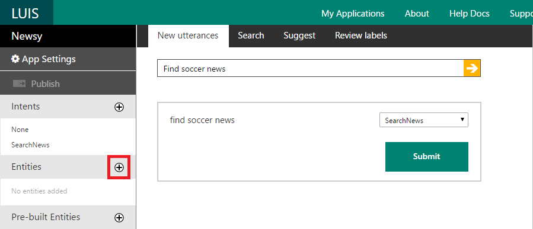

    _Adding an entity_ 

1. Enter "NewsCategory" (without quotation marks) as the entity name. Then click the **Save** button.
 
    

    _Saving the entity_ 

1. To connect the NewsCategory entity to the SearchNews intent, click the word "soccer" and select **NewsCategory** from the popup menu. Then click the **Submit** button.
 
    

    _Connecting an entity to an utterance_

	The phrase "Find soccer news" is now associated with the SearchNews intent, and LUIS will understand the word “soccer” as the target of your action. In order for LUIS to train the model successfully, it needs a few more sample utterances.
	
1. Type "Get soccer news" into the box in the "New utterances" panel and click the **arrow**.
 
    

    _Adding an utterance_	 

1. Select **SearchNews** from the drop-down list of intents.

    

    _Selecting an intent_	 

1. Click the word "soccer" and select **NewsCategory** from the popup menu. Then click the **Submit** button.
 
    

    _Connecting an additional entity to an utterance_

1. Repeat steps 6 through 8, making certain you select **SearchNews** from the intent drop-down, with the following sample phrases (without quotation marks) to populate your LUIS application with enough information to properly train the model:

	- "Get motorcycle news"
	- "Find motorcycle news"
	- "Get tornado news"
	- "Find tornado news"

1. Review the utterances you have defined by clicking **Review labels** and selecting **Show all labeled utterances** from the drop-down list. Confirm that all entries are assigned to the SearchNews intent and have a yellow-highlighted entity.
 
    

    _Reviewing labeled utterances_

1. Click **Train** in the lower-left corner of the page. After a few seconds, the message "Last train completed" followed by a timestamp will appear. 
 
    

    _Training a LUIS model_

Your LUIS application is now configured to understand phrases such as "Get soccer news" and to discern that the user wants to search news for the term "soccer." LUIS is smart enough now to know that a phrase such as "Find hockey news" also represents an intent to search news, but for news regarding hockey even though you haven't explicitly trained the model with that term. Your LUIS model is now ready to be configured to support more advanced scenarios, such as identifying terms from a specific list of news categories.

<a name="Exercise3"></a>
## Exercise 3: Add pre-built entities and phrase lists ##

Now that LUIS understands some basic intentions and phrases, it's time to make the model even more intelligent by leveraging pre-built entities and phrase lists. In this exercise, you will add the pre-built encyclopedia entity to your intents, and add a phrase list for refining news results by category.

1. Click **+** to the right of "Pre-built Entities" to display a list of pre-built entities.
 
    

    _Showing pre-built entities_ 

1. Scroll down and select **encyclopedia**. Then click the **OK** button. A new pre-built entity named "encyclopedia" will be added to the list.
 
    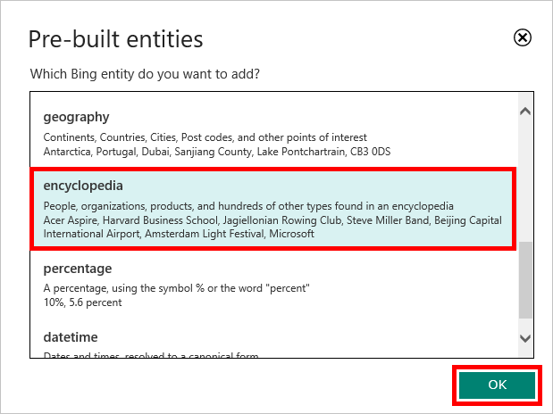

    _Adding the Encyclopedia entity_ 

1. Click **+** to the right of "Phrase List Features" to add a new phrase list.
 
    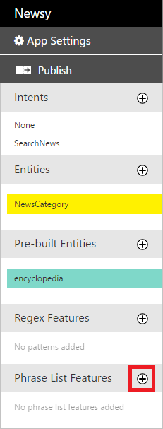

    _Adding a phrase list_ 

1. Type "NewsCategory" (without quotation marks) for the feature name. Enter the comma-delimited list below, and then click the **Save** button.

	```
	Business,Entertainment,Health,Politics,ScienceAndTechnology,Sports,US,World 
 	```

    

    _Saving the phrase list_ 

1. Now that you have added an encyclopedia entity and phrase list, it is time to create a couple more intents to help LUIS understand whether a user wants to search news by using an encyclopedia entity such as "Super Bowl" or "World War," or using a more general category such as "Health" or "Politics." Begin by clicking **SearchNews** in the list of intents.
 
    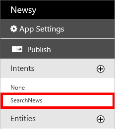

    _Opening the SearchNews intent_ 

1. Click **+ Add Action**. Then click **+ Add Parameter**. Enter "Encyclopedia" as the parameter name and select **encyclopedia** in the drop-down list labeled "Type." Then click the **Save** button.

    

    _Adding an action_ 

1. Click **+** to the right of "Intents" to add an intent.
 
    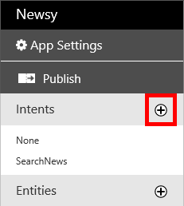

    _Adding another intent_ 

1. Enter "SearchNewsByCategory" for the intent name and "Find Super Bowl news" as an example of a command that triggers the intent. Then click **+ Add Action**, followed by **+ Add Parameter**. Under "Action Parameters," check the **Required** box, enter "NewsCategory" as the parameter name, select **NewsCategory** for both **Type** and **Value**, and enter "Please specify a category" for the prompt. Then click the **Save** button.

    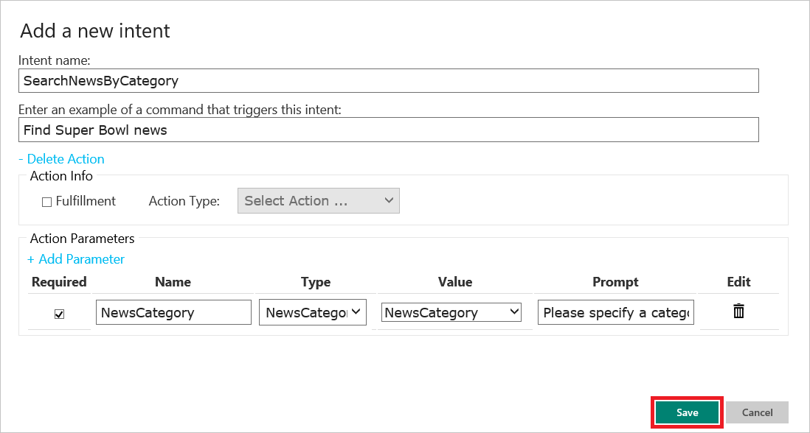

    _Saving the intent_ 
 
1. Notice that the phrase "find super bowl news" is now displayed, with the term "super bowl" highlighted and "SearchNewsByCategory" selected as the intent. LUIS was smart enough to understand the term "super bowl" as an encyclopedia entry. Click the **Submit** button to add this entry to your model. 

    

    _Saving the new utterance_ 

1. Type "Get Health news" into the box and click the **arrow**.

    

    _Searching for an utterance_ 


1.  Select **SearchNewsByCategory** from the drop-down list of intents. Click the word "health" and select **NewsCategory** to connect the two. Then click the **Submit** button.
 
    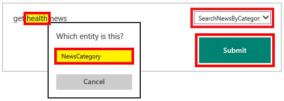

    _Saving the new utterance_ 

1. Click **Train** in the lower-left corner of the page to train the model. 
 
Your LUIS model has now been enhanced with a pre-built entity and a phrase list, and can understand most typical phrases relating to finding news based on various terms. Let's see how LUIS interprets this information and publish the model to make it available for use.

<a name="Exercise4"></a>
## Exercise 4: Train the model and publish to an HTTP endpoint ##

Before your LUIS model can be accessed via an application, you need to ensure your model is up-to-date by training it one more time and then publishing the model to a location accessible to your application.

To train and publish your model:

1. Open the [LUIS Application portal](https://www.luis.ai/ "LUIS Application portal"), if not already signed in from Exercise 1. If asked to login, do so with your Microsoft account.
1. Click **Newsy** in the application list. You will be redirected to the LUIS application page for the Newsy application created in Exercise 1.
 
    

    _Selecting the Newsy application_

1. Click **Train** at the bottom left corner of the LUIS application panel. After a delay of a few seconds a status label stating “Last train completed” and timestamp will appear.
   
    

    _Training a LUIS model_

1. Click **Publish** at the top left corner of the LUIS application to display the “Publish Current Application to URL” dialog.
 
    

    _Clicking Publish_
 
    

    _The LUIS application Publish dialog_


1. Click the **Publish web service** button. 
 
    

    _Publishing to an HTTP endpoint_

	After a short delay the dialog will expand to reveal both a “Query” entry as well as a clickable link to test queries against your model. 

1. Enter “Find Super Bowl news” in the **Query** entry and then click the **link** below.
 
    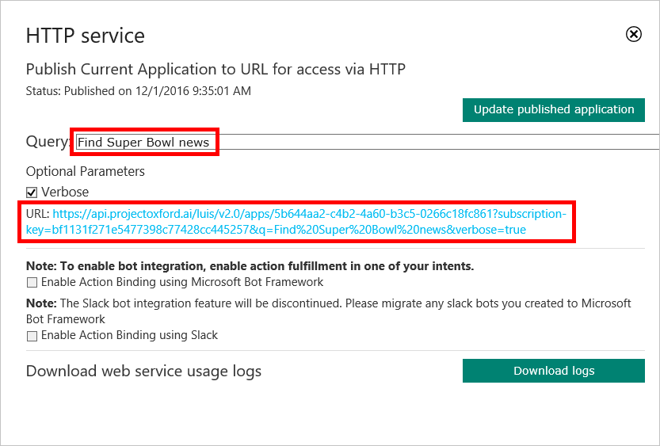

    _Querying a LUIS endpoint_
	
	This emulates calling the HTTP endpoint and displays the results in JSON format for review. Notice LUIS returns an intent as “SearchNews” as well as an entity of “super bowl” in the result. 

    

    _LUIS query test results in JSON format_
	
1. Enter “Get Health news” in the **Query** entry and then click the **link** below one more time.
 
    

    _Re-querying a LUIS endpoint_

	 Notice LUIS is smart enough to return an intent as “SearchNewsByCategory” as well as an entity of “health” in the result. This occurs due to the addition of the phrase list attached to the SearchNewsByCategory intent.

    

    _LUIS re-query test results in JSON format_
	
In this exercise, you performed a final training on your LUIS model, as well as publishing and testing access to your model via an HTTP endpoint. You can now integrate your model into an application with confidence, knowing LUIS will understand a user’s intent when searching for news.

<a name="Exercise5"></a>
## Exercise 5: Create a bot that uses the model ##

Now that your LUIS model is published and available for use in applications, it’s time to start building an application to demonstrate the beauty of LUIS. For this exercise, you’ll be creating a bot in Visual Studio Code, that runs locally on your computer using the Microsoft Bot Framework. If you haven’t installed Visual Studio Code, you will need to do so before continuing with this exercise.

Once you have confirmed you have Visual Studio Code installed you can start building your bot:

1. Start Visual Studio Code and open the Integrated Terminal by clicking **View** > **Integrated Terminal** in the VS Code menu. The TERMINAL windows will appear at the bottom of your environment workspace.
 
    

    _Opening the Integrated Terminal_

    

    _The Integrated Terminal window_

1. In the TERMINAL window type “md Newsy” and hit the **enter key** on your keyboard. A new folder named Newsy has been created.
 
    

    _Executing md Newsy_

1. Type “cd Newsy” in the TERMINAL window, and hit the **enter key** on your keyboard to navigate to the new "Newsy" folder.

    

    _Executing cd Newsy_

1. Type “code .” [the word code, followed by a space and period) to open VS Code in your new folder location. 

    

    _Opening a new instance of Visual Studio Code_

	A new instance of VS Code will start. You will be working in this instance of VS Code for the remainder of the exercises.

    

    _The new Newsy project_

1. In the Explorer, click the **New File** icon to the right of the NEWSY heading to create a new file, and then type “app.js” (without quotation marks) in the new line item in Explorer and hit the **enter key** on your keyboard.

    

    _Adding a new project file_

    

    _The new app.js file_

	A new app.js file has been created. This file will contain the code for your bot.

1. Enter the following single line of code at the top of your new app.js file: 

	```
	console.log("Welcome to Newsy!");
	```

1. From the Visual Studio code menu, open the Integrated Terminal again by clicking **View** > **Integrated Terminal**. 
 
    

    _Opening the Integrated Terminal_

1. In the TERMINAL window, execute the following command to install the Microsoft Bot Builder SDK:

```
npm install --save botbuilder
```	

1. Now execute this command in the TERMINAL window to install the packages needed to leverage REST-based messaging routes in your code:

```
npm install --save restify
```	 

1. Execute the following command in the TERMINAL window to run the application and output "Welcome to Newsy!":

```
node app.js
```	

To finish configuring your bot project we need to add the configuration values generated by your LUIS application in Exercise 1. You will be adding these values to an auto generated configuration file. 

To automatically generate your bot project configuration file:

1.	Click the Visual Studio Code **Debug** tab to open the DEBUG panel.

    

    _Selecting the Debug tab_	

1.	Click the **DEBUG** (green arrow) in the top panel menu and then select **Node.js** from the “Select Environment” drop down. A new launch.json file will be automatically created with default values for deployment and debugging. A message will appear alerting you to setup the launch configuration file for this project. Click the **Close** button.
	
    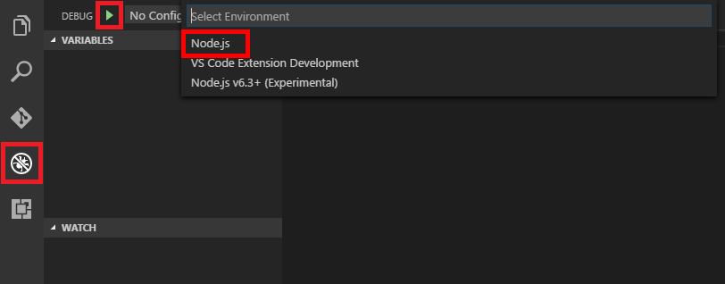

    _Creating a new launch file_	
	
    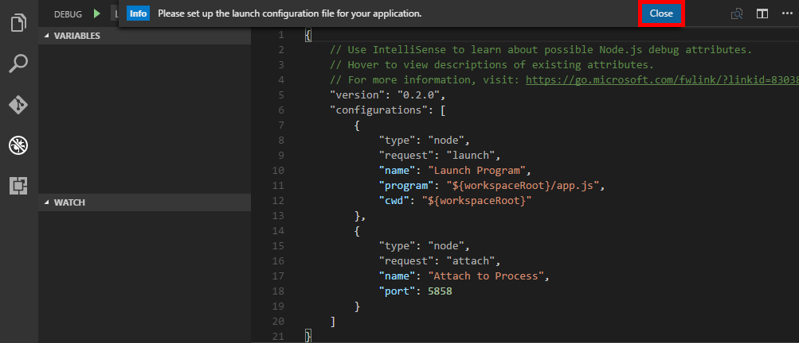

    _Acknowledging creation of a newly created launch.json file_	

1.	Locate the “cwd” node and enter **a comma** (**,**) at the end of this line, and then enter the following code directly below the “cwd" line to add console support for  the integrated terminal:		

	```
	"console": "integratedTerminal"  
	```
	
    

    _Adding the launch file console node_	

1. Close the new launch.json file by selecting **File** > **Close Editor** from the Visual Studio Code menu. If prompted to save changes, click **Save**.
	
    

    _Closing the Visual Code editor window_	

Your bot project is now setup and configured and you’re ready to write code to demonstrate communication between a user and your bot. The next step is to write code to access your LUIS model endpoint and send the information to a news service to return search results to a user, creating a more provide a more meaningful human to computer experience.

<a name="Exercise6"></a>
## Exercise 6: Integrate the model into the bot ##

The entire goal of creating a bot is to have intelligent, automated interactions with users. Now that all the configuration and project setup is complete, you can start writing code for your bot to listen for user input, send the information to LUIS for analysis, and then search a news service based on LUIS suggestions.

To add bot communication and LUIS suggestion code logic to your bot:

1. Open Visual Studio Code, or return to it if Visual Studio Code is still open from the previous exercise.
1. In the Visual Studio Code Explorer, select the **app.js** file created in the previous exercise. The file contents will open in the Editor window.
 
    

    _Opening the app.js file_	

1. Replace the entire contents of the file with the following code:

	```JavaScript
	var builder = require('botbuilder');
	var https = require('https');
	var querystring = require('querystring');
	
	var connector = new builder.ConsoleConnector().listen();
	var bot = new builder.UniversalBot(connector);
	
	var luisAppId = "ae91e38d-4167-4a84-a359-d9bd864fdd69";
	var luisSubscriptionKey = "bf1131f271e5477398c77428cc445257";
	
	bot.dialog('/', [
	
	    function (session) {
	
	        if (session.userData.intent == null) {
	            builder.Prompts.text(session, "Welcome to Newsy! Try typing something like 'Find health news'.");
	        }
	        else {
	            builder.Prompts.text(session, "Try typing something like 'Find health news'.");
	        }
	    },
	
	    function (session, results) {
	
	        session.userData.searchQuery = results.response;
	        var searchQuery = querystring.escape(session.userData.searchQuery);
	        var searchQueryString = "";
	
	        processLuisResults(session, searchQuery, searchQueryString);
	    }
	
	]);
	
	var processLuisResults = (function (session, searchQuery, searchQueryString) {
	
	    //CALL LUIS APPLICATION
	    var optionsLuisGet = {
	        host: 'api.projectoxford.ai',
	        port: 443,
	        path: '/luis/v2.0/apps/' + luisAppId + '?subscription-key=' + luisSubscriptionKey + '&q=' + searchQuery + '&verbose=true',
	        method: 'GET'
	    };
	
	    var reqGet = https.request(optionsLuisGet, function (res) {
	        res.on('data', function (luisResults) {
	
	            var luisResult = JSON.parse(luisResults.toString());
	            session.userData.intent = luisResult.intents[0].intent.toString();
	
	            if (luisResult.topScoringIntent.intent == "None") {
	                session.send("I'm not quite sure what you mean by '" + session.userData.searchQuery.toUpperCase() + "'");
	            }
	            else {
	
	                if (luisResult.topScoringIntent.actions[0].parameters[0].value != null) {
	                    session.userData.entity=luisResult.topScoringIntent.actions[0].parameters[0].value[0].entity;
	                }
	                else {
	                    session.userData.entity = luisResult.entities[0].entity.toString()
	                }               
	
	                switch (session.userData.intent) {
	                    case "FindNews":
	                        searchQueryString = 'searchQuery=' + querystring.escape(session.userData.entity);
	                        break;
	                    case "FindNewsByCategory":
	                        searchQueryString = 'category=' + querystring.escape(session.userData.entity);
	                        break;
	                    default:
	                        searchQueryString = 'searchQuery=' + querystring.escape(session.userData.entity);
	                        break;
	                }
	
	                session.send("Here's some news about " + session.userData.entity.toUpperCase() + " for you:");
	
	                //SEND DERIVED LUIS INTENT OVER TO BING SEARCH
	                showNewsResults(session, searchQueryString);
	            }
	
	        });
	    });
	
	    reqGet.end();
	    reqGet.on('error', function (e) {
	        session.send(e.toString());
	    });
	    //END CALL LUIS APPLICATION
	});
	
	var showNewsResults = (function (session, searchQueryString) {
	
	    //CALL BING NEWS SEARCH
	    var optionsSearch = {
	        host: 'traininglabservices.azurewebsites.net',
	        port: 443,
	        path: '/api/News?' + searchQueryString,
	        method: 'GET'
	    };
	
	    var reqGet = https.request(optionsSearch, function (res) {
	        res.on('data', function (newsResults) {
	
	            var newsResult = JSON.parse(newsResults.toString());
	
	            for (var result in newsResult) {
	                val = newsResult[result];
	                var title = val.Title;
	                var description = val.Description;
	
	                session.send(title + "\r\n" + description);
	            }
	
	        });
	    });
	
	    reqGet.end();
	    reqGet.on('error', function (e) {
	        session.send(e.toString());
	    });
	    //END BING NEWS SEARCH   
	
	});
	```	
 
    

    _The updated app.js file_		


Review the code and observe the use of the Microsoft Bot Framework Bot Builder prompt actions to welcome a user to your bot, conveniently built into the framework, as well as simple HTTP endpoint calls to access your LUIS model. 

Before you can test your new bot, you need to update your code to specify the LUIS App ID and LUIS Subscription ID automatically generated for you in Exercise 1 when you created your LUIS application. These values can be found at the LUIS Application portal.

To access your LUIS App ID and Subscription ID:

1. Open the LUIS application portal, if not already signed in from Exercise 1. Click the **Sign in or create an account button**. Select **Sign in using a Microsoft account**. If asked to login, do so with your Microsoft Account.
1. Click **Newsy** in the application list. You will be redirected to the LUIS application page for the Newsy application created in Exercise 1.
 
    

    _Selecting the Newsy application_
 
1. Click **App Settings** at the top right corner of the portal. The application settings for your Newsy application will be displayed.
 
    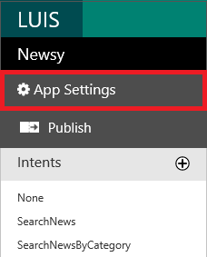

    _Selecting LUIS application App Settings_
 
    

    _LUIS application App Settings_ 
 
1. Copy the unique identifier value to the right of the “App Id” label in the “General Settings” section to your clipboard. This is your LUIS application App ID.
 
    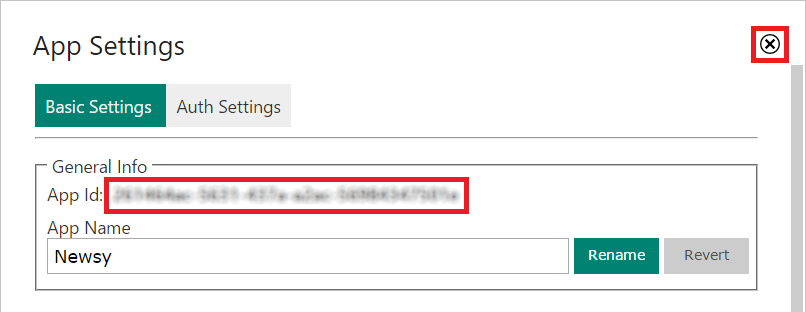

    _Selecting the LUIS application App Id_
 
1. Return to your Visual Studio Code environment, and locate the “[LUIS_APP_ID]” value on or about line 8. Highlight and paste the value from the previous step to replace this value.
 
    

    _Pasting the LUIS application App Id from the clipboard_

1. Return to the LUIS Application portal and click your display name to the right of the gear icon in the top right corner of the portal to display the “My Settings” page.
 
    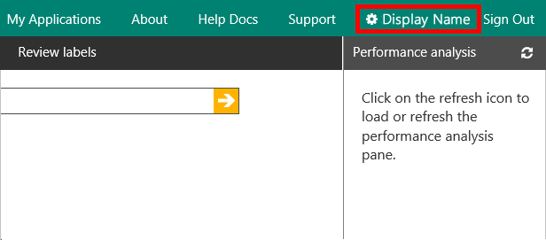

    _Accessing LUIS account settings_

1. Copy the unique identifier value directly below the right of the “Programmatic API Key” label to your clipboard. This is your LUIS Subscription ID.
 
    

    _Selecting the LUIS Subscription Id_
 
1. Return to your Visual Studio Code environment, and locate the “[LUIS_SUBSCRIPTION_ID]” value on or about line 9. Highlight and paste the value from the previous step to replace this value.
 
    

    _Pasting the LUIS Subscription Id from the clipboard_

That’s it! Your bot application is now fully configured to access your LUIS model. To run the Newsy bot to sample real user interaction:

1. Open the Integrated Terminal by clicking **View** > **Integrated Terminal** in the VS Code menu. The TERMINAL window will appear at the bottom of your environment workspace.
1. At the prompt, type “node app.js” (without quotation marks) and hit **enter on your keyboard**. Your bot is now running and listening for interaction.
 
    

    _Running the Newsy bot to start listening for interaction_

1. Type “hello” (again, without quotation marks) to “wake up” your bot. Newsy will now begin a new conversation by recommending a phrase.
 
    

    _Waking up the Newsy bot_

1. Type a request using similar language to the utterances you labeled in Exercise 2, such as “Find soccer news” or “Get Health news” (without quotation marks.) 
 
    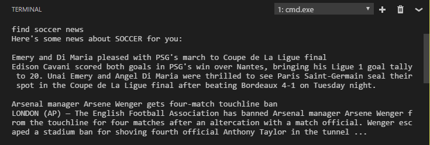

    _Asking Newsy to find news_

1. After a short delay a list of up to five (5) relevant news article and descriptions will appear in the TERMINAL window.
 
    

    _Viewing news results after sending a request to LUIS_

1. You can repeat this process as many times as you’d like, by typing in “hello” after news results are displayed, and then typing in additional utterances. You can even try something like “Find some great Microsoft news”. Notice how LUIS understand what you’re really asking for, and sends only the important keywords (entities) over to the news search service.
 
    

    _Viewing intelligent LUIS predictions_

In this exercise, you’ve written a locally running bot that leverages built in features of the Microsoft Bot Framework, and added additional code to access all the intelligence of LUIS via the model you created, trained, and published in earlier exercises. You have also run your bot within the terminal to experience the flow of the conversation and the way LUIS intelligently analyzes human language and responds with what results based on the most likely intentions.

<a name="Summary"></a>
## Summary ##

In this hands-on lab you learned how to:

- Create a LUIS application
- Create and configure custom LUIS intents and entities
- Enhance LUIS intents with pre-built entities and phrase lists
- Train a LUIS model and publish to an HTTP endpoint
- Create a bot to access a LUIS model
- Integrate a LUIS model into a bot

This is just a beginning, as there’s a whole lot more you can do to leverage the power of the Microsoft Language Understanding and Intelligent Services. Start experimenting with other LUIS features, especially intent dialogs and more complex models using other pre-built entities to create truly “intelligent” human to computer interactions in your applications.

----

Copyright 2016 Microsoft Corporation. All rights reserved. Except where otherwise noted, these materials are licensed under the terms of the MIT License. You may use them according to the license as is most appropriate for your project. The terms of this license can be found at https://opensource.org/licenses/MIT.