<a name="HOLTitle"></a>
# The Microsoft Bot Framework #

---

<a name="Overview"></a>
## Overview ##

Software bots are everywhere. You probably interact with them every day without realizing it. Bots, especially chat and messenger bots, are changing the way we interact with businesses, communities, and even each other. Thanks to light-speed advances in artificial intelligence (AI) and the ready availability of AI services, bots are not only becoming more advanced and personalized, but also more accessible to developers. 

Regardless of the target language or platform, developers building bots face the same challenges. Bots require input and output capabilities. Bots need language and dialog logic. Bots need to respond to questions with appropriate answers, and bots need to be responsive, scalable, and extensible. They need to work cross-platform, and they need to interact with users in a conversational manner and in the language the user chooses. The [Microsoft Bot Framework](https://dev.botframework.com/) combined with [Microsoft QnA Maker](https://qnamaker.ai/) provides the tools developers need to build, connect, manage, and publish intelligent bots that interact naturally with users using a range of services. 

In this lab, you will create a bot using Visual Studio Code and the Microsoft Bot Framework, and populate a knowledge base using Microsoft QnA Maker. Then you will interact with the bot using Skype — one of many popular services that can integrate with bots built with the Microsoft Bot Framework.

<a name="Objectives"></a>
### Objectives ###

In this hands-on lab, you will learn how to:

- Create an Azure Bot Service to register and host a bot
- Create a Microsoft QnA Service to populate a knowledge base
- Setup continuous code integration to publish bot code
- Debug the bots that you build
- Update your bot using Visual Studio Code, Node.js, and JavaScript
- Interact with a bot using Skype

<a name="Prerequisites"></a>
### Prerequisites ###

The following are required to complete this hands-on lab:

- An active Microsoft Azure subscription. If you don't have one, [sign up for a free trial](http://aka.ms/WATK-FreeTrial).
- [Visual Studio Code](http://code.visualstudio.com) 
- [Git Client](https://git-scm.com/downloads)
- [Node.js](https://nodejs.org)
- [Microsoft Bot Framework Emulator](https://emulator.botframework.com/)
- [Skype](https://www.skype.com/en/download-skype/skype-for-computer/)

---

<a name="Exercises"></a>
## Exercises ##

This hands-on lab includes the following exercises:

- [Exercise 1: Create an Azure Bot Service](#Exercise1)
- [Exercise 2: Update Microsoft QnA Service settings](#Exercise2)
- [Exercise 3: Populate and publish a QnA knowledge base](#Exercise3)
- [Exercise 4: Set up continuous integration](#Exercise4)
- [Exercise 5: Debug your bot](#Exercise5)
- [Exercise 6: Update your bot](#Exercise6)
- [Exercise 7: Test your bot](#Exercise7)
 
Estimated time to complete this lab: **60** minutes.

<a name="Exercise1"></a>
## Exercise 1: Create an Azure Bot Service ##

The first step in creating a bot is to provide a location for the bot to be hosted, as well as configuring the services that will be used by your bot for authorization. Azure Web Apps are perfect for hosting bot applications, and the Azure Bot Service is designed to provision and connect these services for you. In this exercise, you will create and configure an Azure Bot Service.

1. Open the [Azure Portal](https://portal.azure.com) in your browser. If you are asked to sign in, do so using your Microsoft account.

1. Click **+ New**, followed by **Intelligence + Analytics** and then **Bot Service (preview)**.
 
    

    _Creating a new Azure Bot Service_
  
1. Enter a name such as "qnafactbot" (without quotation marks) into the **App name** box. *This name must be unique within Azure, so make sure a green check mark appears next to it.* Make sure **Create new** is selected under **Resource Group** and enter the resource-group name "BotsResourceGroup" (again, without quotation marks). Then select the location nearest you and click **Create**. 

    

    _Configuring a new Azure Bot Service_
  
1. Click **Resource Groups** in the ribbon on the left, followed by **BotsResourceGroup** to open the resource group created for the Bot Service.

	> Click the browser's **Refresh** button to update the deployment status. Clicking the **Refresh** button in the resource-group blade refreshes the list of resources in the resource group, but does not reliably update the deployment status.

    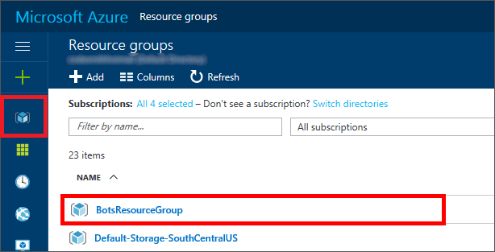

    _Opening the resource group_
  
1. Wait until "Deploying" changes to "Succeeded" indicating that the Bot Service was successfully deployed.

    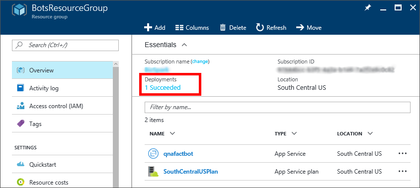

    _Successful deployment_
  
1. Click **qnafactbot** (or the name you entered in Step 3) to open the App Service created for your bot.

    

    _Opening the Bot Service_
  
1. Click **Create Microsoft App ID and password**. If you are asked to sign in again, do so using your Microsoft account.

    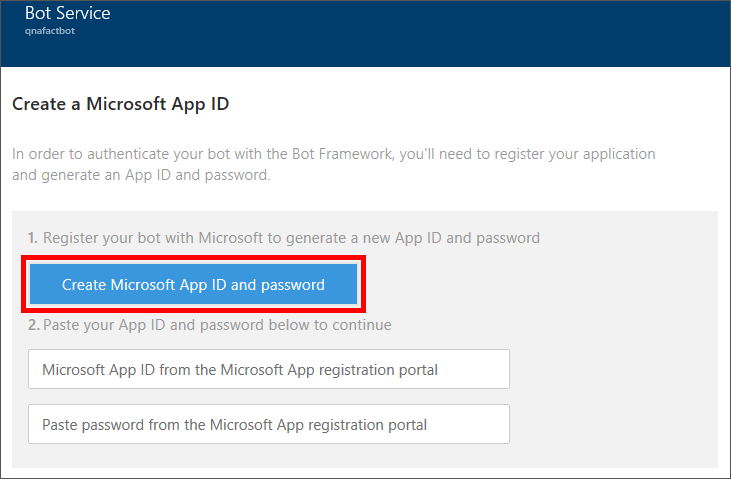

    _Creating an app ID and password_
  
1. Click **Generate an app password to continue**.

    

    _Generating an app password_
  
1. Copy the password to the clipboard. **You will not be able to retrieve this password after this step**, but will be required to use it in a later exercise. Once the password is saved, click **Ok** to dismiss the dialog.

    

    _Copying the app password_
  
1. Review the application registration information, and then click **Finish and go back to Bot Framework**.

    

    _Finalizing the app registration_
  
1. Paste the password copied to the clipboard in Step 9 into the password box.

    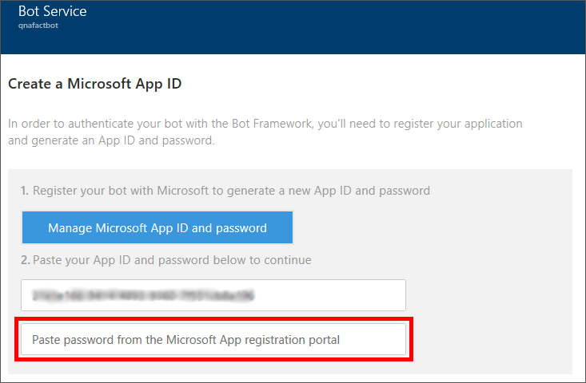

    _Pasting the app password_
  
1. Click **NodeJS**. Then click **Question and Answer** and click **Create bot**. If you are asked to sign in again, do so using your Microsoft account. Also, if you are asked for permission for QnA Maker to access your info, click **Yes**.

    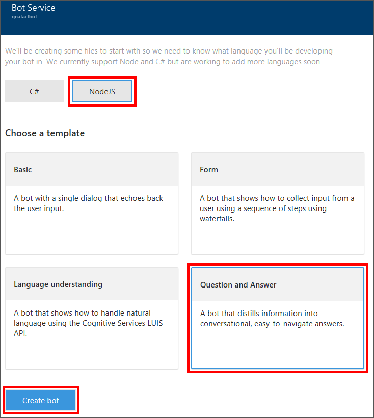

    _Selecting a language and template_

1. Check the **I agree** box, and then click **OK**. (If you are presented with the option of connecting to an existing knowledge base or creating a new one, choose the latter.) 

    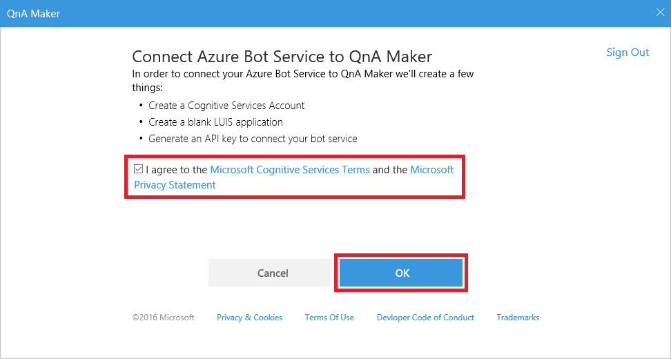

    _Connecting to QnA Maker_
  
1. After a brief pause, the Bot Service will open in the portal and display the Bot Service editor, as pictured below. The Bot Service has now been created, and the following services have been provisioned and configured:

	- A Microsoft Bot registration
	- A Microsoft App registration
	- An Azure App Service
	- A Microsoft QnA Maker service

    

    _The Bot Service editor_  

1. To make sure these services can communicate with each other, you can test bot communication in the Azure Bot Service editor. To test, type the word "hi" (without quotation marks) into the chat window on the right side of the page. Then press **Enter** or click the paper-airplane icon (which stands for "Send").

    

    _Testing bot communication_

1. Wait for the bot to respond with the word "hello," indicating your bot is configured and ready to go.

    

    _Chatting with your bot_

With the Bot Service deployed and configured, the next step is to update Microsoft QnA Maker settings.

<a name="Exercise2"></a>
## Exercise 2: Update Microsoft QnA Service settings ##

Although your bot has been created, it can only understand the word "hi" by responding with the word "hello". To understand where your bot is getting this information, it's time to start working in the Microsoft QnA Maker portal.

1. Open the [Microsoft QnA Maker portal](https://qnamaker.ai/) in your browser. If you are not signed in, click **Sign in** in the upper-right corner and sign in with your Microsoft account. If you are presented with a terms agreement, check the **I agree** box and continue. 

    

    _Signing in to the QnA Maker portal_

1. Ensure that **My services** is selected at the top. Then click the pencil icon.
 
    

    _Editing a Microsoft QnA service_

1. Click **Settings**.
 
    

    _Opening the Settings page_

1. Replace the value in the **Service name** box with "QnA Factbot" (without quotation marks). Then click **Save and retrain** to save the change. 
 
    

    _Updating the service name_

1. Click **Knowledge Base**.
 
    

    _Opening the Knowledge Base page_

1. Replace "hello" in the Answer column with "Welcome to the QnA Factbot!" Then click **Save and retrain** to save the change. 
 
    

    _Updating a response_

1. Click **Test**.
 
    

    _Opening the Test page_

1. Type "hi" into the box at the bottom of the chat window and press **Enter**. Confirm that the bot responds with "Welcome to the QnA Factbot!"
 
    

    _Chatting with the bot_

This is a great start, but a simple reply to the greeting "hi" doesn't demonstrate a lot of value. To give your bot some meaningful content to work with, the next step is to populate the knowledge base with more questions and answers.

<a name="Exercise3"></a>
## Exercise 3: Populate and publish a QnA knowledge base ##

You can enter questions and answers into a QnA Maker knowledge base manually, or you can import them from a variety of sources, including Web sites and local text files. In this exercise, you will use each of these techniques to populate the knowledge base with questions and answers and then publish it for your bot to use.

1. Click **Settings** to the return to the Settings page in the [Microsoft QnA Maker portal](https://qnamaker.ai/).
 
    

    _Opening the Settings page_

1. Paste the following URL into the **URLs** box:

	```
	https://traininglabservices.azurewebsites.net/help/faqs.html
	```

1. Click **Save and retrain** to populate the knowledge base with questions and answers from the Web site whose URL you provided.
 
    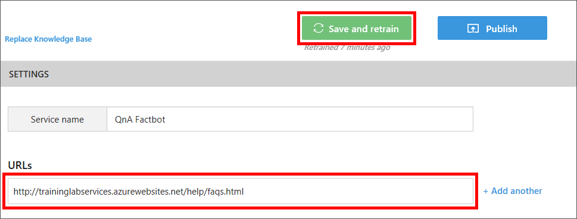

    _Populating the knowledge base with questions and answers_

1. Click **Knowledge Base** and confirm that six new questions and answers were added. Then click **Save and retrain** to save the changes.

    

    _The updated knowledge base_

1. Click **Test** to return to the Test page. Type "What's the largest city in the world?" into the box at the bottom of the chat window and press **Enter**. Confirm that the bot responds as shown below.
 
    

    _Testing the updated knowledge base_

1. The knowledge base only contains a few questions and answers, but can easily be updated to include more. You can even import questions and answers stored in text files on your computer. To demonstrate, click **Replace Knowledge Base** in the upper-left corner of the portal.
 
    

    _Replacing the knowledge base_

1. Browse to the "Resources" folder included with this lab and select the text file named **Final QnA.txt**. Click **OK** when prompted to confirm that importing this file will overwrite existing questions and answers.
 
1. Click **Knowledge Base** and confirm that 14 new questions and answers appear in the Knowledge Base. (The six you imported from the URL are still there, despite the fact that you were warned that they would be overwritten.) Then click **Save and retrain** to save the changes.

    

    _The updated knowledge base_

1. Click **Test** to return to the Test page. Type "What book has sold the most copies?" into the box at the bottom of the chat window and press **Enter**. Confirm that the bot responds as shown below. 
 
    

    _Chatting with the bot_

1. The knowledge base now contains 20 questions and answers, but an invalid character is present in the answer in row 7. To remove the character, click **Knowledge Base** to return to the Knowledge Base page. Locate the invalid character in row 7 between the words "most" and "Emmys," and replace it with a space character. Then click **Save and retrain**.
 
    

    _Editing answer #7_

1. Click **Publish** to publish the QnA Knowledge Base so it can be used with a bot.
 
    

    _Publishing the knowledge base_

1. When asked to "Review your changes,", click **Publish**. After a brief pause, you should be notified that the service has been deployed.
 
    

    _Reviewing changes_

The QnA knowledge base has been populated with questions and answers and published for use in a bot. In the remaining exercises, you will use Visual Studio Code to work with the Microsoft Bot Framework code created for you in [Exercise 1](#Exercise1).

<a name="Exercise4"></a>
## Exercise 4: Set up continuous integration ##

Publishing changes to your bot project often involves a number of steps, since you typically work with code in a local development environment, such as Visual Studio Code, but the final code needs to exist somewhere bot users can easily access. Since an Azure Bot Service is a type of Azure App Service, you can leverage the "continuous integration" feature of Azure App Services to keep your code synchronized with external repositories, such as Visual studio Team Services or GitHub.

1. Return to the Azure Portal and open the Bot Service you created in [Exercise 1](#Exercise1) if it isn't already open.

    

    _Opening the Bot Service_
  
1. Click **Settings**, and then click **Configure**.

    

    _Expanding the "Continuous integration" panel_
  
1. Click the link to the zip file containing source code. Once the download is complete, unzip the zip file and copy its contents to the local folder of your choice.

    

    _Downloading the source code_
  
1. Scroll down the page and click the **Open** button to the right of "Advanced Settings."

    

    _Opening advanced settings_  

1. Click **Deployment credentials**.

    

    _Viewing deployment credentials_  

1. Enter a user name such as "BotAdministrator" (you will probably have to use a different user name since these must be unique within Azure) and enter "Password_1" as the password. Click **Save** to save your changes. Then close the blade by clicking the **x** in the upper-right corner.

    

    _Entering deployment credentials_  

1. Click **Set up integration source**.
 
    

    _Setting up an integration source_  

1. Click **Setup**, followed by **Choose Source**.
 
    

    _Choosing a deployment source_  

1. Select **Local Git Repository** as the deployment source, and then click **OK**. 
 
    

    _Specifying a local Git repository as the deployment source_  

1. If you haven't installed Visual Studio Code, take a moment to do so now. You can download Visual Studio Code from http://code.visualstudio.com. You should also install [Node.js](https://nodejs.org) and [Git Client](https://git-scm.com/downloads) if they aren't already installed. All of these products work cross-platform and can be installed on Windows, macOS, or Linux.

	> An easy way to determine whether Node.js is installed is to open a terminal window or Command Prompt window and execute a **node -v** command. If the Node.js version number is displayed, then Node.js is installed.

1. Start Visual Studio Code. Select **Open Folder** from the **File** menu and browse to the folder to which you copied the contents of the downloaded zip file in Step 3. Then select the "messages" folder and click **Select Folder**.
 
    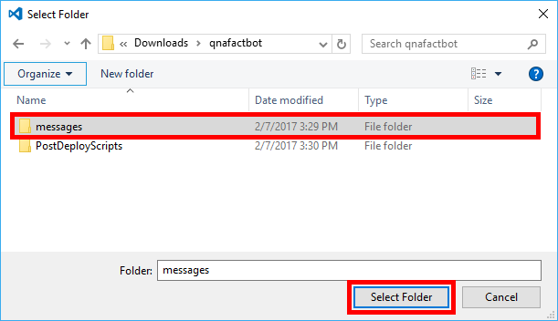

    _Selecting the "messages" folder_  

1. Click the **Git** button in the ribbon on the left, and then click **Initialize Git Repository**. This will initialize a local Git repository for the project.

    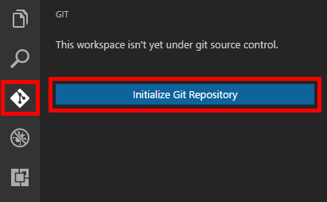

    _Initializing the local Git repository_  

1. Type "First commit" into the message box, and then click the check mark to commit your changes.

    

    _Committing changes to the local Git repository_  

1. Use Visual Studio Code's **View -> Integrated Terminal** command to open an integrated terminal window inside Visual Studio Code. Execute the following command in the integrated terminal, replacing "[BOT_APP_NAME]" in two places with the name of the Bot Service you entered in [Exercise 1](#Exercise1), Step 3.

	```
	git remote add qnafactbot https://[BOT_APP_NAME].scm.azurewebsites.net:443/[BOT_APP_NAME].git
	```

1. Select **Command Palette** from the **View** menu to open the command palette. Then type "Git Pub" into the command palette and select **Git Publish**. 

    

    _Selecting "Git: Publish" from the command palette_  

1. If prompted to confirm that you want to publish, click **Publish**.

    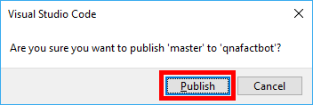

    _Confirming Git publishing_ 

1. If prompted for credentials, enter the user name and password ("Password_1") you specified in Step 6 of this exercise.

    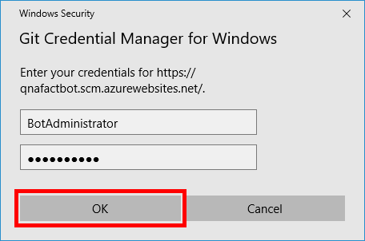

    _Entering deployment credentials_ 

1. Wait until your bot code has been published. A clock will appear over the Git button in the ribbon on the left while publishing is in progress, and disappear when publishing is complete.

    

    _The Git publishing indicator_ 

In this exercise, you created a local copy of your bot project and set up continuous integration to simplify publishing bot code changes to your Azure Bot Service via a local Git repository. Your initial bot code has been published to Azure and it's time to see your bot in action and learn how to debug it in Visual Studio Code.

<a name="Exercise5"></a>
## Exercise 5: Debug your bot ##

The Microsoft Bot Framework supports a number of mechanisms for debugging bots, including the [Bot Framework Emulator](https://emulator.botframework.com/). In this exercise, you will learn how to use Visual Studio code to debug bots by setting breakpoints and stepping through code before integrating your bot with the Microsoft QnA knowledge base that you published in [Exercise 3](#Exercise3).

1. Since most of the logic for a bot experience using a Microsoft QnA knowledge is encapsulated in the QnAMakerDialog object, it is helpful to get a clear understanding of bot communication by debugging a simple "guided" bot experience first. Begin by clicking the **Explorer** button to view the structure of the project.

    

    _Switching to Explorer view_ 

1. Select **index.js** to open it in the code editor. This file contains the code for bot interactions.

    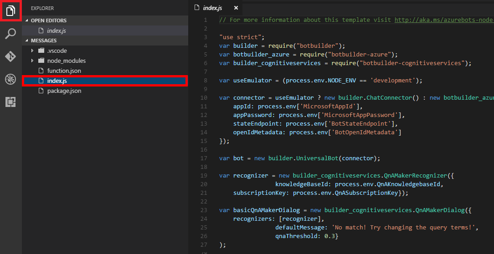

    _Opening index.js_ 

1. Replace the entire contents of **index.js** with the following code:

	```JavaScript
	"use strict";
	var builder = require("botbuilder");
	var botbuilder_azure = require("botbuilder-azure");
	
	var useEmulator = (process.env.NODE_ENV == 'development');
	
	var connector = useEmulator ? new builder.ChatConnector() : new botbuilder_azure.BotServiceConnector({
	    appId: process.env['MicrosoftAppId'],
	    appPassword: process.env['MicrosoftAppPassword'],
	    stateEndpoint: process.env['BotStateEndpoint'],
	    openIdMetadata: process.env['BotOpenIdMetadata']
	});
	
	var bot = new builder.UniversalBot(connector);
	
	bot.dialog('/', [
	
	function (session) {
	    builder.Prompts.text(session, "Hello, and welcome to QnA Factbot! What's your name?");
	},
	
	function (session, results) {
	
	    session.userData.name = results.response;
	    builder.Prompts.number(session, "Hi " + results.response + ", how many years have you been writing code?"); 
	},
	
	function (session, results) {
	
	    session.userData.yearsCoding = results.response;
	    builder.Prompts.choice(session, "What language do you love the most?", ["C#", "JavaScript", "TypeScript", "Visual FoxPro"]);
	},
	
	function (session, results) {
	
	    session.userData.language = results.response.entity;   
	
	    session.send("Okay, " + session.userData.name + ", I think I've got it:" +
	                " You've been writing code for " + session.userData.yearsCoding + " years," +
	                " and prefer to use " + session.userData.language + ".");
	}]);
	
	if (useEmulator) {
	    var restify = require('restify');
	    var server = restify.createServer();
	    server.listen(3978, function() {
	        console.log('test bot endpoint at http://localhost:3978/api/messages');
	    });
	    server.post('/api/messages', connector.listen());    
	} else {
	    module.exports = { default: connector.listen() }
	}
	
	```

1. Observe the Microsoft Bot Builder dialog prompts on lines 19, 25, and 31. Set a breakpoint on each of these lines by clicking in the margin to the left of each line.
 
    

    _Adding breakpoints to index.js_ 

1. Click the **Debug** button in the ribbon the left, and then click the green arrow to start a debugging session.
 
    

    _Launching the debugger_ 

1. Your bot code is now running locally. An easy way to step through processes while debugging is to use the Microsoft Bot Framework Emulator. If you haven't installed the Microsoft Bot Framework Emulator, take a moment to do so now. You can download it from https://emulator.botframework.com/. 

1. Launch the Bot Framework Emulator and type the following URL into the box at the top of the window:

	```
	http://localhost:3978/api/messages
	```

1. Leave **Microsoft App ID** and **Microsoft App Password** blank for now, and click **CONNECT** to connect the emulator to your debugging session.
 
    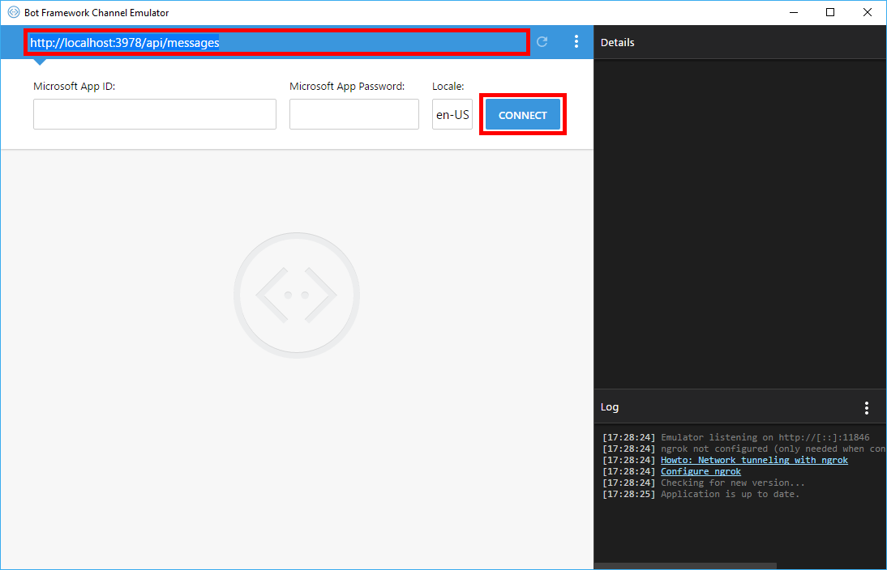

    _Connecting the emulator to the debugging session_ 

1. Type "Hi" (without quotation marks) into the box at the bottom of the emulator and press **Enter**. Visual Studio Code will break on line 19 of **index.js**. 
 
    

    _Chatting with the bot_
 
1. Click the **Continue** button in Visual Studio Code and return to the emulator to see the bot's response.
 
    

    _Continuing in the debugger_ 

1. Continue through the guided bot conversation, answering each question and clicking **Continue** in Visual Studio Code each time it breaks on a breakpoint.
 
    

    _A guided bot conversation_

1. Click the **Stop** button in Visual Studio Code's debugging toolbar to end the debugging session.

At this point, you have a fully functioning bot and know how to debug a bot by launching it in the debugger in Visual Studio Code and connect to the debugging session from the Microsoft Bot Emulator. The next step is to update your bot code to connect to the knowledge base you deployed in [Exercise 3](#Exercise3).

<a name="Exercise6"></a>
## Exercise 6: Update your bot ##

In this exercise, you will update your code and bot configuration to access the Microsoft QnA knowledge base populated earlier in this lab.

1. In Visual Studio Code, click the **Explorer** button in the View Bar to view the structure of your bot code.
1. In the Explorer, if not already open in the code editor, select **index.js** to open it.
 
    

    _Opening index.js again in the Explorer_ 

1. Click the **Debug** button in the View Bar on the left side of Visual Studio Code.
1. Locate the **BREAKPOINTS** pane, then right-click any where over the pane and select **Remove All Breakpoints**.

    

    _Removing all the active breakpoints_ 

1. In **index.js**, replace the entire contents of the file with the following code:

	```JavaScript
	// For more information about this template visit http://aka.ms/azurebots-node-qnamaker
	
	"use strict";
	var builder = require("botbuilder");
	var botbuilder_azure = require("botbuilder-azure");
	var builder_cognitiveservices = require("botbuilder-cognitiveservices");
	
	var useEmulator = (process.env.NODE_ENV == 'development');
	
	var connector = useEmulator ? new builder.ChatConnector() : new botbuilder_azure.BotServiceConnector({
	    appId: process.env['MicrosoftAppId'],
	    appPassword: process.env['MicrosoftAppPassword'],
	    stateEndpoint: process.env['BotStateEndpoint'],
	    openIdMetadata: process.env['BotOpenIdMetadata']
	});
	
	var bot = new builder.UniversalBot(connector);
	
	var recognizer = new builder_cognitiveservices.QnAMakerRecognizer({
	                knowledgeBaseId: process.env.QnAKnowledgebaseId, 
	    subscriptionKey: process.env.QnASubscriptionKey});
	
	var basicQnAMakerDialog = new builder_cognitiveservices.QnAMakerDialog({
	    recognizers: [recognizer],
	                defaultMessage: 'No match! Try changing the query terms!',
	                qnaThreshold: 0.3}
	);
	
	
	bot.dialog('/', basicQnAMakerDialog);
	
	if (useEmulator) {
	    var restify = require('restify');
	    var server = restify.createServer();
	    server.listen(3978, function() {
	        console.log('test bot endpoint at http://localhost:3978/api/messages');
	    });
	    server.post('/api/messages', connector.listen());    
	} else {
	    module.exports = { default: connector.listen() }
	}
	```

1. Observe the use of the **QnAMakerDialog** on line 23. This dialog is part of the Microsoft Bot Framework for use when creating bots that use Microsoft QnA knowledge bases.
 
    

    _The Bot Framework QnAMakerDialog_ 

1. Set a breakpoint on **line 23** by clicking the margin at the far left of the code window for this line.
1. Click the **Debug** button in the View Bar on the left side of Visual Studio Code, and then click the **green arrow** at the top of the debugging panel to start a debugging session.
 
    

    _Launching the VS Code debugger_ 

1. Locate the "DEBUG CONSOLE" input pane, and type in the following code, and then press **Enter** on your keyboard:

	```
	process.env.QnAKnowledgebaseId
	```

1.  Observe the value of "process.env.QnAKnowledgebaseId" is set to an "empty" string.
 
    

    _Querying process.env.QnAKnowledgebaseId in the Debug Console_ 

In order to connect the bot to the QnA knowledge base created in Exercise 1, we need to update the bot configuration file to include both the "QnAKnowledgebaseId" and "QnASubscriptionKey" generated by the Azure Bot Service.

To update the bot configuration with QnA knowledge base information:

1. In Visual Studio Code, click the **Explorer** button in the View Bar to view the structure of your bot code.
1. In the Explorer, select **.vscode** > **launch.json** to open it, and observe the empty string values for both "QnAKnowledgebaseId" and "QnASubscriptionKey" in the "configurations" section. These values need to be populated from the Azure Bot Service Application Settings.
 
    

    _Opening launch.json in the Explorer_ 

1. Open the Azure Portal dashboard (if it’s not already open from Exercise 1) and click the **“hamburger”** icon to open the side drawer menu.
1. Click **Resource Groups** followed by **BotsResourceGroup**.
1. Select the **Overview** tab.
1. Click **qnafactbot** (or the name you used to create the Azure Bot Service in Exercise 1, Step 3) to open the Azure Bot Service editor for the bot.

    

    _Opening the bot service_
 
1. Select the **Settings** tab in the Bot Service editor. 

    

    _Selecting the Settings tab_
 
1. Locate the "Application Settings" panel and click **Open** to open the Azure Bot Service App Settings blade.

    

    _Opening the Azure Bot Service Application Settings_
 
1. Locate the "App Settings" panel and, with your mouse cursor, highlight the value to the right of the "QnAKnowledgebaseId" key and copy it to the clipboard.

    

    _Copying the QnAKnowledgebaseId value_ 
 
1. Return to Visual Studio Code and paste this value between the quotation marks for the setting named **QnAKnowledgebaseId**.

    

    _The updated QnAKnowledgebaseId value_ 

1. In a browser, return to the "App Settings" panel of the "Application Settings" blade and, with your mouse cursor, highlight the value to the right of the "QnASubscriptionKey" key and copy it to the clipboard.

    

    _Copying the QnASubscriptionKey value_
 
1. Return to Visual Studio Code and paste this value between the quotation marks for the setting named **QnASubscriptionKey**.

    

    _The updated QnASubscriptionKey value_ 

1. One more time, click the **Debug** button in the View Bar on the left side of Visual Studio Code, and then click the **green arrow** at the top of the debugging panel to start a debugging session.
1. Locate the "DEBUG CONSOLE" input pane, and type in the following code, and then press **Enter** on your keyboard:

	```
	process.env.QnAKnowledgebaseId
	```

1. Observe the value of "process.env.QnAKnowledgebaseId" is now set to an appropriate value.
1. Locate the **BREAKPOINTS** pane, and then hover your mouse cursor over the heading to display the panel action bar. and click the **Remove All Breakpoints** icon.

    

    _Removing breakpoints via the action bar_ 

1. Click the **Debug** button in the View Bar on the left side of Visual Studio Code, and then click the **green arrow** at the top of the debugging panel to start a debugging session.
1. Open the Bot Framework Emulator, if not already open from the previous exercise.
1. If necessary, select the "Enter your endpoint URL" panel at the top of the emulator window one more time and enter the following endpoint URL:

	```
	http://localhost:3978/api/messages
	```

1. Remember to leave the Microsoft App ID and Microsoft App Password entries empty, and click **CONNECT**. The Bot Framework Emulator is now re-connected to your Visual Studio Code debugging session.
1. In the emulator, click the **Refresh** icon to start a new conversation.

    

    _Starting a new conversation in the emulator_

1. Type in "What's the most popular software programming language in the world?" (without quotation marks) in the "Type your message..." entry at the bottom of the emulator chat window and press **Enter** on your keyboard.

    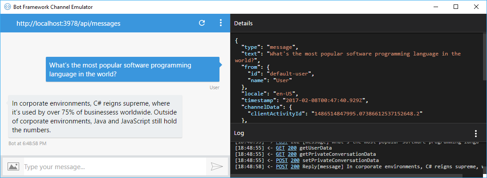

    _Bot interaction using QnA knowledge base integration_

1. Observe the responses are now based on the QnA knowledge base populated in Exercise 3. Feel free to ask the bot additional questions to validate QnA dialog responses.  

    

    _Additonal interaction using QnA knowledge base integration_

1. Select **View**  > **Command Palette** to open the VS Code command palette, and then type in "Git Sy" in the command palette and select **Git Sync**. 

	

    _Selecting Git: Sync from the Command Palette_  

1. If Visual Studio Code prompts with a Git synchronization warning, click **OK**.

	

    _The Git synchronization warning_  

1. After a short delay your bot code and configuration changes will be published to the Azure Bot Service.

Now that your bot has been written, updated, and tested, the final step is to test it in a connected channel.

<a name="Exercise7"></a>
## Exercise 7: Test your bot ##

Once deployed, bots can be connected to channels such as Skype, Slack, Microsoft Teams, and Facebook Messenger, where you can interact with them the way you would interact with any other user. In this exercise, you will test your bot with Skype. If Skype isn't already installed on your computer, please install it now. You can download Skype for Windows, macOS, and Linux from https://www.skype.com/en/download-skype/skype-for-computer/.

1. Open the Azure Portal dashboard (if it’s not already open from the previous exercise) and click the **“hamburger”** icon to open the side drawer menu.
1. Click **Resource Groups** followed by **BotsResourceGroup**.
1. Select the **Overview** tab.
1. Click **qnafactbot** (or the name you used to create the Azure Bot Service in Exercise 1, Step 2) to open the Azure Bot Service editor for the bot.

    

    _Opening the bot service_
 
1. Select the **Channels** tab in the Bot Service editor. 

    

    _The Bot Service Channels tab_
 
1. Locate the "Channels" panel and click **Edit** in the row for the Skype channel.

    

    _Editing the Bot Service Skype channel_
 
1. Ensure that **Enable QnAFactbot on Skype** is toggled ON and click **I’m done configuring** at the bottom of the page. Your bot is now ready to test in a Skype conversation.

    

    _Ensuring Bot Service Skype integration_
 
1. Click the **Add to Skype** button.
 
    

    _Adding QnA Factbot to Skype_
 
1.  Click **Add to Contacts** to add the bot as a Skype contact. After a short delay, Skype will launch and display a new conversation thread between you and the bot. 
  
	> If Skype does not automatically add QnA Factbot to a conversation, select the bot from the "Recent" list in Skype to initiate a conversation manually. 
	
    

    _Adding QnA Factbot to your Skype contacts_
	
1. Start a conversation with the QnA Factbot by typing "hi" into the Skype window. After a short delay, the bot will display a welcome message and you can start a question and answer process using the information available in your QnA knowledge base!   	
 
    

    _Using the QnA Factbot in Skype_

You now have a fully functioning bot, created with the Microsoft Bot Framework, available for anyone in the world to use. You may have noticed there are many other channels to choose from as well. Feel free to plug your bot into other channels and test it in different scenarios. 

<a name="Summary"></a>
## Summary ##

In this hands-on lab you learned how to:

- Create an Azure Bot Service to register and host a bot
- Create a Microsoft QnA Service to populate a knowledge base
- Setup continuous code integration to publish bot code
- Debug the bots that you build
- Update your bot using Visual Studio Code, Node.js, and JavaScript- 
- Interact with a bot using Skype

There is much more that you can do to leverage the power of the Microsoft Bot Framework by incorporating [dialogs](http://aihelpwebsite.com/Blog/EntryId/9/Introduction-To-Using-Dialogs-With-The-Microsoft-Bot-Framework), [FormFlow](https://blogs.msdn.microsoft.com/uk_faculty_connection/2016/07/14/building-a-microsoft-bot-using-microsoft-bot-framework-using-formflow/), and [Microsoft Language Understanding and Intelligence Services (LUIS)](https://docs.botframework.com/en-us/node/builder/guides/understanding-natural-language/). With these and other features, you can build sophisticated bots that respond to users' queries and commands and interact in a fluid, conversational, and non-linear manner. For more information, see https://blogs.msdn.microsoft.com/uk_faculty_connection/2016/04/05/what-is-microsoft-bot-framework-overview/.

----

Copyright 2016 Microsoft Corporation. All rights reserved. Except where otherwise noted, these materials are licensed under the terms of the MIT License. You may use them according to the license as is most appropriate for your project. The terms of this license can be found at https://opensource.org/licenses/MIT.