<a name="HOLTitle"></a>
# Blockchain-as-a-Service on Azure #

---

<a name="Overview"></a>
## Overview ##

[Blockchain](https://en.wikipedia.org/wiki/Blockchain) is one of the world's most talked-about technologies, and one that has the potential to fundamentally change the way we use the Internet. Originally designed for [Bitcoin](https://en.wikipedia.org/wiki/Bitcoin), Blockchain remains the technology behind that digital currency but is not limited to applications involving virtual money. In the words of Dan Tapscott, author, TED speaker, and Executive Director of the [Blockchain Research Institute](https://www.blockchainresearchinstitute.org/), "Blockchain is an incorruptible digital ledger of economic transactions that can be programmed to record not just financial transactions, but virtually everything of value." One of the more inventive uses for Blockchain is to implement tamper-proof digital voting systems, a concept that is being actively explored [in the U.S. and abroad](https://venturebeat.com/2016/10/22/blockchain-tech-could-fight-voter-fraud-and-these-countries-are-testing-it/).

Blockchain gets its name from the manner in which it stores data. Transactions such as a transfer of money from one party to another or a vote cast for a political candidate are stored in cryptographically sealed blocks. Blocks are joined together into chains ("blockchains"), with each block in the chain containing a hash of the previous block. A blockchain acts like a ledger, and rather than be stored in one place, it is replicated across countless computers (nodes) in a Blockchain network. This decentralization means that a blockchain has no single point of failure and is controlled by no single entity. The latter is especially important for a system whose primary goal is to allow private transactions to take place without involving a "trusted" third party such as a bank.

Anyone can build a Blockchain network and use it to host blockchains. Microsoft Azure makes it incredibly simple to do both by supporting Blockchain-as-a-Service. A few button clicks in the Azure Portal are sufficient to deploy a network of virtual machines provisioned with popular Blockchain implementations such as [Ethereum](https://www.ethereum.org/), [Corda](https://www.corda.net/), or 
[Hyperledger Fabric](https://www.hyperledger.org/projects/fabric).

Ethereum was one of the first general-purpose blockchain implementations. The software is open-source and is the basis for Ethereum's own cryptocurrency known as [Ether](https://www.ethereum.org/ether). You can deploy Ethereum networks of your own and use its Blockchain implementation however you wish. Among other features, Ethereum supports [smart contracts](https://en.wikipedia.org/wiki/Smart_contract), which are written in languages such as [Solidity](https://en.wikipedia.org/wiki/Solidity) and then compiled into bytecode and deployed to the network for execution.

In this lab, you will deploy an Ethereum network on Azure and create your own cryptocurrency named "My Coin" to run on it. The currency will be brokered by a smart contract that allows funds to be transferred between accounts. Along the way, you will get first-hand experience running Blockchain networks on Azure, as well as writing smart contracts for Ethereum and deploying them to the network.

<a name="Objectives"></a>
### Objectives ###

In this hands-on lab, you will learn how to:

- Deploy an Ethereum Blockchain network on Azure
- Use MetaMask to create an Ethereum wallet
- Write smart contracts and deploy them to Ethereum networks
- Manipulate Ethereum blockchains using Node.js

<a name="Prerequisites"></a>
### Prerequisites ###

- An active Microsoft Azure subscription. If you don't have one, [sign up for a free trial](http://aka.ms/WATK-FreeTrial).
- [PuTTY](http://www.chiark.greenend.org.uk/~sgtatham/putty/download.html) and PowerShell (Windows users only)
- [Google Chrome](https://www.google.com/chrome/browser/desktop/index.html)
- [Node.js](https://nodejs.org)

<a name="Exercises"></a>
## Exercises ##

This hands-on lab includes the following exercises:

- [Exercise 1: Create a blockchain on Azure](#Exercise1)
- [Exercise 2: Create a wallet](#Exercise2)
- [Exercise 3: Unlock the coinbase account (Windows)](#Exercise3)
- [Exercise 4: Unlock the coinbase account (macOS and Linux) ](#Exercise4)
- [Exercise 5: Deploy a smart contract](#Exercise5)
- [Exercise 6: Deploy an app that uses the contract](#Exercise6)
- [Exercise 7: Delete the Ethereum network](#Exercise7)

Estimated time to complete this lab: **60** minutes.

<a name="Exercise1"></a>
## Exercise 1: Create a blockchain on Azure ##

Deploying a blockchain on Azure only takes a few minutes. In this exercise, you will use the Azure Portal to deploy an Ethereum blockchain network in the cloud.

1. In your browser, navigate to the [Azure Portal](https://portal.azure.com). If you are asked to sign in, do so using your Microsoft account.

1. In the portal, click **+ New**, followed by **Blockchain** and **Ethereum Consortium Blockchain**.

	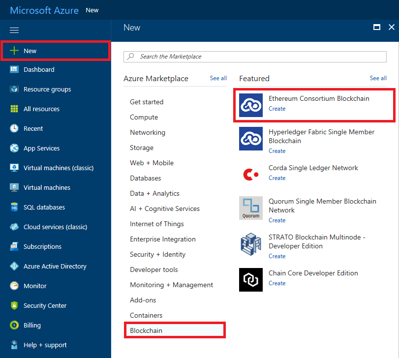

	_Creating an Ethereum blockchain_

1. Click the **Create** button at the bottom of the "Ethereum Consortium Blockchain" blade.

1. In the "Basics" blade, set **Resource prefix** to "blkchn" (without quotation marks), **VM user name** to "blkadmin" (without quotation marks), and the password to "Blockchain!321" (once more, without quotation marks). Make sure **Create new** is selected under **Resource group**, and enter "BlockchainResourceGroup" as the resource-group name. Select the location nearest you, and then click **OK**.

	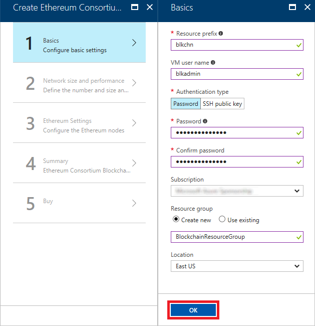

	_Entering basic settings_

1. Click **OK** at the bottom of the "Network Size and Performance" blade to accept the default settings for VM sizes, number of nodes, and so on.

	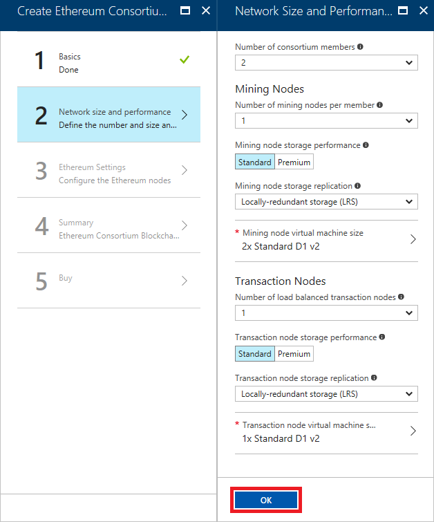

	_Accepting the default network settings_

1. In the "Ethereum Settings" blade, set **Network ID** to **123456**, and enter "Blockchain!321" in four places as the Ethereum account password and private key passphrase. Then click **OK**.

	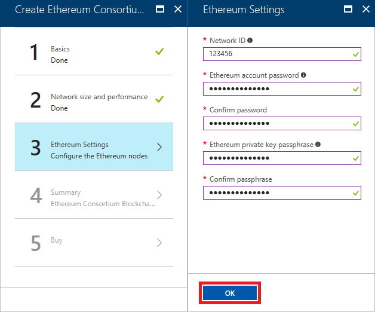

	_Entering Ethereum settings_

1. Review the settings in the "Summary" blade and click **OK**.

	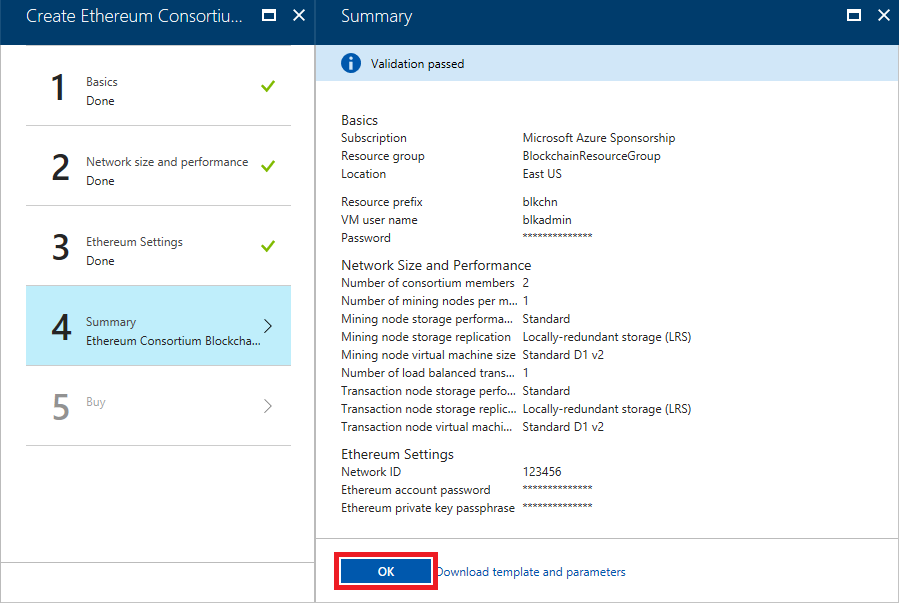

	_Reviewing the settings_

1. Click the **Purchase** button to begin the deployment.

	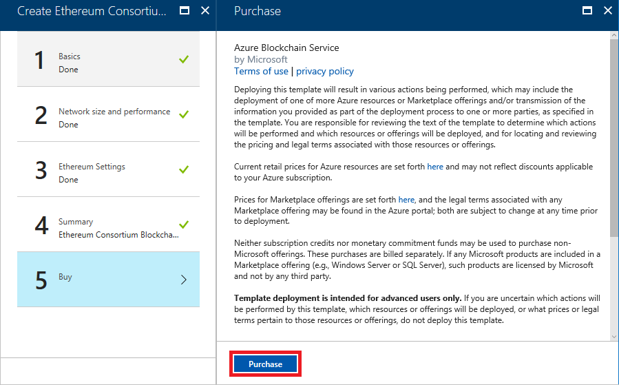

	_Beginning the deployment_

The deployment will probably take about 5 minutes to complete, but rather than wait for it to finish, proceed to Exercise 2 and begin the process of setting up a wallet. 

<a name="Exercise2"></a>
## Exercise 2: Create a wallet ##

The next task is to set up a wallet. For this, you'll use a Google Chrome extension called [MetaMask](https://metamask.io/). MetaMask enables you to use the Ether from a Blockchain network on Ethereum-enabled Web sites as well as create an account and seed it with Ether. You won't be using Ether directly, but setting up a wallet is an easy way to create an account on the network that can be used in digital transactions.

1. If Google Chrome isn't installed on your computer, [download it and install it](https://www.google.com/chrome/browser/desktop/index.html) now.

1. Start Chrome, paste the following link into the address bar, and press **Enter**. 

	```
	https://chrome.google.com/webstore/detail/meta-mask/nkbihfbeogaeaoehlefnkodbefgpgknn?hl=en
	```

1. Click **Add to Chrome**.

	

	_Adding MetaMask to Chrome_

1. Click **Add Extension**.

	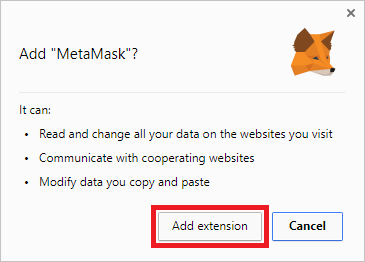

	_Installing the MetaMask extension_

1. Click the MetaMask icon to the right of the address bar, and then click **Accept**.

	

	_Accepting the privacy notice_

1. Scroll to the bottom of the terms of use, and then click **Accept**.

	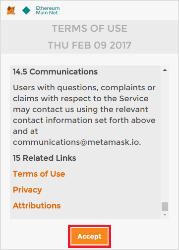

	_Accepting the terms of use_

1. Enter "Blockchain!321" (without quotation marks) as the password in two places, and then click **Create**.

	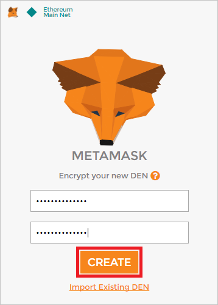

	_Creating a MetaMask account_

1. Copy the 12 words presented to you into a text file and save the file for safekeeping. Then click **I've Copied It Somewhere Safe**.

	> You won't need this recovery information in this lab, but in the real world, these words act as a pass phrase that can be used to restore access to a MetaMask account that you have been locked out of.

	

	_Saving MetaMask recovery information_

1. Return to the Azure Portal. Click **Resource groups** in the ribbon on the left, and then click the resource group that you created for the Ethereum blockchain network in [Exercise 1](#Exercise1).

	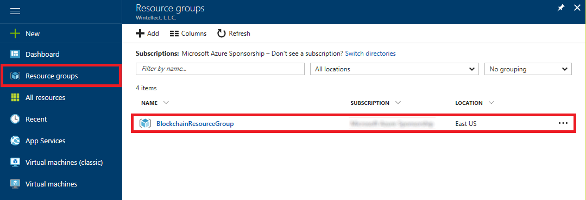

	_Opening the resource group_

1. Make sure all deployments have finished. (If they haven't, periodically click the **Refresh** button at the top of the blade until all deployments have completed.) Then click **Deployments**, followed by **microsoft-azure-blockchain...**.

	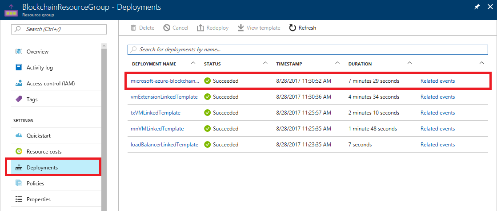

	_Opening the Blockchain resource_
	
1. Click the **Copy** button next to ETHEREUM-RPC-ENDPOINT under "Outputs." This URL is very important, because it allows apps to make JSON-RPC calls to the network to unlock accounts, upload smart contracts, and perform other blockchain-related tasks.

	

	_Copying the endpoint URL_
 
1. Return to Chrome and the MetaMask window. (If the window is no longer displayed, click the MetaMask icon to the right of the address bar to display it again.) Then click the hamburger icon to display the MetaMask menu, and select **Settings** from the menu.

	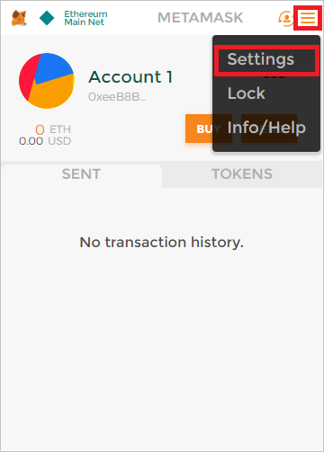

	_Opening MetaMask settings_

1. Paste the URL on the clipboard into the "Current Network" box and and click **Save**. Then click the back arrow next to "Settings."

	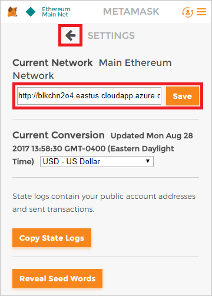

	_Entering the network URL_

1. Return to the Azure Portal and click the **Copy** button next to ADMIN-SITE.

	

	_Copying the admin-site link_

1. Open a new browser instance and paste the URL on the clipboard into the browser's address bar. Then press **Enter**.

	

	_Opening the admin site_

1. Return to Chrome. Click the ellipsis (**...**) in the MetaMask window, and then select **Copy Address to clipboard**. The "address" you are copying is actually the account ID for Account 1, which was created automatically when you "joined" the network by pasting the Ethereum RPC endpoint URL into MetaMask.

	

	_Copying the account address to the clipboard_

1. Return to the admin site you open in Step 15 and paste the value on the clipboard into the **Address of Recipient** box. Then click **Submit** to seed Account 1 with 1,000 Ether.

	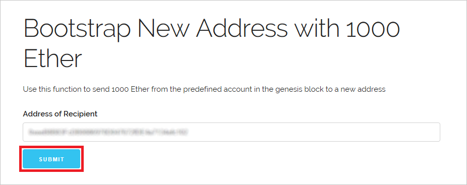

	_Boostrapping the account with 1,000 Ether_

1. Return to MetaMask and click the refresh icon. Then select **Account 1** and confirm that the account now shows a balance of 1,000 Ether.

	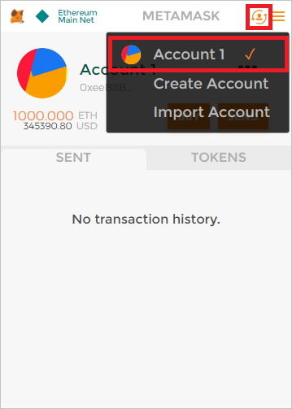

	_Refreshing the wallet_

Seeding your wallet with Ether isn't strictly necessary because you won't be using the Ether in it in this lab; you will use your own cryptocurrency instead. But if you *were* deploying an Ethereum network for the purpose of transferring Ether between accounts, you now know how to get some Ether into your account for testing purposes. 

Where did the 1,000 Ether come from? They came from the *coinbase* account that was created when the network was created. The coinbase account holds all the Ether that haven't been transferred to individual accounts. Later, you will use Ether in this account to *fuel* the transactions that you perform via the contracts that you deploy. Before you can do that, you must unlock the account.

<a name="Exercise3"></a>
## Exercise 3: Unlock the coinbase account (Windows) ##

To unlock the coinbase account, you must connect to one of the Ethereum servers with SSH and execute a couple of commands. If you are running macOS or Linux, **skip to [Exercise 4](#Exercise4)** and use the built-in SSH client. If you are running Windows instead, proceed with this exercise.

1. PuTTY is a popular (and free) SSH client for Windows. If PuTTY isn't installed on your computer, [download and install it](http://www.chiark.greenend.org.uk/~sgtatham/putty/download.html) now.

1. Return to the Azure Portal and click the **Copy** button next to ADMIN-SITE.

	

	_Copying the admin-site link_

1. Start PuTTY and paste the value on the clipboard into the **Host Name (or IP address)** field. Remove "http://" from the beginning of the string, and type **3000** into the **Port** field to connect using port 3000. Then click the **Open** button to initiate a Secure Shell (SSH) connection. If you are prompted with a security warning asking if you want to update the cached key, answer yes.

	

	_Connecting with PuTTY_

1. A PuTTY terminal window will appear and you will be prompted to **login as**. Log in with the user name ("blkadmin") and password ("Blockchain!321") you entered in Exercise 1, Step 4.

1. Execute the following command in the console window to attach to the Ethereum node:

	```
	geth attach
	```

1. Now execute the following command to unlock the coinbase account:

	```
	web3.personal.unlockAccount(web3.personal.listAccounts[0],"Blockchain!321", 15000)
	```

	This will allow you to deploy smart contracts to the blockchain. Make sure that the output from the command is the word "true."

1. Type **exit** into the console window to detach from Ethereum.

1. Type **exit** again to close the SSH connection and end the PuTTY session.

Now that the coinbase account is unlocked, you are ready to start using the network to execute transactions on the blockchain. Proceed to [Exercise 5](#Exercise5). Exercise 4 is for macOS and Linux users only.

<a name="Exercise4"></a>
## Exercise 4: Unlock the coinbase account (macOS and Linux) ##

To unlock the coinbase account, you must connect to one of the Ethereum servers with SSH and execute a couple of commands. macOS and Linux users can use the built-in SSH client to connect.

1. Return to the Azure Portal and click the **Copy** button next to SSH-TO-FIRST-TX-NODE.

	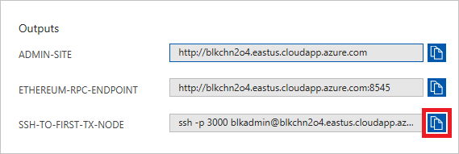

	_Copying the SSH command_

1. Open a terminal window and paste the command on the clipboard into the terminal window. Then press **Enter** to execute the command. If you are prompted with a security warning asking if you want to update the cached key, answer yes.

1. When prompted for a password, enter the password ("Blockchain!321") you entered in Exercise 1, Step 4.

1. Execute the following command in the terminal window to attach to the Ethereum node:

	```
	geth attach
	```

1. Now execute the following command to unlock the coinbase account:

	```
	web3.personal.unlockAccount(web3.personal.listAccounts[0],"Blockchain!321", 15000)
	```

	This will allow you to deploy smart contracts to the blockchain. Make sure that the output from the command is the word "true."

1. Type **exit** into the terminal window to detach from Ethereum.

Now that the coinbase account is unlocked, you are ready to start using the network to execute transactions on the blockchain.

<a name="Exercise5"></a>
## Exercise 5: Deploy a smart contract ##

Ethereum blockchains use "smart contracts" to broker transactions. A smart contract is essentially a program that runs on blockchain transaction nodes. Ethereum developers often use the popular [Truffle](http://truffleframework.com/) framework to develop smart contracts. In this exercise, you will set up a Truffle development environment, code and then compile a smart contract, and deploy it to the blockchain.

1. If Node.js isn't installed on your system, go to https://nodejs.org and install the latest LTS version for your operating system.

	> If you aren't sure whether Node.js is installed, open a Command Prompt or terminal window and type **node -v**. If you don't see a Node.js version number, then Node.js isn't installed. If a version of Node.js older than 6.0 is installed, it is highly recommend that you download and install the latest version.

1. If you are using macOS or Linux, open a terminal. If you are using Windows instead, open a PowerShell window.

1. In the terminal or PowerShell window, use the following command to create a directory named "truffle" in the location of your choice:

	```
	mkdir truffle
	```

1. Now change to the "truffle" directory:

	```
	cd truffle
	```

1. Use the following command to install Truffle:

	```
	npm install -g truffle
	```

1. Most smart contracts for Ethereum networks are written in a language called Solidity, which is similar to JavaScript. Use the following command to install the Solidity compiler:

	```
	npm install -g solc
	```

1. Now use the following command to initialize a Truffle project in the current directory. This will download a few Solidity scripts and install them, and create a scaffolding in the "truffle" folder.

	```
	truffle init
	```

1. Use your favorite text or program editor to open the file named **truffle.js** in the "truffle" folder. Return to the Azure Portal and copy the Ethereum RPC endpoint to the clipboard as you did in Exercise 2, Step 11. Replace "localhost" on line 4 of **truffle.js** with the URL on the clipboard, and remove the leading "http://" and the trailing ":8545," as shown below. Then save the modified file.

	```javascript
	module.exports = {
  	    networks: {
            development: {
                host: "blkchn2o4.eastus.cloudapp.azure.com",
                port: 8545,
   	            network_id: "*" // Match any network id
   	        }
 	    }
	};
	```

1. Create a new contract in the subdirectory named "contracts" (which was created when you ran ```truffle init```) by creating a text file named **myCoin.sol** in that directory, pasting in the following code, and then saving the file:

	```
	pragma solidity ^0.4.4;

	// Declares the contract
	contract myCoin {
		
	    // This is a mapping that works like a dictionary or associated array in other languages.
	    mapping (address => uint) balances;

	    // This registers an event
	    event Transfer(address indexed _from, address indexed _to, uint256 _value);

	    // The contract constructor, which is called when the contract is deployed to the blockchain. The contract is persistent on the blockchain, so it remains until it is removed.
	    function myCoin() {
	        balances[tx.origin] = 100000;
	    }

	    // This method modifies the blockchain. The sender is required to fuel the transaction in Ether.
	    function sendCoin(address receiver, uint amount) returns(bool sufficient) {
	        if (balances[msg.sender] < amount) return false;
	        balances[msg.sender] -= amount;
	        balances[receiver] += amount;
	        Transfer(msg.sender, receiver, amount);
	        return true;
	    }

	    // This method does not modify the blockchain, so it does not require an account to fuel for the call.
	    function getBalance(address addr) returns(uint) {
	        return balances[addr];
	    }
	}
	```

	This contract, named "myCoin," is written in Solidity. Solidity files are compiled to JSON files containing interface definitions as well as bytecode that is used when the contracts are deployed. The contract contains a function named ```sendCoin``` that, when called, transfers the specified number of My Coin from the sender's account to the receiver's account.

1. Create a new file named **3_deploy_myCoin.js** in the "migrations" subdirectory. Paste the following code into the file and save it:

	```javascript
	var myCoin = artifacts.require("./myCoin.sol");

	module.exports = function(deployer) {
	    deployer.deploy(myCoin);
	};
	```

	This is the code that deploys the "myCoin" contract to the blockchain.

1. Return to the terminal or PowerShell window and execute the following command to compile the  contract:

	```
	truffle compile
	```

1. Now use the following command to deploy the contract to the blockchain:

	```
	truffle deploy
	```

The contract is now present in the blockchain and waiting for its ```sendCoin``` function to be called to transfer funds. All we lack is a mechanism for calling that function. In the next exercise, you will close the loop by using a Node.js app to execute the contract.

<a name="Exercise6"></a>
## Exercise 6: Deploy an app that uses the contract ##

Smart contracts are designed to be used by applications that use the blockchain for secure transactions. In this exercise, you will create a Node.js app that uses the "myCoin" contract and then run it to broker an exchange of My Coin currency — specifically, to transfer funds from the coinbase account to your own account (Account 1). The app will use a library named [web3.js](https://github.com/ethereum/web3.js/), which wraps the Ethereum RPC API and dramatically simplifies code for interacting with smart contracts. Note that there are also web3 libraries available for other languages, including Java and Python.

1. In a terminal or PowerShell window, use the following command to create a directory named "use-contract" in the location of your choice:

	```
	mkdir use-contract
	```

1. Make "use-contract" the current directory:

	```
	cd use-contract
	```

1. Use the following command to install the NPM package named "web3:"

	```
	npm install web3@^0.20.0
	```

1. Create a new text file named **use-contract.js** in the "use-contract" folder. Then paste in the following code:

	```javascript
	var Web3 = require("web3");

	var AzureBlockchainRPC = "AZURE_RPC_URL";
	var account1 = "ACCOUNT1_ADDRESS";
	var contractAddress = "CONTRACT_ADDRESS";

	let web3 = new Web3();
	web3.setProvider(new web3.providers.HttpProvider(AzureBlockchainRPC));

	// The abi object defines the contract interface. Web3 uses this to build the contract interface.
	var abi = JSON.parse('[{"constant":false,"inputs":[{"name":"receiver","type":"address"},{"name":"amount","type":"uint256"}],"name":"sendCoin","outputs":[{"name":"sufficient","type":"bool"}],"payable":false,"type":"function"},{"constant":false,"inputs":[{"name":"addr","type":"address"}],"name":"getBalance","outputs":[{"name":"","type":"uint256"}],"payable":false,"type":"function"},{"inputs":[],"payable":false,"type":"constructor"},{"anonymous":false,"inputs":[{"indexed":true,"name":"_from","type":"address"},{"indexed":true,"name":"_to","type":"address"},{"indexed":false,"name":"_value","type":"uint256"}],"name":"Transfer","type":"event"}]');

	let myCoinContract = web3.eth.contract(abi);
	let myCoinInstance = myCoinContract.at(contractAddress);

	// This sets up a listener for the Transfer event.
	var transferEvent = myCoinInstance.Transfer( {}, {fromBlock: 0, toBlock: 'latest'});

	// Watching for transfer.... 
	transferEvent.watch(function(error, result) {
	    if (!error) {
	        console.log("Coin Sent!\n\nChecking balance for coin base...");
	        console.log(myCoinInstance.getBalance.call(web3.eth.coinbase));
	        console.log("Checking balance for account1...");
	        console.log(myCoinInstance.getBalance.call(account1));
	    }
	    else {
	        console.log("An error occurred.");
	        console.log(error);
	    }
	    process.exit();
	});

	web3.eth.defaultAccount = web3.eth.coinbase;
	console.log("Sending some coin...");
	console.log(myCoinInstance.sendCoin(account1, 1000, {from: web3.eth.coinbase}));

	console.log("Checking balance for coin base...")
	console.log(myCoinInstance.getBalance.call(web3.eth.coinbase));

	console.log("Checking balance for account1...")
	console.log(myCoinInstance.getBalance.call(account1));

	console.log("Waiting for event to fire...");
	```

	This code, when executed, transfers 1,000 My Coin from the coinbase account to Account 1. Notice the asynchronous nature of the call. Before calling ```sendCoin``` to invoke the contract, the code registers a handler for the ```Transfer``` event that fires after the transaction has completed.

1. Replace AZURE_RPC_URL on line 3 of **use-contract.js** with the Ethereum RPC endpoint obtained from the Azure Portal (see Exercise 2, Step 11).

1. In the PowerShell or terminal window, CD back to the "truffle" directory that you created in the previous exercise. Then use the following command to list the addresses of all the smart contracts in the project, including the "myCoin" contract and some default contracts that were created when you ran ```truffle init```:

	```
	truffle networks
	```

1. Replace CONTRACT_ADDRESS on line 5 of **use-contract.js** with the "myCoin" address in the output.

	

	_Retrieving the contract address_
 
1. Return to the MetaMask window in Chrome and copy the address for **Account 1** to the clipboard as you did in Exercise 2, Step 16. Then replace ACCOUNT1_ADDRESS on line 4 of **use-contract.js** with the address on the clipboard and save your changes to **use-contract.js**.

	

	_Copying the account address to the clipboard_

1. In the PowerShell or terminal window, CD back to the "use-contract" directory. Then execute the following command to invoke the contract and transfer My Coin:

	```
	node use-contract.js
	```

1. Watch the output. Onserve that before the ```Transfer``` event fired, the accounts held their original balances even though the ```sendCoin``` method had already been invoked. Checking the balances again in the ```Transfer``` event handler reveals the final, post-transaction balances, and shows that 1,000 My Coin were transferred from the coinbase account to Account 1.

	```	
	Sending some coin...
	0xb677604426c9589bb1072f1ec517d2ad3d5e37c56f0b5d9a3b2d689a4bd962ad
	Checking balance for coin base...
	{ [String: '100000'] s: 1, e: 5, c: [ 100000 ] }
	Checking balance for account1...
	{ [String: '0'] s: 1, e: 0, c: [ 0 ] }
	Waiting for event to fire...
	Coin Sent!

	Checking balance for coin base...
	{ [String: '99000'] s: 1, e: 4, c: [ 99000 ] }
	Checking balance for account1...
	{ [String: '1000'] s: 1, e: 3, c: [ 1000 ] }
	```

If you'd like, you can run the app again to transfer another 1,000 My Coin. Each time you run the app and invoke the contract, the balance is the coinbase account will decrease by 1,000, and the balance in Account 1 will increase by the same amount.

<a name="Exercise7"></a>
## Exercise 7: Delete the Ethereum network ##

Resource groups are a useful feature of Azure because they simplify the task of managing related resources. One of the most practical reasons to use resource groups is that deleting a resource group deletes all of the resources it contains. Rather than delete those resources one by one, you can delete them all at once.

In this exercise, you will delete the resource group created in [Exercise 1](#Exercise1) when you created the Ethereum network. Deleting the resource group deletes everything in it and prevents any further charges from being incurred for it.

1. Return to the blade for the resource group you created in Exercise 1. Then click the **Delete** button at the top of the blade.

	

	_Deleting a resource group_

1. For safety, you are required to type in the resource group's name. (Once deleted, a resource group cannot be recovered.) Type the name of the resource group. Then click the **Delete** button to remove all traces of this lab from your Azure subscription.

After a few minutes, the blockchain and all of the associated resources will be deleted. Billing stops when you click the **Delete** button, so you're not charged for the time required to delete the resources. Similarly, billing doesn't start until the resources are fully and successfully deployed.

<a name="Summary"></a>
## Summary ##

This is just one example of the kinds of apps you can build with Blockchain, and with Ethereum Blockchain networks in particular. It also demonstrates how easily Blockchain networks are deployed on Azure. For more on Azure blockchains and on Ethereum networks and their capabilities, refer to https://www.ethereum.org/.

---

Copyright 2017 Microsoft Corporation. All rights reserved. Except where otherwise noted, these materials are licensed under the terms of the MIT License. You may use them according to the license as is most appropriate for your project. The terms of this license can be found at https://opensource.org/licenses/MIT. 