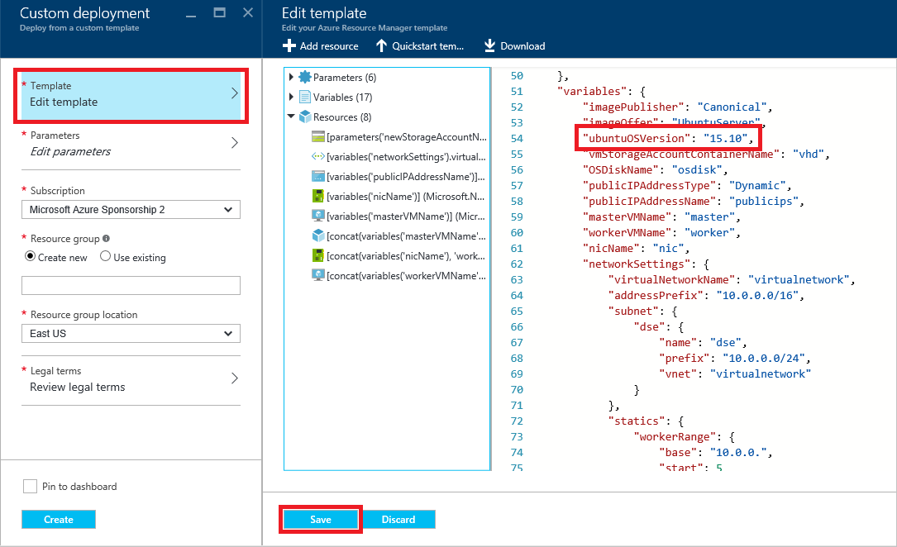
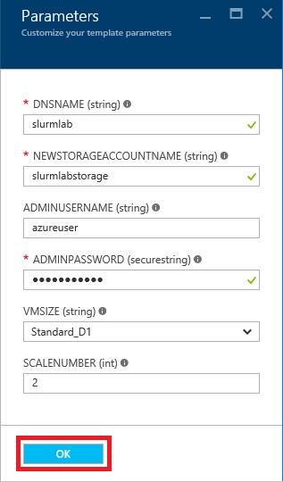
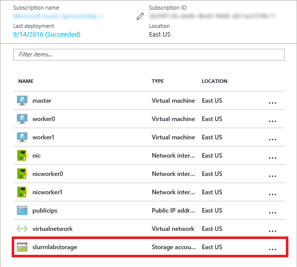
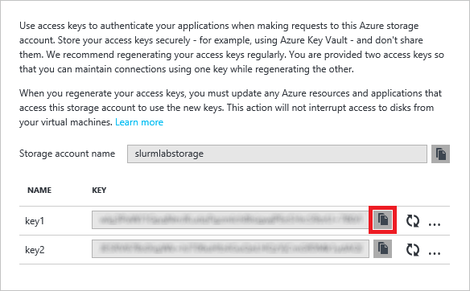
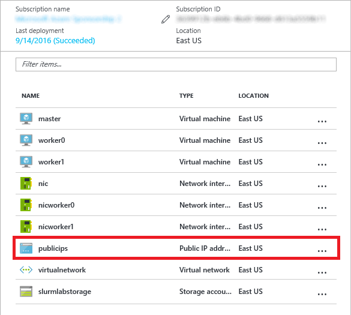
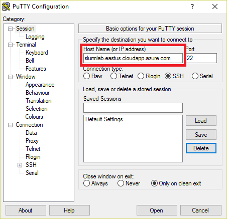
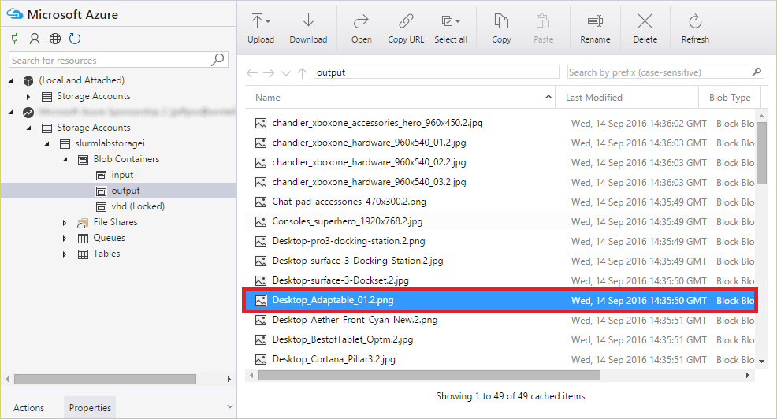
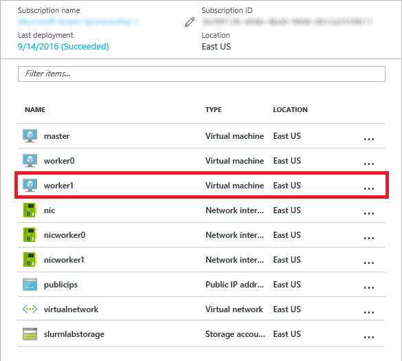
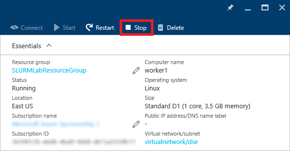

# Creating and Using a SLURM Cluster #

---

## Overview ##

The [Simple Linux Utility for Resource Management](https://computing.llnl.gov/linux/slurm/overview.html) (SLURM), also known as the *SLURM Workload Manager*, is a free and open-source job scheduler for Linux that excels at distributing heavy computing workloads across clusters of machines and processors. It is used on more than half of the world's largest supercomputers and High-Performance Computing (HPC) clusters, and it enjoys widespread use in the research community for jobs that require significant CPU resources.

Azure makes it easy to deploy SLURM clusters and size them to handle workloads large and small. In this lab, you will create a SLURM cluster consisting of three nodes (VMs) and run a Python script on it to convert a batch of color images to grayscale. You will get first-hand experience deploying HPC clusters in Azure as well as managing and using the nodes in a cluster. And you will learn how easy it is to bring massive computing power to bear on problems that require it when you use the cloud.

### Objectives ###

In this hands-on lab, you will learn how to:

- Create a SLURM cluster using an Azure Resource Manager template
- Copy local resources to a SLURM cluster
- Remote into the nodes in a SLURM cluster
- Run jobs on a SLURM cluster
- Start and stop nodes in a SLURM cluster
- Use the Azure Resource Manager to delete a SLURM cluster

### Prerequisites ###

The following are required to complete this hands-on lab:

- An active Microsoft Azure subscription. Use the one you created in Lab 1, or [sign up for a free trial](http://aka.ms/WATK-FreeTrial)
- [Microsoft Azure Storage Explorer](http://storageexplorer.com/)
- [PuTTY](http://www.chiark.greenend.org.uk/~sgtatham/putty/download.html)

---

## Exercises ##

This hands-on lab includes the following exercises:

- [Exercise 1: Create a SLURM cluster using an Azure Quickstart template](#Exercise1)
- [Exercise 2: Create storage containers and upload images](#Exercise2)
- [Exercise 3: Prepare the job scripts](#Exercise3)
- [Exercise 4: Copy the job scripts, configure the nodes, and run the job](#Exercise4)
- [Exercise 5: View the converted images](#Exercise5)
- [Exercise 6: Suspend the SLURM cluster](#Exercise6)
- [Exercise 7: Delete the SLURM cluster](#Exercise7)

Estimated time to complete this lab: **60** minutes.

## Exercise 1: Create a SLURM cluster using an Azure Quickstart template

The Azure Resource Manager allows you to provision applications using declarative templates. A template contains a complete description of everything that makes up the application, including virtual machines, databases, Web apps, IP addresses, and other resources. Templates can include parameters that users will be prompted to fill in each time an application is deployed. Templates can also invoke scripts to initialize resources to a known and consistent state. To learn more about Azure Resource Manager templates, refer to the [documentation](https://azure.microsoft.com/en-us/documentation/articles/resource-group-template-deploy/) online.

In this exercise, you will use a deployment template built by the Azure team. This template creates a collection of virtual machines and all the resources required to form a SLURM HPC cluster from them. It is one of many useful templates on the [Azure Quickstart Templates](http://azure.microsoft.com/en-us/documentation/templates/) page and in the Quickstart templates [GitHub repository](https://github.com/Azure/azure-quickstart-templates).

The template you will use, which you can [view here](https://github.com/Azure/azure-quickstart-templates/tree/master/slurm) on GitHub, is titled "Deploy a slurm cluster." It performs the following steps:

- Creates a storage account for the virtual machines
- Deploys three Ubuntu servers named "master," "worker0," and "worker1"
- Creates a private network for the three servers
- Creates a public IP address for master server
- Creates the same user account on all three servers
- Executes a shell script to configure ssh and install and configure SLURM on all three servers

Let's get started!

1. In your browser, navigate to [https://github.com/Azure/azure-quickstart-templates/tree/master/slurm](https://github.com/Azure/azure-quickstart-templates/tree/master/slurm). In the middle of the page, click the **Deploy to Azure** button. This will load the template into a new instance of the Azure Portal. You may be asked to sign in again; if so, sign in using your Microsoft account.

    

     _Deploying from GitHub_

1. In the Azure Portal, click **Edit template** in the "Custom deployment" blade. When the "Edit template" blade opens, find the variable named "ubuntuOSVersion." If the variable's value is anything other than "16.04.0-LTS," change it to "16.04.0-LTS" and then click the **Save** button. (If the variable value doesn't have to be changed, click the **Discard** button instead.)

    

     _Editing the deployment template_

1. Click **Edit parameters** in the "Custom deployment" blade. In the ensuing "Parameters" blade, enter a unique DNS name for **DNSNAME** and a unique storage-account name for **NEWSTORAGEACCOUNTNAME**. (Recall that storage-account names must be from 3 to 24 characters in length and can only contain numbers and lowercase characters.) Make both names as unique as possible, even factoring in your initials, birth date, etc. A name that is unique right now might not be unique several minutes from now while the deployment is in progress.

	> The storage account that's being created will hold the virtual hard disks (VHDs) for the VMs in the cluster.

	Accept the default **ADMINUSERNAME** value of "azureuser" and type the password "Azure\*Pass" (without quotation marks) into the **ADMINPASSWORD** field. You will need these credentials to log into the cluster later.

	Accept the default values for **VMSIZE** and **SCALENUMBER**. The latter specifies the number of worker nodes in the cluster. The template automatically creates an additional VM to serve as the master node. For **LOCATION**, select the location nearest you. Once all these values are entered, click the **OK** button at the bottom of the blade.

    

     _The "Parameters" blade_

1. In the "Custom deployment" blade, select **Create new** under under **Resource group** and enter the name "SLURMLabResourceGroup" (without quotation marks). Under **Resource group location**, select the same location that you selected in the previous step.

	Before you can create the cluster, you must accept the legal terms. Click **Review legal terms**, review the terms in the new blade that appears, and then click **Purchase** at the bottom of that blade to indicate that you accept the terms.

	Once that's done, click the **Create** button at the bottom of the "Custom deployment" blade to begin deploying your SLURM cluster.

    

     _The "Custom deployment" blade_

1. Deploying the SLURM cluster can take 10 minutes or more. You can monitor the status of the deployment by opening the resource group's blade. Click **Resource group** in the ribbon on the left side of the portal, and then click the resource group name ("SLURMLabResourceGroup") to open the blade. "Deploying" will change to "Succeeded" when the deployment has completed successfully.

	> Click the browser's **Refresh** button every few minutes to update the deployment status. Clicking the **Refresh** button in the resource-group blade refreshes the list of resources in the resource group, but does not reliably update the deployment status.

    

     _Monitoring the deployment_

When the deployment completes successfully, you'll see all the resources that comprise the cluster in the resource group. The next step is to create a couple of storage containers to hold the images that the cluster will process.

## Exercise 2: Create storage containers and upload images

In [Exercise 4](#Exercise4), you will run a Python script on the cluster to generate grayscale images from color images. That script requires a set of color images as well as two blob storage containers: one for input and one for output. In this exercise, you'll use the cross-platform [Microsoft Azure Storage Explorer](http://storageexplorer.com/) to create the containers and upload the images.

1. Start the Microsoft Azure Storage Explorer. If you're prompted for credentials, sign in with the user name and password for your Microsoft account.

1. In the Storage Explorer window, find the storage account that was created when you deployed the SLURM cluster. Expand the list of items underneath that storage account and click the small arrow next to **Blob Containers** to see a list of containers. There is already one blob container named "vhd." It was created when the cluster was deployed and holds the virtual hard disks (VHDs) for the nodes in the cluster.

	Right-click **Blob Containers** and select **Create Blob Container** from the menu.

    

    _Creating a new container_

1. Type "input" (without quotation marks) and press **Enter** to create a container named "input."

1. Repeat this procedure to create a blob container named "output."

1. Double-click the "input" container to show its contents. Then click the **Upload** button and select **Upload Files** from the menu.

    

    _Uploading images to the "input" container_

1. Click the **...** button to the right of the field labeled "Files." In the ensuing dialog, navigate to this lab's "ColorImages" subdirectory and select all the files in that subdirectory. Then close the dialog and click  the **Upload** button.

    

    _Uploading files to blob storage_

1. Confirm that all 49 files were uploaded to the "input" container.

    

    _Uploaded images_

You now have containers to hold input and output and a collection of color images in the input container. The next step is to prepare the scripts needed to configure the cluster and process the images.

## Exercise 3: Prepare the job scripts

With the SLURM cluster up and running and the images uploaded to blob storage, you are now ready to modify the job scripts with information about the cluster's storage account and admin user. Here is a list of those scripts and a description of what they do:

- slurmdemo.py - The Python script that runs on the SLURM nodes to process the images
- slurmdemo.setup.sh - The script that configures the SLURM nodes with the dependencies and packages required by the Python script
- slurmdemo.sh - The SLURM control script that runs on each of the nodes to perform a single unit of work

You can use Notepad or any other text editor you're comfortable with. There is no need to be concerned about how line breaks are encoded, because after uploading these scripts to the cluster's master node, you will run a utility to insert Linux-style line breaks into each script.

1. Return to the Azure Portal and open the resource group named "SLURMLabResourceGroup." In the resource group's blade, click the storage account to open a blade for the storage account.

    

    _Opening the storage account_

1. In the storage-account blade, click the key icon to open the "Access keys" blade.

    

    _Storage-account keys_

1. In the "Access keys" blade, click the **Copy** button to the right of **key1** to copy the storage account's primary access key to the clipboard.

    

    _Copying the storage account's primary access key_

1. Navigate to this lab's "hpc-resources" subdirectory. Then open **slurmdemo.py** in a text editor and find the following section near the top of the file:

	<pre>
    #######################################################
    # Update these two variables to those for your account.
    #######################################################
    ACCOUNT_NAME = 'account_name'
    ACCOUNT_KEY = 'account_key'
    #######################################################
    </pre>

1. Replace *account_name* with the name of the storage account. Make sure the account name is enclosed in single quotes.

1. Replace *account_key* with the access key that you copied to the clipboard. Make sure it is enclosed in single quotes. The modified code will look something like this:

	<pre>
    #######################################################
    # Update these two variables to those for your account.
    #######################################################
    ACCOUNT_NAME = 'jrslurmlabstorage'
    ACCOUNT_KEY = 'jWdpHOyfIdJ+VdrtgJrz+8+qrunWbGym/ULY...'
    #######################################################
    </pre>

1. Save your changes to **slurmdemo.py** and close the text editor.

1. Still in the "hpc-resources" directory, open **slurmdemo.setup.sh** in your text editor. Search for all instances of "adminuser" and replace them with the ADMINUSERNAME value ("azureuser") you specified in [Exercise 1](#Exercise1). **There are six instances that need to be replaced**.

1. Save your changes to **slurmdemo.setup.sh** and close the text editor.

You've updated the script files with the necessary information. Now you're ready for the next step: configuring the SLURM cluster and using it to process the images.

## Exercise 4: Copy the job scripts, configure the nodes, and run the job

In this exercise, you will upload the slurmdemo.* files to the master node of the SLURM cluster and use those files to configure the cluster and run the job. To remote into the cluster, you'll use a popular Windows SSH client named PuTTY, which is already installed in your VM.

1. The deployment template that you used to create the SLURM cluster created an IP address and a publicly addressable DNS name for the master node. To find the node's DNS name, open the blade for the resource group that holds the cluster. Then click **publicips**.

    

    _Opening the publicips resource_

1. Place the cursor over the DNS name in the "publicips" blade. When a **Copy** button appears, click it to copy the DNS name to the clipboard.

    

    _Copying the DNS name to the clipboard_

1. Start PuTTY and paste the DNS name for the master node into the **Host Name (or IP address)** field. Then click the **Open** button to initiate a Secure Shell (SSH) connection.

	> Because this is the first time you have connected to the master node, you will be prompted with a warning dialog asking if you trust this host. Since the host is one you created, click **Yes**.

    

    _Connecting with PuTTY_

1. A PuTTY terminal window will appear and you will be prompted to **login as**. Log in with the user name ("azureuser") and password ("Azure*Pass") you entered into the ADMINUSERNAME and ADMINPASSWORD fields of the deployment template. After logging in, you should see something similar to the following:

    <pre>
    login as: azureuser
    azureuser@slurmlab.eastus.cloudapp.azure.com's password:
    Welcome to Ubuntu 15.04 (GNU/Linux 3.19.0-25-generic x86_64)

      Documentation:  https://help.ubuntu.com/

      System information as of Sun Aug  9 03:33:04 UTC 2015

      System load:  0.09              Processes:           104
      Usage of /:   4.3% of 28.42GB   Users logged in:     0
      Memory usage: 5%                IP address for eth0: 10.0.0.254
      Swap usage:   0%

      Graph this data and manage this system at:
        https://landscape.canonical.com/

      Get cloud support with Ubuntu Advantage Cloud Guest:
        http://www.ubuntu.com/business/services/cloud

    12 packages can be updated.
    2 updates are security updates.

    The programs included with the Ubuntu system are free software;
    the exact distribution terms for each program are described in the
    individual files in /usr/share/doc/*/copyright.

    Ubuntu comes with ABSOLUTELY NO WARRANTY, to the extent permitted by
    applicable law.

    To run a command as administrator (user "root"), use "sudo <command>".
    See "man sudo_root" for details.
    </pre>

1. To copy files to the master node, you will use PuTTY's Secure Copy utility, pscp.exe. Open a Command Prompt window and navigate to the directory containing the scripts you modified in [Exercise 3](#Exercise3).
 
1. Execute the following command, replacing *masterDNS* with the DNS name on the clipboard. When prompted, enter your admin password ("Azure*Pass").

    <pre>
    pscp *.py sl*.sh azureuser@<i>masterDNS</i>:/home/azureuser
    </pre>

	If the copy is successful, you will see output similar to the following:

    <pre>
    slurmdemo.py              | 5 kB |   5.1 kB/s | ETA: 00:00:00 | 100%
    slurmdemo.setup.sh        | 1 kB |   1.9 kB/s | ETA: 00:00:00 | 100%
    slurmdemo.sh              | 0 kB |   0.5 kB/s | ETA: 00:00:00 | 100%
    </pre>

1. To be certain that the script files contain Linux-style line endings ("/r" rather than "/r/n"), return to the PuTTY terminal window and execute the following commands:

    <pre>
    sudo apt-get install dos2unix
    dos2unix -k -o slurm*
    </pre>

1. Now execute the command below in the PuTTY terminal window to configure the nodes in the cluster. It typically takes 5 to 10 minutes to run.

    <pre>
    sh slurmdemo.setup.sh
    </pre>

1. Once slurmdemo.setup.sh has finished, it is time to put the cluster to work converting the color images in the "input" container into grayscale images in the "output" container. Execute the following command in the PuTTY terminal window to start the job:

    <pre>
    python slurmdemo.py
    </pre>

Next, you'll check the output to verify that the job ran correctly.

## Exercise 5: View the converted images

If the job ran successfully, the grayscale images generated from the color images in the input container will be in the output container you created in [Exercise 2](#Exercise2). In this exercise, you will check the contents of that container.

1. Launch the Microsoft Azure Storage Explorer if it isn't already running.

1. In Storage Explorer, double-click the container named "output" to see its contents. Then double-click one of the blobs in the container.

    

    _Contents of the output container_

1. When the downloaded image opens, confirm that it's a grayscale image, not a color image. To be sure, download a few other images, too. If the images are grayscale, congratulations! You have a working SLURM cluster.

You now know how to deploy and configure SLURM clusters and run jobs on them. But when those clusters aren't being used, you should shut them down to avoid incurring unnecessary charges. The next exercise explains how.

## Exercise 6: Suspend the SLURM cluster

When virtual machines are running, you are being charged — even if the VMs are idle. Therefore, it's advisable to stop virtual machines when they are not in use. You will still be charged for storage, but that cost is typically insignificant compared to the cost of an active VM. The Azure Portal makes it easy to stop virtual machines. VMs that you stop are easily started again later so you can pick up right where you left off.

1. In the Azure Portal, open the blade for the cluster's resource group. Click **worker1** to open a blade for the virtual machine named "worker1."

    

    _Opening a virtual machine_

1. Click the **Stop** button to stop the virtual machine.

    

    _Stopping a virtual machine_

1. Repeat this process for the virtual machines named "worker0" and "master."

You can stop and start virtual machines in the Azure portal, but if you have a lot of VMs, that's not very efficient. In the real world, you might prefer to use an Azure CLI script to enumerate all the VMs in a resource group and start or stop them all. For more information on scripting the Azure CLI, see the section entitled "How to script the Azure CLI for Mac, Linux, and Windows" in [Install and Configure the Azure CLI](https://azure.microsoft.com/en-us/documentation/articles/xplat-cli/). If you prefer visual tools to command-line tools, you can use [Azure Automation](https://azure.microsoft.com/en-us/services/automation/) to automate VM operations.

## Exercise 7: Delete the SLURM cluster

Resource groups are a useful feature of Azure because they simplify the task of managing related resources. One of the most practical reasons to use resource groups is that deleting a resource group deletes all the resources it contains. Rather than delete those resources one by one, you can delete them all at once.

In this exercise, you'll delete the resource group created in [Exercise 1](#Exercise1) when you created the SLURM cluster. Deleting the resource group deletes everything in it and prevents any further charges from being incurred for it.

1. In the Azure Portal, open the blade for the resource group that holds the cluster. Then click the **Delete** button at the top of the blade.

	

	_Deleting a resource group_

1. For safety, you are required to type in the resource group's name. (Once deleted, a resource group cannot be recovered.) Type the name of the resource group.

1. Click the **Delete** button to remove all traces of this lab from your account.

### Summary ###

In this hands-on lab, you learned how to:

- Create a resource group for a SLURM cluster
- Create a SLURM cluster in that resource group using an Azure Resource Manager template
- Copy local resources to a SLURM cluster
- Remote into the nodes in a SLURM cluster
- Run jobs on a SLURM cluster
- Start and stop nodes in a SLURM cluster
- Delete a SLURM cluster by deleting the resource group containing it

It is **much** easier to deploy a SLURM cluster in Azure than to install and configure a physical SLURM cluster. This is one of the ways in which cloud computing benefits computer scientists: it allows you to quickly and easily deploy the resources you need, *when* you need them, pay only for the resources you use, and delete them when they are no longer necessary.

---

Copyright 2016 Microsoft Corporation. All rights reserved. Except where otherwise noted, these materials are licensed under the terms of the MIT License. You may use them according to the license as is most appropriate for your project. The terms of this license can be found at https://opensource.org/licenses/MIT.
