<a name="HOLTitle"></a>
# Building Smart Apps with Azure Machine Learning Studio #

Machine learning, which facilitates predictive analytics using large volumes of data by employing algorithms that iteratively learn from that data, is one of the fastest growing areas of computer science. Its uses range from credit-card fraud detection and self-driving cars to optical character recognition (OCR) and online shopping recommendations. It makes us smarter by making computers smarter. And its usefulness will only increase as more and more data becomes available and the desire to perform predictive analysis from that data grows, too.

[Azure Machine Learning Studio](https://azure.microsoft.com/en-us/services/machine-learning/) is a cloud-based predictive-analytics service that offers a streamlined experience for data scientists of all skill levels. It features an easy to use, drag-and-drop interface for building machine-learning models. It comes with a library of time-saving experiments and features best-in-class algorithms developed and tested in the real world by Microsoft businesses such as Bing. And its built-in support for [R](https://www.r-project.org/) and [Python](https://www.python.org/) means you can build custom scripts  to customize your model. Once you've built and trained your model, you can easily expose it as a Web service that is consumable from a variety of programming languages, or share it with the community by placing it in the [Cortana Intelligence Gallery](https://gallery.cortanaintelligence.com/).

In this lab, you will use Azure Machine Learning Studio to build, train, and score a model that recognizes hand-written numeric digits. You will use a real OCR data set published for academic research. After deploying the model as a Web service, you will write a [Universal Windows Platform](https://msdn.microsoft.com/en-us/windows/uwp/get-started/whats-a-uwp) (UWP) client for it that lets you sketch digits on the screen and then consult Azure Machine Learning to see if it can identify the digits you sketched. You will learn how to build and train a model, as well as how to write code that leverages the model.

<a name="Objectives"></a>
### Objectives ###

In this hands-on lab, you will learn how to:

- Build, train, and score a model using Azure Machine Learning Studio
- Deploy your model as a Web service so it can be accessed from code or scripts
- Call an ML Web service from the apps that you write

<a name="Prerequisites"></a>
### Prerequisites ###

The following are required to complete this hands-on lab:

- An active Microsoft Azure subscription. If you don't have one, [sign up for a free trial](http://aka.ms/WATK-FreeTrial).
- [Visual Studio 2017 Community edition](https://www.visualstudio.com/en-us/products/visual-studio-community-vs.aspx) or higher with the "Universal Windows Platform development" and "Azure development" workloads installed

<a name="Resources"></a>
### Resources ###

[Click here](https://a4r.blob.core.windows.net/public/cs-machine-learning-resources.zip) to download a zip file containing the resources used in this lab. Copy the contents of the zip file into a folder on your hard disk.

<a name="Cost"></a>
### Cost ###


The cost of this lab is **low**. For an overview of cost ratings, refer to [Explanation of Costs](../../Costs.md).

---

<a name="Exercises"></a>
## Exercises ##

This hands-on lab includes the following exercises:

- [Exercise 1: Create a Machine Learning experiment](#Exercise1)
- [Exercise 2: Upload a dataset](#Exercise2)
- [Exercise 3: Train a classification model](#Exercise3)
- [Exercise 4: Score the model](#Exercise4)
- [Exercise 5: Deploy the model as a Web service](#Exercise5)
- [Exercise 6: Build a universal Windows client](#Exercise6)
- [Exercise 7: Test the model](#Exercise7)

Estimated time to complete this lab: **60** minutes.

<a name="Exercise1"></a>
## Exercise1: Create a Machine Learning experiment

The first step in employing Azure Machine Learning Studio is to create a Machine Learning Studio workspace and an experiment to go in it. In this exercise, you'll get a machine-learning experiment up and running in Azure Machine Learning Studio.

1. Open the [Azure Portal](https://portal.azure.com) in your browser. If asked to log in, do so using your Microsoft account.

1. Click **+ Create a resourc**. Then type "machine learning" (without quotation marks) into the search box and select **Machine Learning Studio Workspace** from the search results.

    

    _Creating a workspace_

1. Click the **Create** button at the bottom of the "Machine Learning Studio Workspace" blade.

    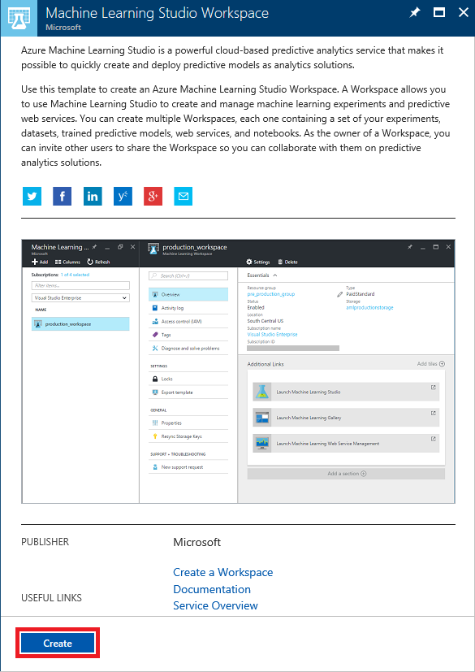

    _Creating a workspace_

1. In the "Machine Learning Studio workspace" blade, enter a workspace name such as "DXLabs" and make sure a green check mark appears next to it. Select **Create new** under **Resource group** and enter a resource-group name such as "MachineLearningResourceGroup." Select the location nearest you under **Location**. Then enter a storage-account name, making it as unique as possible, and make sure a green check mark appears next to it, too.

	> Storage-account names can be 3 to 24 characters in length, can only contain numbers and lowercase letters, and must be unique within Azure. A green check mark next to the name indicates that it meets all these criteria.

	Now click **Web service plan pricing tier** and select **S1 Standard** in the "Choose your pricing tier blade." Finish up by clicking **Select** at the bottom of that blade, and clicking **Create** at the bottom of the "Machine Learning Studio workspace" blade.

    

    _Creating a workspace_

1. Click **Resource groups** in the ribbon on the left side of the portal, and then click the resource group created for the Machine Learning Studio workspace.

    

    _Opening the resource group_

1. Wait until "Deploying" changes to "Succeeded," indicating that the workspace has been created. (You can click **Refresh** at the top of the blade to refresh the deployment status.) Then click the Machine Learning Studio workspace in the resource group.

    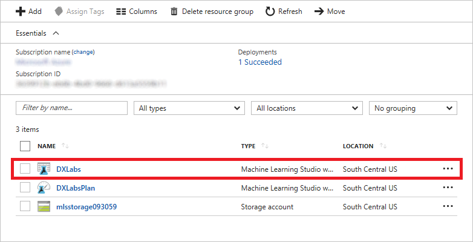

    _Opening the workspace_

1. Click **Launch Machine Learning Studio**.

    

    _Launching ML Studio_

1. Click **Sign In** to sign in to Machine Learning Studio with your Microsoft account.

    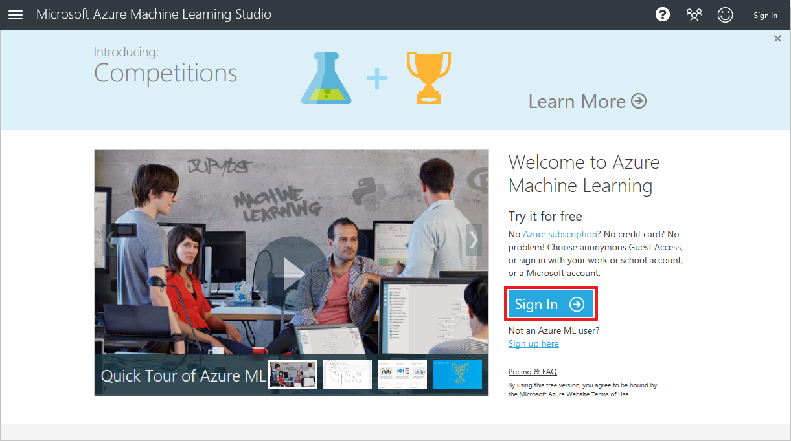

    _Signing in to ML Studio_

1. In Machine Learning Studio, click **+ NEW** in the lower-left corner. Then start a new experiment by clicking **Blank Experiment**.

    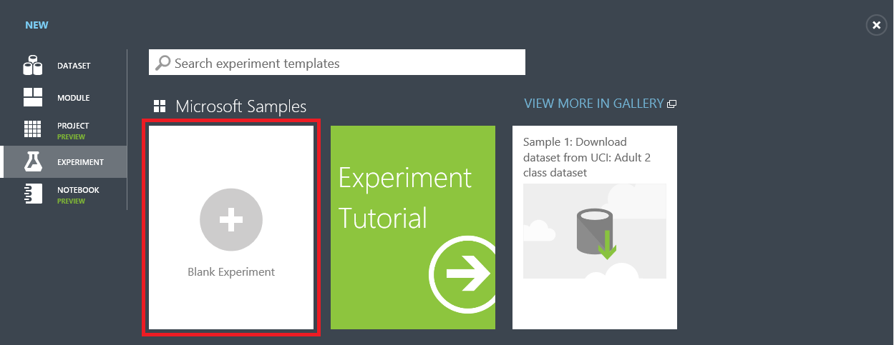

    _Creating a blank experiment_

1. Click the experiment title at the top of the page ("Experiment created on...") and type a new experiment name such as "Digit Recognition."

    

    _Renaming the experiment_

Now that the experiment has been created, the next step is to import some data and build a model around it.

<a name="Exercise2"></a>
## Exercise 2: Upload a dataset

Azure Machine Learning Studio comes with several sample datasets. Additional datasets are available from a variety of sources, including [Data.gov](http://www.data.gov/), [Kaggle](http://www.kaggle.com/), and the University of California Irvine's [Machine Learning Repository](http://archive.ics.uci.edu/ml/). In this exercise, you will upload a public dataset containing data generated by scanning and digitizing handwritten digits (0 through 9) from a sample of 43 people. You will later use the dataset to train an ML model that can recognize handwritten digits with a high degree of accuracy.

1. Click **+ NEW** in the lower-left corner of ML Studio. Then click **DATASET**, followed by **FROM LOCAL FILE**.

    

    _Creating a new dataset_

1. Click the **Browse** button. Select the file named **digit-recognition.csv** from the [resources that accompany this lab](https://a4r.blob.core.windows.net/public/cs-machine-learning-resources.zip). Make sure **Generic CSV File with a header (.csv)** is selected under **SELECT A TYPE FOR THE NEW DATASET**. Optionally enter a friendly name for the dataset in the **ENTER A NAME FOR THE NEW DATASET** box, and then click the check mark in the lower-right corner to begin uploading the dataset.

    

    _Uploading the dataset_

1. Wait for the upload to finish. Then go to the modules palette on the left and find the dataset you just uploaded under **Saved Datasets** -> **My Datasets**.

    

    _The uploaded dataset_

1. Drag the dataset from the modules palette and drop it onto the canvas (the gray area to the right).

    

    _Adding the dataset to the model_

1. To see what this dataset looks like, click the output port (the circle with the "1" in it) at the bottom of the dataset and select **Visualize**.

    

    _Visualizing the dataset_

1. The variables, or "features," in the dataset appear as columns, with each row representing a digit from 0 to 9. The dataset contains 3,823 rows and 65 columns. The first 64 columns contain values from 0 to 16 representing 4x4 blocks of pixels. Each digit represented in the dataset was scanned into a 32x32 array, yielding a total of 1,024 pixels per digit. Each scan is represented in the dataset by 64 values, each representing 16 pixels. 

    

    _The Digit Recognition dataset_

1. Scroll all the way to the right until you see the final column — the one named "digit." Each value in this column is the digit that corresponds to the pixel data in the same row. THIS is the target value that your model will predict given values for the other 64 columns.

    

    _The target variable_

Close the visualization window by clicking the "**x**" in the upper-right corner. The data is loaded. Now it's time to do something with it.

<a name="Exercise3"></a>
## Exercise 3: Train a classification model

In this exercise, you will use ML Studio's drag-and-drop user interface to train an ML model. *Training* involves picking a machine-learning algorithm and feeding data into the model. During training, the computer looks for patterns in the data that it can use to predict values from future inputs.

There are several types of machine-learning models. One of the most common is the regression model, which uses one of a number of regression algorithms to produce a numeric value — for example, a person's age or the probability that a credit-card transaction is fraudulent. You will be training a classification model, which seeks to resolve a set of inputs into one of a set of known outputs. A classic example of a classification model is one that examines e-mails and classifies them as "spam" or "not spam." Your model will examine a set of inputs representing pixel patterns and attempt to classify each as a digit from 0 to 9, inclusive.

1. At the top of the modules palette, type "metadata" (without quotation marks) into the search box to find the [Edit Metadata](https://msdn.microsoft.com/en-us/library/azure/dn905986.aspx) module.

    

    _Finding the Edit Metadata module_

1. Drag the module to the experiment canvas and drop it underneath the dataset. Then connect the output port of the dataset to the input port of the Edit Metadata module by dragging an arrow downward from the output port. Among other things, the Edit Metadata module allows you to specify data types for the columns in the dataset.

    

    _Adding an Edit Metadata module_

     > A key concept to understand in Azure ML Studio is that of ports and connectors. In this step, you connected the output port of the dataset to the input port of the Edit Metadata module. The data flows from one module to the next through the connector. Some modules support multiple inputs and outputs and therefore have multiple input and output ports. If you want to know what a port does, hover over it with the mouse and a tooltip will pop up. If you want more information, right-click on the module and select **Help** from the popup menu.

1. Click the Edit Metadata module to select it. (When selected, it has a bold blue border.) Then click the **Launch column selector** button in the Properties pane on the right.

    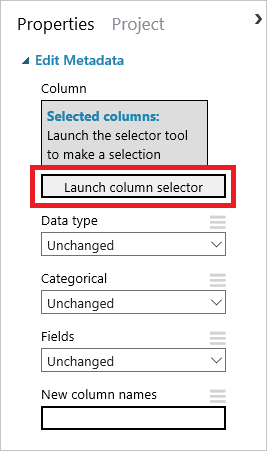

    _Launching the column selector_

1. Scroll to the bottom of the **AVAILABLE COLUMNS** list and click **digit**. Then click the **>** button to move **digit** into the **SELECTED COLUMNS** list. Recall that **digit** is the value your model will predict. Finish up by clicking the check mark in the lower-right corner of the window.

    

    _Selecting the digit column_

1. In the Properties pane, select **Make Categorial** from the drop-down list named **Categorical**. This tells the model that values in the **digit** column should be treated as discrete (as opposed to numeric values, which could take on values such as 7.5 and 8.6).

    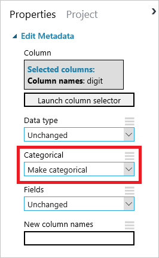

    _Making the digit column categorical_

1. Click the **SAVE** button at the bottom of the page to save the experiment.

    

    _Saving the experiment_

	> When working with the Azure Machine Learning Studio, get in the habit of saving your experiments often, particularly before you run a model. That way, if you encounter a problem, you will not have to redo your work. Also, be aware that you **may lose your work if you click the browser's Back button without saving your experiment first.**

1. Type "split" (without quotation marks) into the search box at the top of the modules palette. Then drag a [Split Data](https://msdn.microsoft.com/en-us/library/azure/dn905969.aspx) module onto the canvas and connect the output port from the Edit Metadata module to the input port of the Split Data module. The purpose of the Split Data module is to split a dataset into two parts: one for training and one for scoring. It's useful when you don't have separate datasets for training and scoring.

    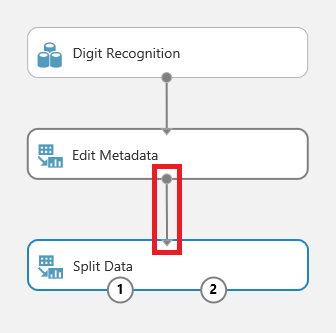

    _Adding a Split Data module_

1. Make sure the Split Data module is selected. Then go to the Properties pane on the right and set the split to 0.8. You will use 80% of the rows to train the model, and the remaining 20% to score it. Also make sure that the **Randomized split** box is checked. This is particularly important when you are splitting data that is ordered.

    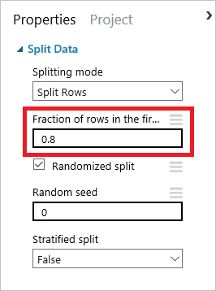

    _Setting the split percentage_

1. Click the **SAVE** button at the bottom of the page to save the experiment.

1. Click the **RUN** button at the bottom of the page to run the experiment.

1. Next, type "train model" (without quotation marks) into the search box at the top of the modules palette. Find the [Train Model](https://msdn.microsoft.com/en-us/library/azure/dn906044.aspx) module and drag it onto the canvas. Connect the left output from the Split Data module to the right input of the Train Model module.

    

    _Adding a Train Model module_

1. The next step is a crucial one. In it, you will identify for the Train Model module which value you want it to predict. Select the Train Model module, and then click **Launch column selector** in the Properties pane.

    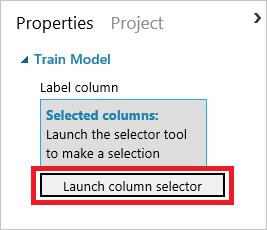

    _Launching the column selector_

1. Type in "digit" (without quotation marks) to select the **digit** column. This is the value that your model is going to predict. Finish up by clicking the check mark in the lower-right corner.

    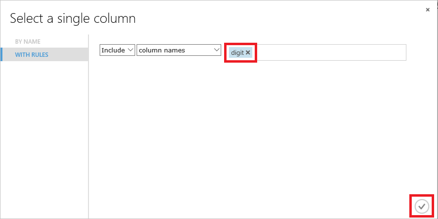

    _Specifying the target value_

1. Now it's time to select a learning algorithm. Azure Machine Learning offers several kinds of classification and regression algorithms for you to choose from, as well as algorithms of other types. Each is represented by a module in the modules palette. You can always code your own algorithms in R or Python as well. Your model will employ an algorithm known as "Multiclass Logistic Regression." It's a classification algorithm that employs logistic regression, which is frequently used in statistics to predict the probability of an outcome.

	> The Azure Machine Learning team has put together a "cheat sheet" to help you decide which algorithm to choose based on the intended purpose of your model. You can download it from [here](http://download.microsoft.com/download/A/6/1/A613E11E-8F9C-424A-B99D-65344785C288/microsoft-machine-learning-algorithm-cheat-sheet-v6.pdf).

	Type "multiclass" (without quotation marks) into the search box at the top of the modules palette. Find the [Multiclass Logistic Regression](https://msdn.microsoft.com/en-us/library/azure/dn905853.aspx) module and drag it onto the canvas. Then connect the output from the Multiclass Logistic Regression module to the left input of the Train Model module, as shown below.

    

    _Specifying the learning algorithm_

1. Click the **SAVE** button to save the experiment.

1. Click the **RUN** button to run the model. Wait until green check marks appear in all the modules indicating that they ran successfully.

1. If you would like to see how influential each of the input variables was in computing an output, right-click the output port of the Train Model module and select **Visualize**. You'll see a list of all the features (columns) in the model and the weights assigned to them.

The model has been trained. But how accurate is it in predicting values? That's where scoring comes in.

<a name="Exercise4"></a>
## Exercise 4: Score the model

In this exercise, you will score the model you trained in the previous exercise. *Scoring* determines how well the model was trained — that is, how adept it is at predicting target values from variables presented to it. ML Studio makes the scoring process very easy. You used 80% of the dataset that you uploaded to train the model. You will use the remaining 20% to score it.

1. Add a [Score Model](https://msdn.microsoft.com/en-us/library/azure/dn905995.aspx) module to the canvas. Connect the output of the Train Model module to the Score Model module's left input port. Then connect the right output port of the Split Data module to the right input port of the Score Model module. That connection represents the 20% of the data that was not used for training.

    

    _Adding the Score Model module_

1. Click the **SAVE** button to save the experiment.

1. Click the **RUN** button to run the experiment.

1. After the run finishes, right-click the output port of the Score Model module and select **Visualize**. Scroll to the right. In the column labeled "digit," you see actual values from the 20% of the dataset passed to the Score Model module. The next ten columns — "Scored Probabilities for Class X" — indicate how the model scored the ten possible outputs (the digits 0 through 9) using the inputs on the left. The higher the number, the greater the likelihood of a match. The final column — "Scored Labels" — indicates which digit the model predicted from the inputs, which is the digit scored with the highest probability. By comparing values in the "digit" column to values under "Scored Labels," you can assess the accuracy of the model. A cursory examination reveals that the model gets it right the vast majority of the time.

    

    _The scored dataset_

1. Close the visualization window by clicking the "**x**" in the upper-right corner.

1. To evaluate the quality of the results without having to compare hundreds of values manually, add an [Evaluate Model](https://msdn.microsoft.com/en-us/library/azure/dn905915.aspx) module to the experiment canvas. Connect the output port of the Score Model module to the left input port of the output of the Evaluate Model module. (There are two input ports because Evaluate Model can be used to compare two models.)

    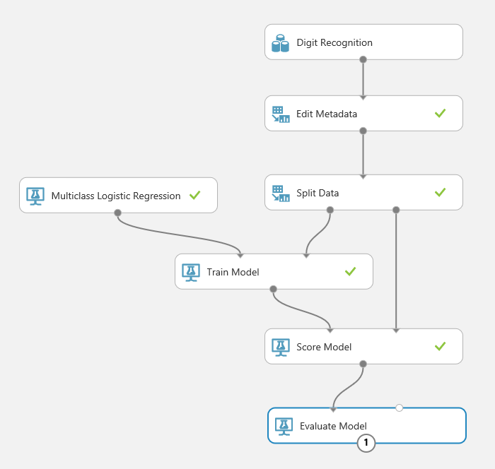

    _Adding the Evaluate Model module_

1. Click **Save** to save the experiment. Then run the experiment again by clicking the **RUN** button.

1. Click the output port of the Evaluate Model module and select **Visualize** from the menu. From the **Overall accuracy** and **Average accuracy** numbers, you can see that the model performs very well. Given a digitized scan of a handwritten digit, it can correctly identify the digit more than 97% of the time.

    

    _The evaluation results_

1. Close the visualization window by clicking the "**x**" in the upper-right corner.

Now that the model is built and tested, it's time to put it to work. The ultimate goal is to write an app that runs on a PC or mobile device and calls up to the cloud and runs the model. To facilitate that, you need to deploy the model as a Web service.

<a name="Exercise5"></a>
## Exercise 5: Deploy the model as a Web service

Once you have a trained and scored model, you can deploy it as a Web service and interact with it programmatically. Before deploying as a Web service, you need to streamline your experiment. This involves creating a new experiment from your trained model, removing unnecessary modules, and adding Web-service input and output modules. Fortunately, ML Studio can do all of this for you.

1. Click the **RUN** button to run your model again.

1. At the bottom of the screen, click the **SET UP WEB SERVICE** button and in the ensuing menu, select **Predictive Web Service [Recommended]**. If this option is grayed out, click the **RUN** button and try again.

    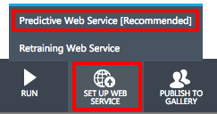

    _Creating a predictive Web service_

1. ML Studio will spin for a few seconds, after which a predictive experiment will appear. Observe that Split Data and Train Model are gone, and that 100% of the training data now flows into Score Model. In addition, new modules were added at the top and bottom for Web-service input and output.

	> Don't be alarmed thinking your original model is gone. It's still there. You can get to it by clicking the **Training experiment** tab at the top of the page.

    

    _The predictive experiment_

1. To create a Web service that you can call to perform predictive analytics, click **RUN** once more. After the run completes, click the **DEPLOY WEB SERVICE** button to deploy the Web service.

    

    _Deploying the Web service_
 
1. In a moment, the dashboard for the new Web service will appear. The dashboard includes a **Test** button that you can click to test the Web service (not very practical here, because you'd have to enter 64 values from 0 to 16 representing pixel patterns). It also includes an API key that apps can use to make authenticated calls to the service. You will use this API key in the next exercise.

	For convenience, click the button to the right of the API key to copy the key to the clipboard, and then paste it into a text editor so you can easily retrieve it later.

    

    _Copying the API key_

1. Now click **REQUEST/RESPONSE** to see useful information about calling the Web service over HTTPS using [REST](https://en.wikipedia.org/wiki/Representational_state_transfer).

    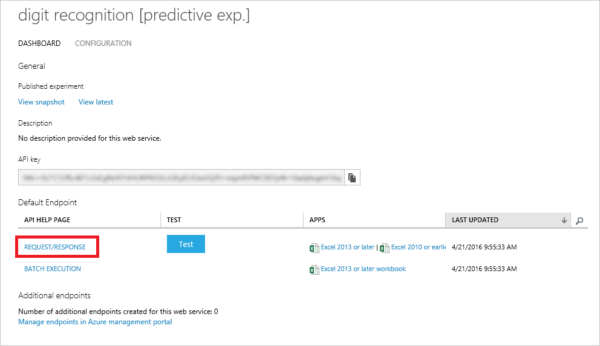

    _Viewing Request/Response information_

1. This page offers documentation that's useful to programmers who want to write apps that consume the Web service, including:

	- How HTTPS requests are formatted
	- How HTTPS responses are formatted
	- Input and output parameters
	- Sample code demonstrating how to call the Web service

	Scroll to the bottom of the page and you'll see the sample code. It's available in three languages: C#, Python, and R. Make sure **C#** is selected, and then scroll down until you see the statement that assigns the Web service's URL to client.BaseAddress. Copy this URL to the clipboard and paste it into a text editor so you can retrieve it in the next exercise. You're going to write code similar to this to call the Web service. And to do so, you'll need the URL.

    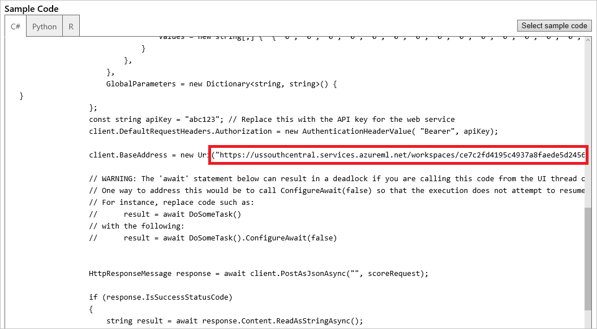

    _The Web service URL_

A common question regarding Azure ML Web services is: how much do they cost? You can find the current pricing information in the [Machine Learning Pricing](https://azure.microsoft.com/en-us/pricing/details/machine-learning/) page.

<a name="Exercise6"></a>
## Exercise 6: Build a universal Windows client

The whole reason for deploying an Azure ML model as a Web service is so you can build smart apps that utilize the model. There are many ways to build such apps. You could call the service from a Web app using JavaScript and AJAX, for example, or you could use Visual Studio to write a [Xamarin](https://www.xamarin.com/) app that runs on iOS, Android, and Windows and places calls to the service using .NET's HttpClient class.

In this exercise, you will write a client app that targets the [Universal Windows Platform](https://msdn.microsoft.com/en-us/windows/uwp/get-started/whats-a-uwp), or UWP. The beauty of such apps is that they run on a variety of Windows devices, including PCs, tablets, phones, and even on Xbox One. The app you will write enables you to draw digits into an onscreen grid. Then it calls your ML Web service and tells you what digit you drew.

1. In order to build and run UWP apps on a Windows 10 PC, you must enable developer mode on the device. To ensure that developer mode is enabled, click the **Windows** button (also known as the Start button) in the lower-left corner of the desktop. Then select **Settings** from the menu and click **Update & security** in the "Settings" dialog. Now click **For developers** on the left and select **Developer mode** on the right, as shown below.

    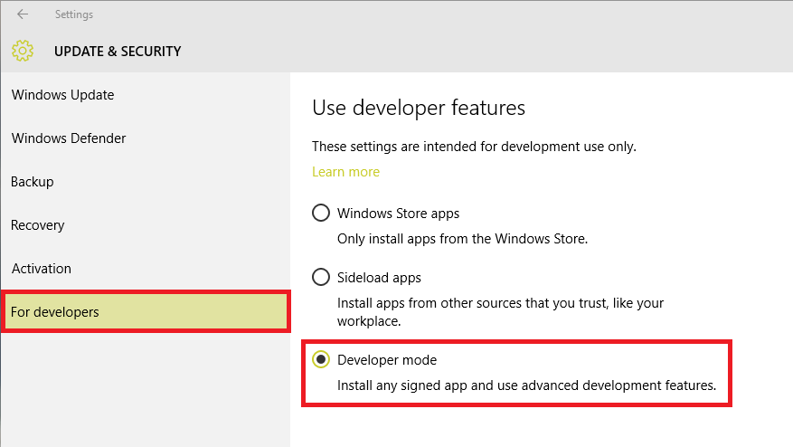

    _Enabling developer mode in Windows 10_

1. Start Visual Studio and use the **File -> New -> Project** command to create a new **Blank App (Universal Windows)** project named "DigitRecognizer." After clicking **OK**, accept the default target version and minimum version presented to you.

    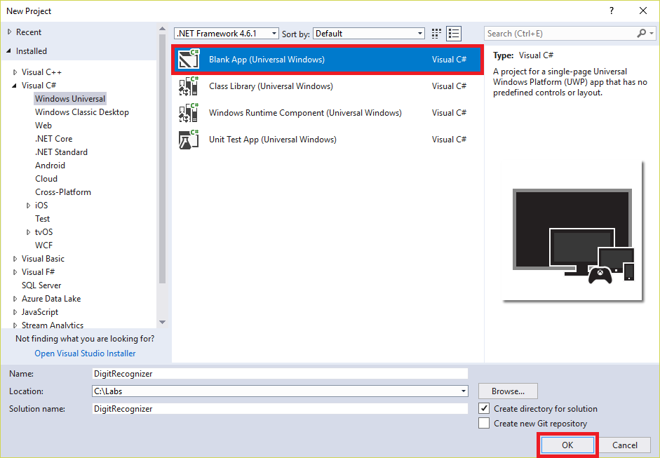

    _Creating a new UWP project_

1. In the Solution Explorer window, right-click the **DigitRecognizer** project and select **Manage NuGet Packages...**. Click **Browse**. Then type "webapi.client" (without quotation marks) into the search box. Click **Microsoft.AspNet.WebApi.Client** to select the Web API client package from NuGet. Finally, click **Install** to install the latest stable version of the package. This package contains helper APIs that your app will use to communicate with the Web service. OK any changes and accept any licenses presented to you.

	> NuGet is a free and open-source package manager for Microsoft development platforms. It provides access to thousands of libraries, or *packages*, containing code to perform a variety of tasks. It is integrated into Visual Studio, which makes it easy to add NuGet packages to your project and make a lot of things happen without writing a lot of code.

    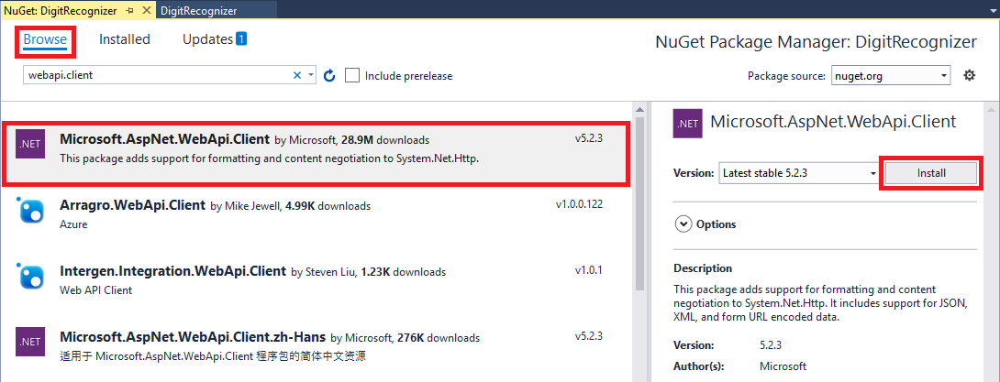

    _Installing the Web API Client_

1. Right-click the project in Solution Explorer and use the **Add -> Class...** command to add a class file named **StringTable.cs**. Then replace the ```StringTable``` class in the file with this one:

	```C#
	class StringTable
	{
	    public string[] ColumnNames { get; set; }
	    public string[,] Values { get; set; }
	}
	```

1. Open **MainPage.xaml** and find the empty ```Grid``` element highlighted below.

    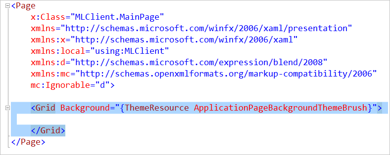

    _The empty Grid element_

1. Replace the empty ```Grid``` element with the following markup:

	```xaml
	<StackPanel VerticalAlignment="Center">
	    <TextBlock Text="Draw a digit from 0 to 9" FontSize="28" Margin="0,0,0,8" HorizontalAlignment="Center" />
	    <Grid x:Name="Cells" Width="400" Height="400">
	        <!-- Empty cell grid filled programmatically -->
	    </Grid>
	    <Button Content="Submit" Width="400" Height="100" FontSize="32" Margin="0,16,0,0" HorizontalAlignment="Center" Click="OnSubmit" />
	    <Button Content="Clear" Width="400" Height="100" FontSize="32" Margin="0,16,0,0" HorizontalAlignment="Center" Click="OnClear" />
	</StackPanel>
	```

	The markup that you just inserted is [Extensible Application Markup Language](https://msdn.microsoft.com/en-us/library/cc189036(VS.95).aspx), or XAML. XAML is a language created by Microsoft for building user interfaces. It was originally created for WPF, but has since been repurposed for universal Windows apps. Combined with [Xamarin Forms](https://www.xamarin.com/forms), it can even be used to build user interfaces for iOS and Android. It is an extremely expressive language that enjoys designer support in Visual Studio and other popular tools.

1. Now open **MainPage.xaml.cs** and add the following ```using``` statements to those already at the top of the file:

	```C#
	using Windows.UI.Xaml.Shapes;
	using Windows.UI;
	using Windows.Devices.Input;
	using System.Net.Http;
	using System.Net.Http.Headers;
	using System.Threading.Tasks;
	using Windows.UI.Core;
	using Windows.UI.Popups;
	using Newtonsoft.Json;
	```

1. Still in **MainPage.xaml.cs**, replace everything inside the ```MainPage``` class with the following code:

	```C#
	private const double _margin = 2.0;  // Margin around each cell
	private const double _opacity = 0.2; // Opacity of empty cells
	private Rectangle _last;

	public MainPage()
	{
	    this.InitializeComponent();
	
	    // Add rows and columns to the Grid
	    for (int i = 0; i < 8; i++)
	        Cells.ColumnDefinitions.Add(new ColumnDefinition());
	
	    for (int j = 0; j < 8; j++)
	        Cells.RowDefinitions.Add(new RowDefinition());
	
	    // Fill the Grid with Rectangles
	    for (int row = 0; row < 8; row++)
	    {
	        for (int col = 0; col < 8; col++)
	        {
	            var cell = new Rectangle();
	            cell.Fill = new SolidColorBrush(Colors.Blue);
	            cell.Opacity = _opacity;
	            cell.Margin = new Thickness(_margin);
	            cell.SetValue(Grid.RowProperty, row);
	            cell.SetValue(Grid.ColumnProperty, col);
	            cell.PointerPressed += OnCellPressed;
	            cell.PointerEntered += OnCellEntered;
	            Cells.Children.Add(cell);
	        }
	    }
	}
	
	private void OnCellPressed(object sender, PointerRoutedEventArgs e)
	{
	    if (e.Pointer.PointerDeviceType == PointerDeviceType.Mouse)
	    {
	        var point = e.GetCurrentPoint(null);
	
	        if (point.Properties.IsLeftButtonPressed)
	        {
	            var cell = (Rectangle)sender;
	            ToggleCell(cell); // Toggle the cell (left mouse button only)
	            _last = cell;
	        }
	    }
	}
	
	private void OnCellEntered(object sender, PointerRoutedEventArgs e)
	{
	    var cell = (Rectangle)sender;
	
	    if (e.Pointer.PointerDeviceType == PointerDeviceType.Mouse)
	    {
	        var point = e.GetCurrentPoint(null);
	
	        if (!point.Properties.IsLeftButtonPressed)
	            return; // Ignore if it's a mouse but not the left button
	
	        if (cell == _last)
	        {
	            _last = null;
	            return; // Ignore if it's a mouse but the cell was toggled in OnCellPressed
	        }
	    }
	
	    ToggleCell(cell);
	}
	
	private void ToggleCell(Rectangle cell)
	{
	    cell.Opacity = (cell.Opacity < 1.0) ? 1.0 : _opacity;
	}
	
	private async void OnSubmit(object sender, RoutedEventArgs e)
	{
	    // Package up the data
	    string[] values = new string[65];
	
	    for (int row = 0; row < 8; row++)
	    {
	        for (int col = 0; col < 8; col++)
	        {
	            int index = (row * 8) + col;
	            values[index] = ((Rectangle)Cells.Children[index]).Opacity == 1.0 ? "16" : "0";
	        }
	    }
	
	    values[64] = "0"; // digit parameter
	
	    try
	    {
	        // Call the ML service
	        await MLSubmitAsync(values);
	    }
	    catch(Exception ex)
	    {
	        // Let the user know if something went wrong
	        var dialog = new MessageDialog(ex.Message);
	        await dialog.ShowAsync();
	    }
	}
	
	private void OnClear(object sender, RoutedEventArgs e)
	{
	    for (int i = 0; i < 64; i++)
	        ((Rectangle)Cells.Children[i]).Opacity = _opacity;
	}
	
	private async Task MLSubmitAsync(string[] v)
	{
	    using (var client = new HttpClient())
	    {
	        var request = new
	        {
	            Inputs = new Dictionary<string, StringTable>()
	            {
	                {
	                    "input1",
	                    new StringTable()
	                    {
	                        ColumnNames = new string[]
	                        {
	                            "p01", "p02", "p03", "p04", "p05", "p06", "p07", "p08",
	                            "p09", "p10", "p11", "p12", "p13", "p14", "p15", "p16",
	                            "p17", "p18", "p19", "p20", "p21", "p22", "p23", "p24",
	                            "p25", "p26", "p27", "p28", "p29", "p30", "p31", "p32",
	                            "p33", "p34", "p35", "p36", "p37", "p38", "p39", "p40",
	                            "p41", "p42", "p43", "p44", "p45", "p46", "p47", "p48",
	                            "p49", "p50", "p51", "p52", "p53", "p54", "p55", "p56",
	                            "p57", "p58", "p59", "p60", "p61", "p62", "p63", "p64",
	                            "digit"
	                        },
	                        Values = new string[,]
	                        {
	                            {
	                                v[0],  v[1],  v[2],  v[3],  v[4],  v[5],  v[6],  v[7],
	                                v[8],  v[9],  v[10], v[11], v[12], v[13], v[14], v[15],
	                                v[16], v[17], v[18], v[19], v[20], v[21], v[23], v[23],
	                                v[24], v[25], v[26], v[27], v[28], v[29], v[30], v[31],
	                                v[32], v[33], v[34], v[35], v[36], v[37], v[38], v[39],
	                                v[40], v[41], v[42], v[43], v[44], v[45], v[46], v[47],
	                                v[48], v[49], v[50], v[51], v[52], v[53], v[54], v[55],
	                                v[56], v[57], v[58], v[59], v[60], v[61], v[62], v[63],
	                                v[64]
	                            }
	                        }
	                    }
	                },
	            },
	            GlobalParameters = new Dictionary<string, string>() { }
	        };
	
	        const string key = "API_KEY";
	        client.DefaultRequestHeaders.Authorization = new AuthenticationHeaderValue("Bearer", key);
	        client.BaseAddress = new Uri("WEB_SERVICE_URL");
	
	        HttpResponseMessage response = await client.PostAsJsonAsync("", request).ConfigureAwait(false);
	
	        // Resumes on background thread, so marshal to the UI thread
	        await this.Dispatcher.RunAsync(CoreDispatcherPriority.Normal, async () =>
	        {
	            if (response.IsSuccessStatusCode)
	            {
	                string json = await response.Content.ReadAsStringAsync();
	                dynamic result = JsonConvert.DeserializeObject<dynamic>(json);
	                var digit = result.Results.output1.value.Values[0][75];
	                var dialog = new MessageDialog(String.Format("Azure ML says you entered a {0}", digit));
	                await dialog.ShowAsync();
	            }
	            else
	            {
	                var dialog = new MessageDialog(String.Format("The request failed with status code: {0}", response.StatusCode));
	                await dialog.ShowAsync();
	            }
	        });
	    }
	}
	```

	Admittedly, that's a lot of code. But it packs a lot of punch, too. Here are a few parts of it that you may care to examine more closely:

	- ```MainPage```'s class constructor fills the ```Grid``` element declared in **MainPage.xaml** with XAML Rectangles to form an 8x8 grid. XAML elements such as this are normally created declaratively, but in this case, creating them in code prevents **MainPage.xaml** from being filled with row after row of nearly identical Rectangle elements.
	- ```OnCellEntered``` is the method called when a finger, pen, or mouse (in UWP parlance, a "pointing device") makes contact with any of the 64 Rectangles. Its job: toggle the Rectangle "on" or "off" by changing its opacity.
	- The ```OnSubmit``` method is called when you click the **Submit** button. It scans the 8x8 grid to determine which squares are "on," and then passes the data to ```MLSubmit```.
	- ```MLSubmitAsync``` is where the magic happens. It uses UWP's ```HttpClient``` class to place a REST call to the Web service. It is closely patterned after the C# sample code presented on the Web service's dashboard.
	
1. In the source code you just inserted, replace API_KEY with the API key obtained in Exercise 5, Step 5.

1. Next, replace WEB_SERVICE_URL with the URL of your Web service obtained in Exercise 5, Step 7.

1. Use the **Build -> Build Solution** command to build the solution. Correct any build errors that are reported, and then press **Ctrl+F5** to launch the app. Confirm that it looks like this:

    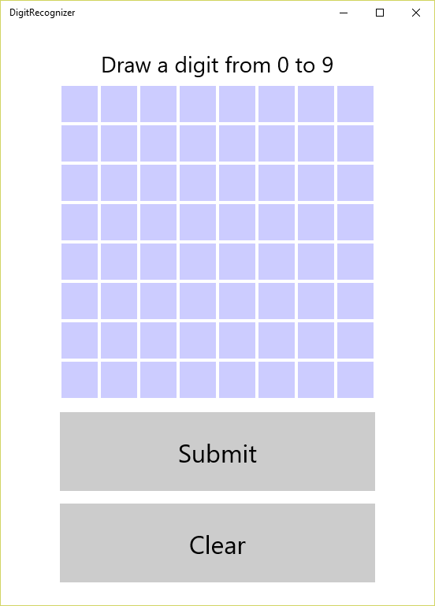

    _The DigitRecognizer app_

Congratulations! You just built a universal Windows app that relies on Azure Machine Learning for intelligence. The final task is to try it out and see how intelligent the app really is.

<a name="Exercise7"></a>
## Exercise 7: Test the model

DigitRecognizer puts a graphical front end on Web-service calls. You draw a digit into the grid of squares by dragging a finger, pen, or mouse over the squares. Clicking the **Submit** button creates an array of 64 values (one per square, and one for each of the 64 feature columns in the training dataset), serializes it into JSON, and passes it to the Web service. The app deserializes the JSON that comes back and displays the result. In essence, DigitRecognizer provides a highly visual way to gauge the accuracy of your ML model.

1. Use your mouse to sketch a "7" into the grid, similar to the one shown below. Then click the **Submit** button.

    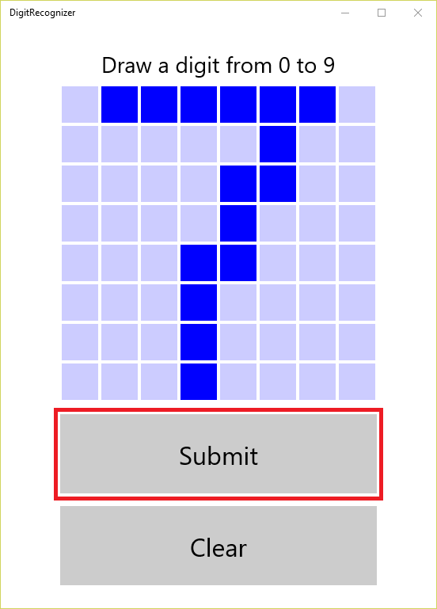

    _Testing the app_

1. In a moment, a popup window will appear telling you what digit you sketched. Is it correct?

    

    _Azure ML's response_

1. Click the **Clear** button to clear the grid and try a few other digits. You'll probably find that the model you built is better at identifying some digits than others, and that you get the best results when the digits you draw fill the expanse of the grid as much as possible.

The incorrect answers are partly the result of the relatively small dataset you trained the model with (the dataset was roughly 0.5 MB, which is small by big-data standards), and partly due to the fact that the onscreen grid DigitRecognizer displays uses only 1/16th the resolution of the scans that the model was trained with. Nonetheless, it's a pretty impressive feat for an app to perform basic OCR in this manner. And it's indicative of the kinds of apps you can build when you have Azure Machine Learning doing the heavy lifting.

## Summary

In this hands-on lab, you learned how to:

- Create an Azure Machine Learning experiment
- Upload a dataset
- Train and score an Azure Machine Learning model
- Deploy the model as a Web service
- Call the Web service using REST

There's much more than you can do with Azure Machine Learning, but this is a start. Feel free to experiment with it on your own and explore the exciting world of predictive analysis with a tool that is not only productive, but fun!

----

Copyright 2017 Microsoft Corporation. All rights reserved. Except where otherwise noted, these materials are licensed under the terms of the MIT License. You may use them according to the license as is most appropriate for your project. The terms of this license can be found at https://opensource.org/licenses/MIT.
