<a name="HOLTitle"></a>
# Deploying a Cognitive Services Web Site to Azure via GitHub #

How easy is it to build a Web site, store it in GitHub, and deploy it to Azure? What if it's not just a static Web site, but a dynamic, data-driven Web site that runs on Node.js and uses Artificial Intelligence (AI) to process user input? It's easier than you might think, thanks to [Azure Web Apps](https://azure.microsoft.com/en-us/documentation/articles/app-service-web-overview/), which provides a robust platform for Web apps of all types and features built-in [GitHub](https://github.com/) support; [Visual Studio Code](https://code.visualstudio.com/), a free and cross-platform source-code editor that includes GitHub support of its own; and Azure Cognitive Services' [Text Analytics API](https://azure.microsoft.com/services/cognitive-services/text-analytics/), which exposes [REST](https://en.wikipedia.org/wiki/Representational_state_transfer) methods backed by AI and machine learning for extracting insights from text.

In this lab, you will create an Azure Web App and use Visual Studio Code to deploy to it the "Classrates" site pictured below for rating college classes. Rather than enter ratings directly, you will enter comments, and the site will use the Text Analytics API to analyze comments for sentiment and rate the classes accordingly. You will also leverage the GitHub support in Azure and Visual Studio Code to enact source control and publish to Azure directly from GitHub. And you will accomplish all of this in under 30 minutes.

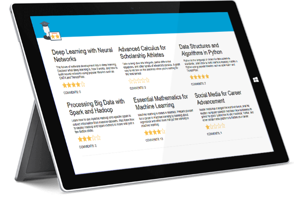

Sound like fun? Then let's get started!

<a name="Prerequisites"></a>
### Prerequisites ###

The following are required to complete this hands-on lab:

- An active Microsoft Azure subscription. If you don't have one, [sign up for a free trial](http://aka.ms/WATK-FreeTrial).
- An active [GitHub](https://github.com/) account. If you don't have one, [sign up for free](https://github.com/join).
- [Git](https://git-scm.com) for Windows, macOS, or Linux
- [Visual Studio Code](http://code.visualstudio.com)
- [Node.js](https://nodejs.org)

<a name="Cost"></a>
### Cost ###


The cost of this lab is **low**. For an overview of cost ratings, refer to [Explanation of Costs](../../Costs.md).

<a name="Exercises"></a>
## Exercises ##

This hands-on lab includes the following exercises:

- [Exercise 1: Get a Text Analytics API key](#Exercise1)
- [Exercise 2: Fork the repo and run Classrates locally](#Exercise2)
- [Exercise 3: Create an Azure Web App](#Exercise3)
- [Exercise 4: Deploy the modified Classrates site to Azure](#Exercise4)

Estimated time to complete this lab: **20 to 30** minutes.

<a name="Exercise1"></a>
## Exercise 1: Get a Text Analytics API key ##

The Classrates site that you are going to build uses Cognitive Services' [Text Analytics API](https://azure.microsoft.com/services/cognitive-services/text-analytics/) to analyze sentiment in the comments that students enter. The Text Analytics API takes text as input and returns a value from 0 to 1 quantifying the sentiment expressed in that text. The higher the score, the more favorable the sentiment. A comment such as "The most awesome class I've ever taken!" will score very high, while "Wouldn't wish this class on my worst enemy" will score low.

In order to call the Text Analytics API, you need an API key. In this exercise, you will retrieve a free API key from the "Try Cognitive Services" portal. A free key enables you to call the Text Analytics API up to 5,000 times per month. If you need more than that — if, for example, you intend to use the Text Analytics API in a production app or Web site — you can use the Azure portal to [sign up for a paid API key](https://docs.microsoft.com/azure/cognitive-services/text-analytics/how-tos/text-analytics-how-to-signup) with higher limits.

1. Go to https://azure.microsoft.com/try/cognitive-services in your browser. Click **Language**, and then click **Get API Key** to the right of "Text Analytics API."

	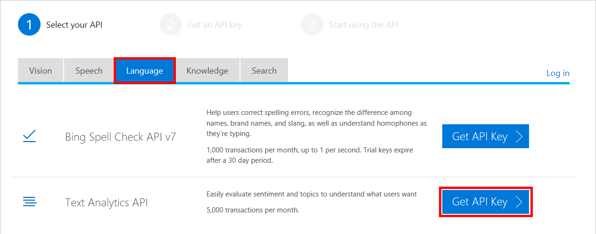

    _Getting a Text Analytics API key_ 

1.  Check the **I agree** box in the ensuing dialog. Then click **Next** and sign in using your Microsoft account (or a Facebook, LinkedIn, or GitHub account if you prefer).

1. Copy the endpoint URL and either of the API keys presented to you into a text file or some other place where you can easily retrieve them in the next exercise. Or simply leave the browser window open so you can copy and paste from there.

	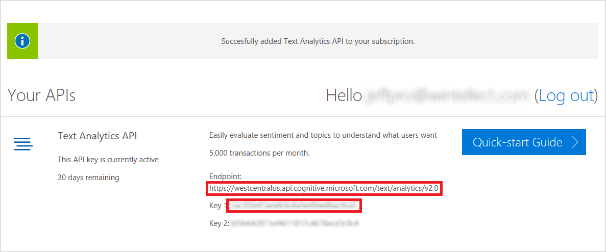

    _Copying the endpoint and API key_ 

The endpoint is the base URL to which calls to the Text Analytics API are placed — "base" because "/sentiment" must be added to the end to complete the URL. The API key travels in an HTTP header in each request. Without a valid API key, the Text Analytics API fails requests placed to it. It is the API's way of ensuring that the caller is authorized.

<a name="Exercise2"></a>
## Exercise 2: Fork the repo and run Classrates locally ##

[Visual Studio Code](http://code.visualstudio.com) is a free, lightweight, and powerful source-code editor available for Windows, macOS, and Linux. In this exercise, you will fork a GitHub repository containing the source code for Classrates into a repo of your own. Then you will clone the repo to create a copy on your PC, open it in Visual Studio Code, add the endpoint and API key you retrieved in the previous exercise, and test the Classrates Web site locally.

1. If [Git](https://git-scm.com/) isn't installed on your PC, go to https://git-scm.com/downloads and install the Git client for your operating system. Git is a free and open-source distributed version-control system, and it integrates seamlessly into Visual Studio Code. If you aren't sure whether Git is installed, open a Command Prompt or terminal window and execute the following command:

	```	
	git --version
	```

	If a version number is displayed, then the Git client is installed.

1. If you don't already have a GitHub account, go to https://github.com/join and create one.

1. Go to the [Classrates repo on GitHub](https://github.com/Wintellect/Classrates) and log in if you aren't already logged in. Then click **Fork** to fork the repo and create a copy of it in your own GitHub account.

	

	_Forking the Classrates repo_

1. With the forked repo open in your browser, click **Clone or download**, and then click the **Copy** button to copy the repo's Git URL to the clipboard.

	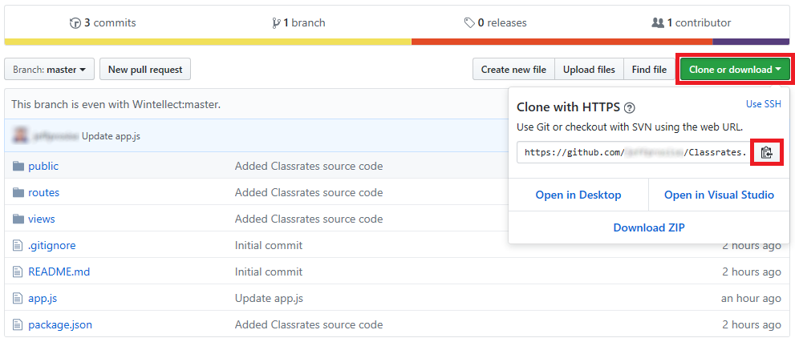

	_Copying the Git URL_

1. Open a Command Prompt or terminal window and use a ```cd``` command to navigate to the directory on your hard disk that you want to clone the Classrates repo into. Cloning will create a directory named "Classrates," so simply ```cd``` to the directory where you want the "Classrates" directory to be created.

1. Execute the following command in the Command Prompt or terminal window to clone Classrates on your PC, substituting the URL copied to the clipboard in Step 4 for URL.

	```
	git clone URL
	```

	When the command has completed, confirm that a directory named "Classrates" was created in the current directory. This is the local repo containing the Classrates source code.

1. If Node.js isn't installed on your PC, go to https://nodejs.org/ and install the latest LTS version. You can determine whether Node is installed by opening a Command Prompt or terminal window and typing the following command:

	```
	node --version
	```

	If Node is installed, the version number will be displayed.

1. If Visual Studio Code isn't installed on your PC, go to https://code.visualstudio.com/ and install it now.

1. Start Visual Studio Code and use the **File** > **Open Folder...** command to open the "Classrates" directory containing the cloned repo — the directory that was created by the ```git``` command in Step 6.

1. Select **Integrated Terminal** from Visual Studio Code's **View** menu to open an integrated terminal. Then execute the following command in the integrated terminal to install [Bootstrap](https://www.npmjs.com/package/bootstrap), [Express](https://www.npmjs.com/package/express), and other packages that Classrates requires:

	```
	npm install
	```

1. Use the EXPLORER panel in Visual Studio code to open the file named **functions.js** located in the project's "public/scripts" folder. Replace TEXT_ANALYTICS_API_KEY on line 3 with the API key you retrieved in the previous exercise, and replace TEXT_ANALYTICS_ENDPOINT on line 4 with the endpoint URL you retrieved in the same exercise. Then save the file.

	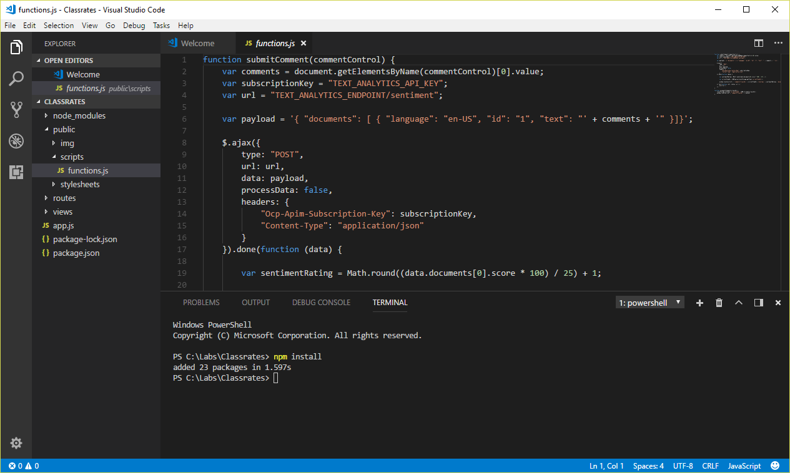

	_Editing functions.js_

1. Execute the following command in Visual Studio Code's integrated terminal to start the Web app:

	```
	npm start
	```

1. Open a browser to http://localhost:3000 and confirm that the Classrates home page appears:

	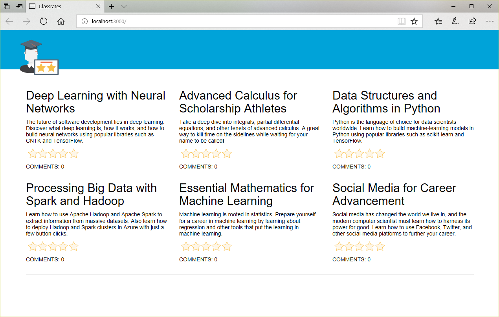

    _The Classrates Web site_ 

1. Click **Deep Learning with Neural Networks** to go to the comments page for that class. Enter a comment and click the **Submit Comment** button. How does this comment rate on a scale of one to five stars?

	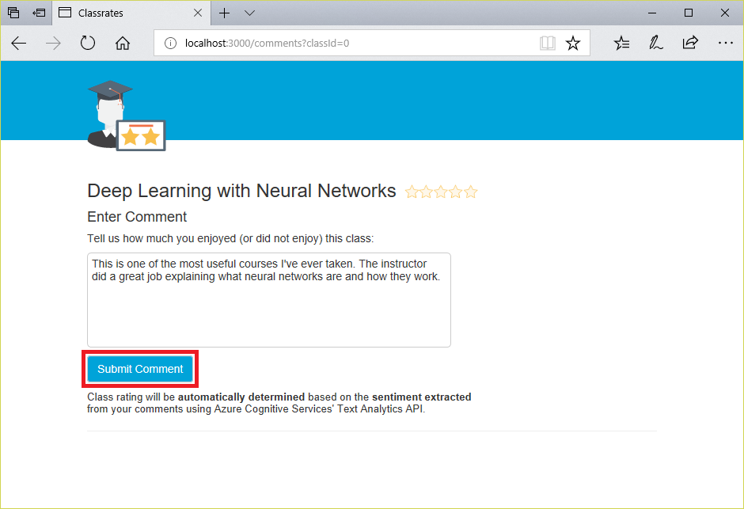

    _Entering a comment_ 

1. Enter additional comments for this class. Observe how the individual comments are rated, and how each new comment affects the overall rating for the class.

Play around with the Web site and familiarize yourself with how it works. Feel free to poke around the source code, too — particularly the **functions.js** file, which houses the code that submits comments to the Text Analytics API and parses the JSON that comes back for the results of the sentiment analysis. The next step is to deploy the site to Azure so others can enjoy it as well. But first, you need to create an Azure Web App to host it. 

<a name="Exercise3"></a>
## Exercise 3: Create an Azure Web App ##

In this exercise, you will use the [Azure portal](https://portal.azure.com) to create an Azure Web App and connect it to the Classrates repo that was created for you in GitHub when you forked the master repo. With this connection established, pushing changes from the local repo to the GitHub repo will automatically publish those changes to Azure — a process known as [continuous integration](https://en.wikipedia.org/wiki/Continuous_integration).

1. Open the [Azure portal](https://portal.azure.com) in your browser. If you are asked to sign in, do so using your Microsoft account.

1. In the portal, click **+ Create a resource**, followed by **Web + Mobile** and **Web App**.

    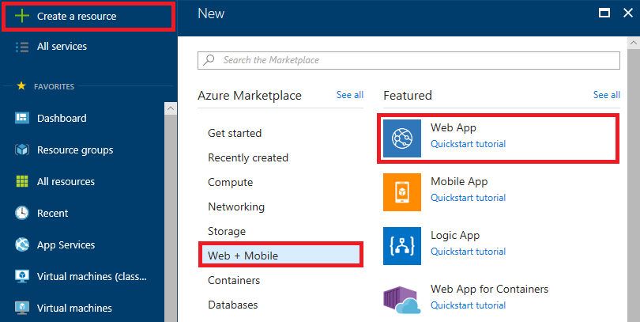

    _Creating an Azure Web App_

1. Enter a unique name for the app. The name must be unique across Azure, so you will probably have to use something other than "Classrates." Select **Create new** under "Resource Group" and enter a resource-group name, and select the operating system on which you want the Web App to run. (Either Windows or Linux is fine.) Click **App service plan/Location** and create a new service plan that specifies the Azure region in which you want to host the Web App (for example, East US). Then click the **Create** button at the bottom of the blade.

	> When you create a service plan, you can also choose the type of server that will host the Web site and select a cost model. At the time of this writing, Azure offers a free hosting plan for Windows, but not for Linux. Azure is constantly evolving, so this may change in the future.

	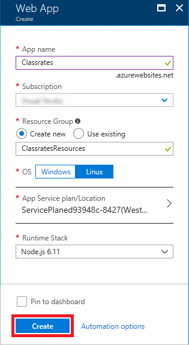

	_Creating an Azure Web App_

1. Wait for the deployment to finish. (It typically takes 5 minutes or less.) Then go to the Azure Web App in the Azure portal. One way to get there is to click **Resource groups** in the ribbon on the left, select the resource group whose name you specified in the previous step, and then click the Web App resource. You can also click the **Go to resource** button in the dialog that pops up in the portal when the deployment completes.

1. Click **Deployment options** in the menu on the left side of the blade for the Azure Web App. Click **Choose Source**, and then click **GitHub**.

	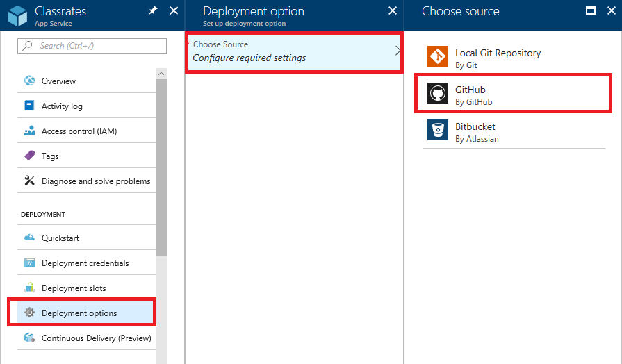

	_Specifying the deployment source_

1. Click **Authorization** in the "Deployment option" blade, and then click the **Authorize** button in the "Authorization" blade. Follow the on-screen instructions to authorize Azure to access your GitHub account.

	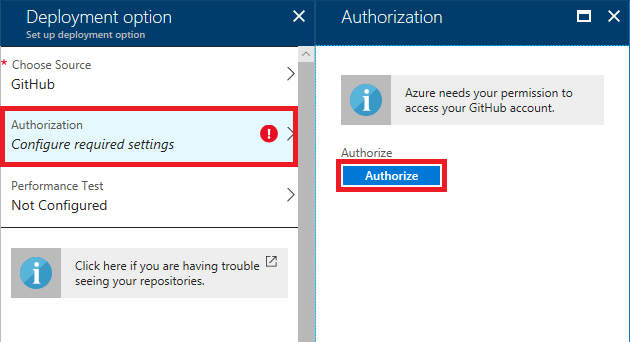

	_Allowing Azure to access your GitHub account_

1. Now that Azure has access to your GitHub account, you need to tell it which repo to use as a deployment source for the Azure Web App. Click **Choose project** in the "Deployment option" blade and select the Classrates repo. Make sure **Choose branch** is set to "master," and then click **OK** at the bottom of the blade.

	

	_Specifying the deployment project_

With the Azure Web App created and configured to use a GitHub repo as a deployment source, the next step is to commit the changes you made to Classrates in Visual Studio Code and push the changes to GitHub.

<a name="Exercise4"></a>
## Exercise 4: Deploy the modified Classrates site to Azure ##

In this exercise, you will use Visual Studio Code to push the modified version of Classrates to GitHub. Then you will open the Web site (the Web version, not the local version) in your browser and confirm that the changes propagated to Azure.

1. Return to Visual Studio Code and click the **Source Control** button in the activity bar. Type "First commit" into the text box, and then click the check mark to commit your changes.

    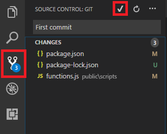

    _Committing changes to Classrates_ 

1. Click the ellipsis (the three dots) to the right of the check mark at the top of the SOURCE CONTROL panel and select **Publish Branch** from the menu to publish Classrates to Azure. When prompted, type in your GitHub user name and password.

	> If you have two-factor authentication enabled in GitHub, you will be prompted to enter a passcode as well. Two-factor authentication is highly recommended for security reasons.

1. Navigate to http://WEB_APP_NAME.azurewebsites.net in your browser, substituting your Azure Web App's name for WEB_APP_NAME. Confirm that Classrates' home page appears in your browser:

	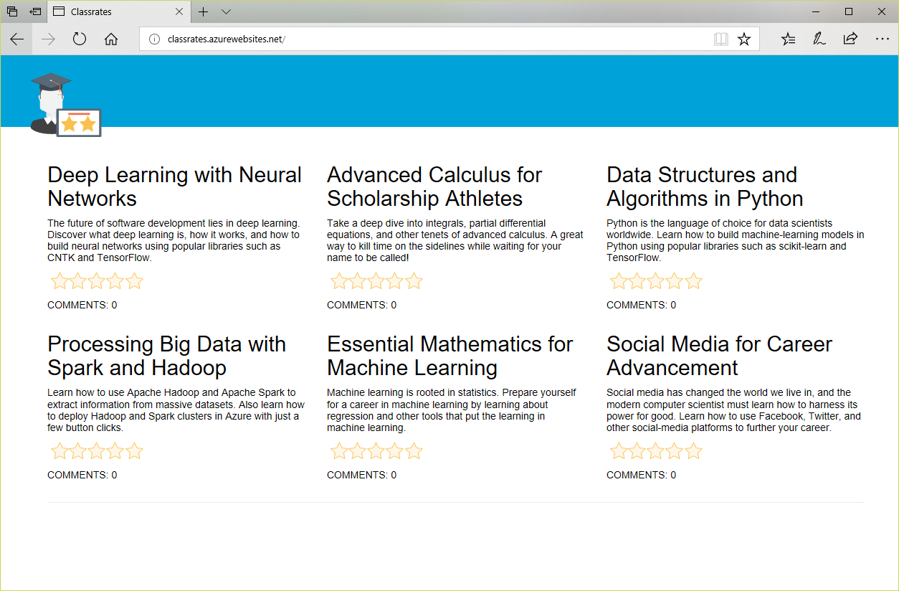

	_Classrates running in Azure_

1. Click around the site and enter a few comments, ensuring that the site works the same in Azure as it did when you ran it ran locally. In particular, make sure that the comments you enter are converted into ratings, which is proof that the version of **functions.js** that you modified with an endpoint URL and an API key was successfully published to GitHub and subsequently to Azure.

Now that you have continuous integration set up, you can make changes to the Web site by making the changes locally, checking them in, and rerunning the **Publish Branch** command. Of course, you can still test your changes locally before publishing them to Azure. You also enjoy the many benefits of source control, including the ability to isolate the work that you do in branches, view the changes that have been committed, and easily revert to previous versions of the code. To learn more about source control in Visual Studio Code, see [Using Version Control in VS Code](https://code.visualstudio.com/docs/editor/versioncontrol).

<a name="Summary"></a>
## Summary ##

Want to do more to make Classrates a first-rate Web app? One suggestion is to add support for editing and deleting comments. Another idea is to add a MySQL database to persist the comments that are entered. Currently, the comments are stored only in memory, and they go away if the Web App is recycled. It's easy to create a MySQL database in Azure and connect it to an Azure Web App. For guidance, see [Connect an existing Azure App Service to Azure Database for MySQL server](https://docs.microsoft.com/en-us/azure/mysql/howto-connect-webapp). Now that you have a solid foundation to work from, the only limit is your imagination.

---

Copyright 2018 Microsoft Corporation. All rights reserved. Except where otherwise noted, these materials are licensed under the terms of the MIT License. You may use them according to the license as is most appropriate for your project. The terms of this license can be found at https://opensource.org/licenses/MIT.